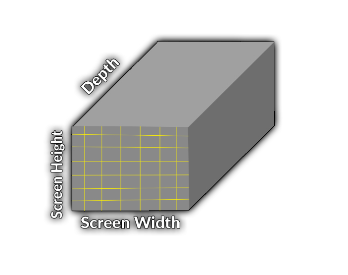
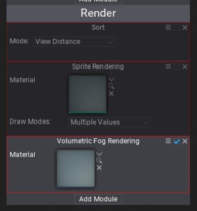
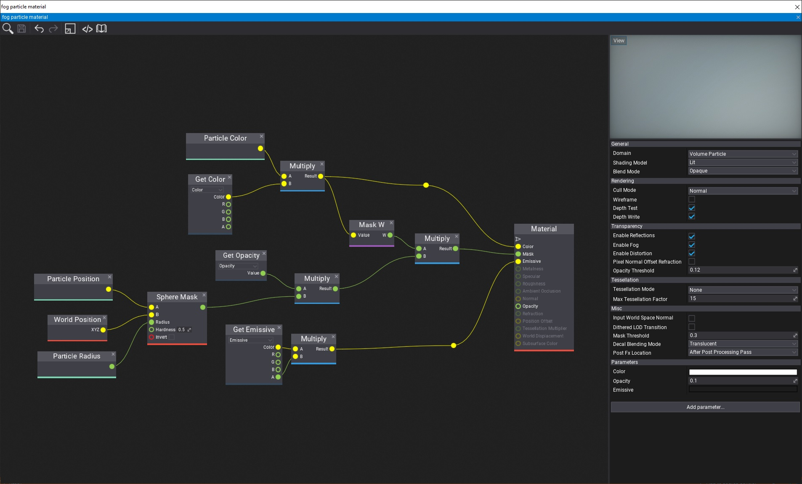

# Volumetric Fog

**Volumetric Fog** is a rendering feature that simulates the light transmission through the scene that contains fog (dust, smoke, particles, steam, etc.). The effect itself is implemented using a set of 3D textures (volume textures) that are *attached* to the camera and are used to compute the per-cell fog particle density, albedo, and lighting. This information is used to estimate the amount of light scattering through the volume to the camera. This results in realistic-looking fog and gives the very good performance-quality ratio.

## Technical aspects

* Target PC + Consoles
* Requires 3D Textures + Compute Shaders
* ~1.1ms (on GTX 840M - Witcher 3 runs stable 21 FPS on it)
* Low-res sampling + Temporal filtering
* Local fog particles density and color
* Volumetric shadows

## Algorithm

* 3D texture aligned to camera frustum
* Voxels (3d texels) store data per world-space cell
* Supports hardware filtering
* Low resolution 3D texture (e.g. 150x80x64)
* Outputs 3D texture with accumulated lighting and transmittance

Algorithm steps:
1. Initialize volume properties
 * Writes fog attributes into the set of two 3D textures:
  * Scattering.rgb, Absorption.a – R16G16B16A16
  * Emissive.rgb – R11G11B10
 * Use volume particles to modify fog locally (eg. steam coming out of pipe)
2. Lights Injection
 * Calculate per-cell diffuse lighting (use HDR format R11G11B10, can use shadow maps)
3. Light Scattering
 * Calculate scattering and extinction
 * Apply temporal blend (~7% blend current frame with the previous)
4. Final Integration
 * Integrate along the view ray (the one moment in your life when you actually use ∫f(x)dx)

## How to use it

Use [Exponential Height Fog](exponential-height-fog.md) actor and enable **Volumetric Fog** option. Then you can adjust its density and other parameters. Also, every light can affect the fog by adjusting the **Volumetric Scattering Intensity** value and **Cast Volumetric Shadow** option.

## Showcase

## Local Fog via Volumetric Fog Particles

Exponential Height Fog actor controls the global properties of the fog on the scene such as *Albedo*, *Density*, and *Emission*. To create local-fogging effects such as smoke, dust or mist use particles with  **Volumetric Fog Rendering** module.

Ensure to assign the material shader to the material created with **Volume Particle** domain. Then use **Color** input to define th albedo color of the fog, **Emissive** input for light emission and **Mask** with **Opacity** to define the fog particle shape (eg. use world-aligned noise texture to add more realistic look to the fog).

Volumetric Fog Particles are rendered using **Sphere** shape so use per-particle **Radius** property to control the size of the particles.

