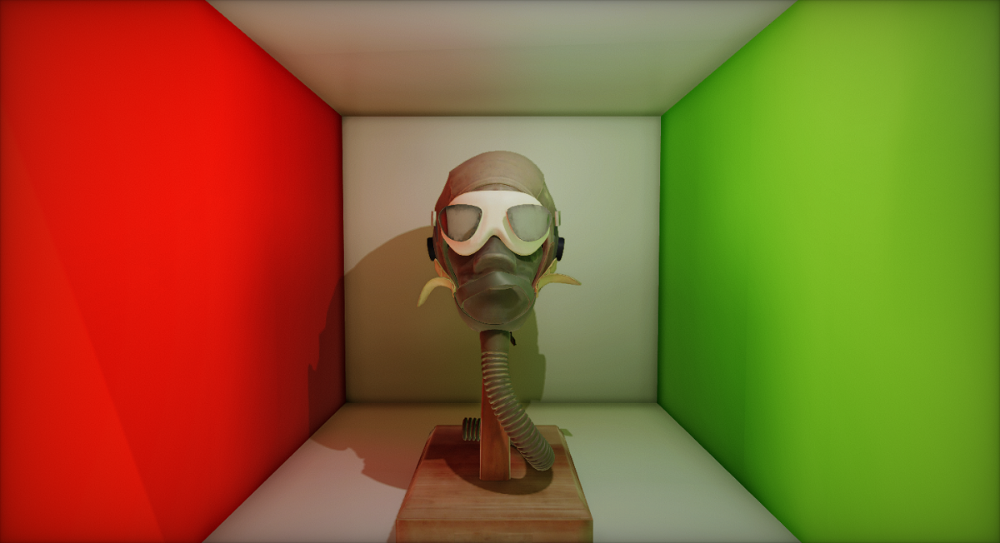
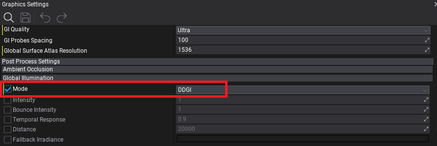
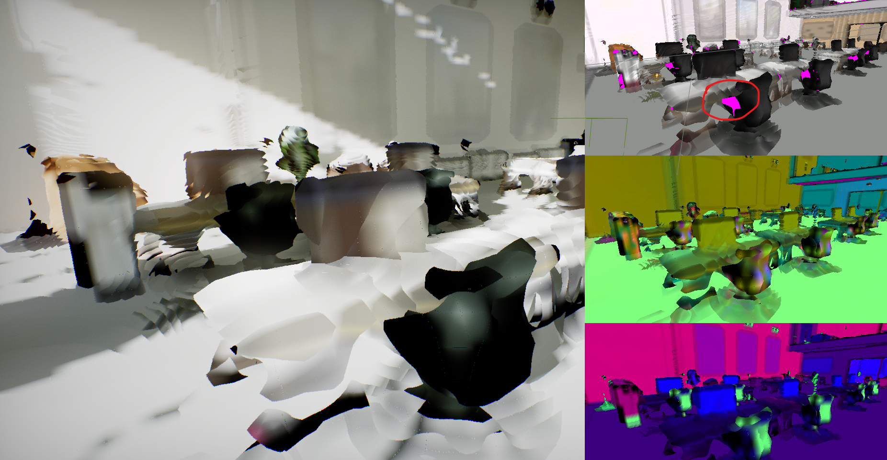
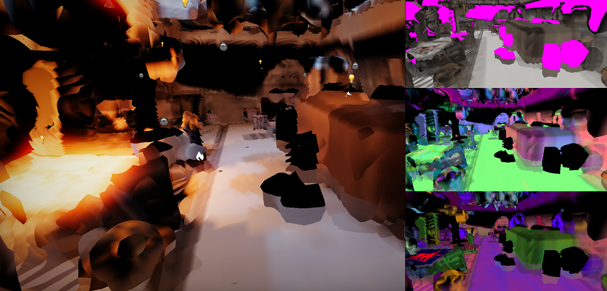
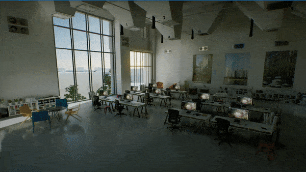

# HOWTO: Setup Realtime Global Illumination

In this tutorial you will learn how to setup Realtime Global Illumination in your project and use it to have realistic lighting in your scenes.

See the [Realtime Global Illumination](realtime.md) page to learn basics about GI in Flax.

## 1. Enable DDGI

First, open the [Graphics Settings](../../../editor/game-settings/graphics-settings.md) and in the *Global Illumination* section, under *Post Process Settings*, set **Mode** to **DDGI**. This will enable realtime GI rendering globally.

## 2. Enable Ray Traced Reflections

The next step is to enable using **Software Tracing** for **Trace Mode** in *Screen Space Reflections* settings (inside Graphics Settings). This will enable using the Global Surface Atlas raytracing as a fallback to normal screen-space tracing which will enhance the look of reflective surfaces by adding off-screen reflections of the whole scene.

### 3. Setup SDF

Now you need to ensure that all your scene meshes have proper [Signed Distance Fields](../../models/sdf.md) setup in order to be visible in Global SDF.

It's recommended to enable the **Generate SDF On Model Import** option in Graphics Settings which will change the default model import value to always generate SDFs on model import.

The next time a model is imported to the project, the Generate SDF option will be selected by default:

You can also manually generate SDFs for all your models in a project by using the Model Window's *SDF* section, or use the small utility in Editor under **Tools -> Build all meshes SDF** which will compute the SDF for all meshes on the scene. It might take some time and freeze your computer due to large amounts of data needing to be processed.

Use **View -> Debug View -> Global SDF** to inspect your scene and ensure that it has a good representation in SDF. It doesn't need to be exact but should roughly represent major scene objects - especially walls, floors and ceilings of structures.

### 3. Setup Surface Atlas

Now use **View -> Debug View -> Global Surface Atlas** to debug the surface cache rendering that uses the DDGI algorithm to calculate lighting inside the level. The Global Surface Atlas is a low-resolution representation of the scene, and combined with Global SDF can roughly represent the scene which is used by the DDGI raytracer (this shows *what the GI alrothim sees*). Follow the *Software Ray Tracing* and *Debugging Surface Atlas* sections in [DDGI](realtime.md) docs to learn more.

The important thing during this step is to split large objects with interiors into smaller chunks thus the Surface Atlas can represent these object surfaces and have bounces on them. A common problem is using interior meshes of the whole house or other buildings, wheras to have proper GI lighting inside, the structure should be divided into 2 or 3 parts (eg. separate walls and separate floor). By using the Global Surface Atlas debug view you can spot pink areas of the level that have missing representations in the atlas. If the area is large (eg. covers a significant part of the screen) then you should optimize the content to work better with the algorithm (eg. splitting meshes). Also, adding model LODs is a good practice as it greatly improves performance.

Below you can see an example of a non-ideal scene where the walls and some props are largly covered in a pink color which indicates missing coverage on the Global Surface Atlas.

### 4. Test results and iterate

Finally, you can test and validate GI in your scene. It should work fine after initial setup but might require some minor adjustments depending on your content and gameplay in the world.

For further adusting, aside from the things mentions above, use the *Temporal Response* to improve responsivness of GI for lighting changes (eg. if set to `0.8`) or increase it to make it more stable with less indirect lighting micro-flickering (eg. to `0.95`). You can also manually boost or reduce the GI *Intensity* and *Bounce Intensity* to control the artistic look of the lighting (eg. globally or per-scene with a Post Fx Volume).
