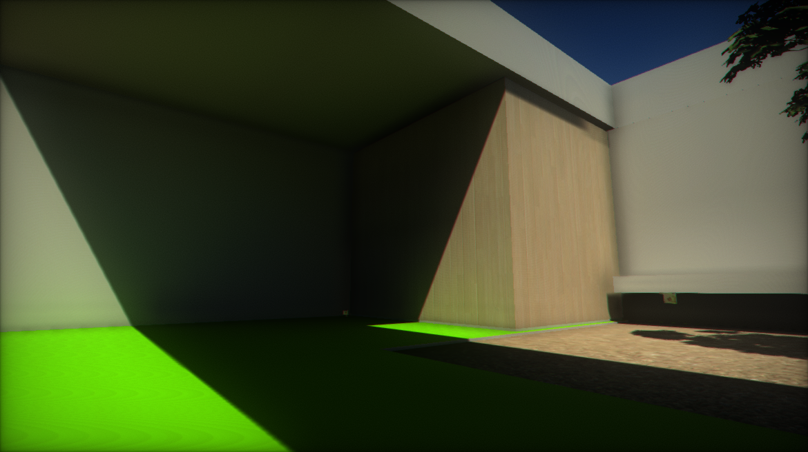

# Global Illumination

**Global Illumination** (shorten as *GI*) is a technique that models how light is bounced off of surfaces onto other surfaces. This effect is called indirect light transport and is highly complex to compute. Flax supports baking GI into lightmap textures in Editor. This highly improves the overall visual look of the scenes.

Follow this documentation section to learn more about how to use global illumination in your game.

## In this section

* [Lightmap UVs](lightmap-uvs.md)
* [Lightmapping](lightmapping.md)
* [Lightmap Settings](settings.md)
