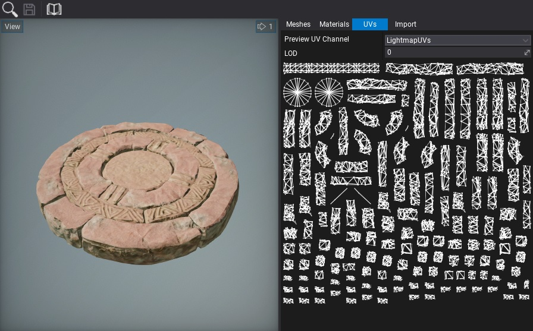

# Lightmap UVs

In order to use lightmap textures on the static objects, their geometry has to have valid lightmap texture coordinates channel. Many DDC tools have the option to generate this data during model exporting. Also, Flax supports the automatic generation of lightmap UVs on model import. You can adjust the lightmap texcoord import method by setting **Lightmap UVs Source** to *Disable*, *Generate*, *Channel0*, *Channel1*, *Channel2*, or *Channel3*,

Model Lightmap UVs can be view in the asset editor under **UVs** tab. To achieve the best lightmap results it's recommended to apply padding into the charts and separate object seams (as shown on a picture below).

