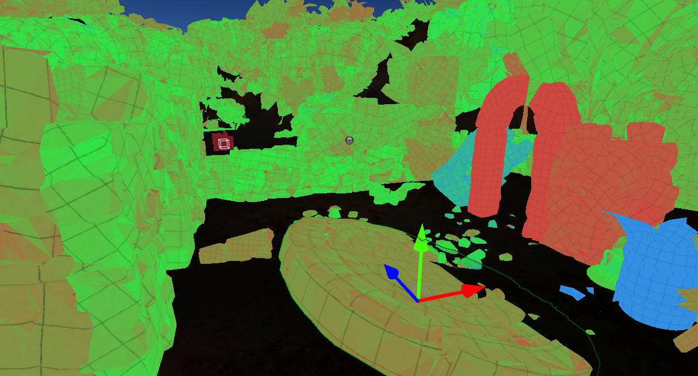

# Lightmap UVs

In order to use lightmap textures on the static objects, their geometry has to have valid lightmap texture coordinates channel. Many DDC tools have the option to generate this data during model exporting. Also, Flax supports the automatic generation of lightmap UVs on model import. You can adjust the lightmap texcoord import method by setting **Lightmap UVs Source** to *Disable*, *Generate*, *Channel0*, *Channel1*, *Channel2*, or *Channel3*,

## UVs preview

Model Lightmap UVs can be view in the asset editor under **UVs** tab. To achieve the best lightmap results it's recommended to apply padding into the charts and separate object seams (as shown on a picture below).

## UVs quality preview

The final quality of the baked lighting depends on the lightmap uvs quality, objects dimensions, and the [bake settings](settings.md). To identify issues with the lightmap coverage over the objects the **Lightmap UVs Density** view is recommended. In *Editor* viewport option **View -> Debug View -> Lightmap UVs Density** enables the preview of lightmap charts density.

Colors mapping:
* *red* - too low or invalid lightmap density (fix lightmap uvs or increase the object scale in lightmap)
* *green* - good density
* *blue* - too high lightmap density (reduce object scale in lightmap)

