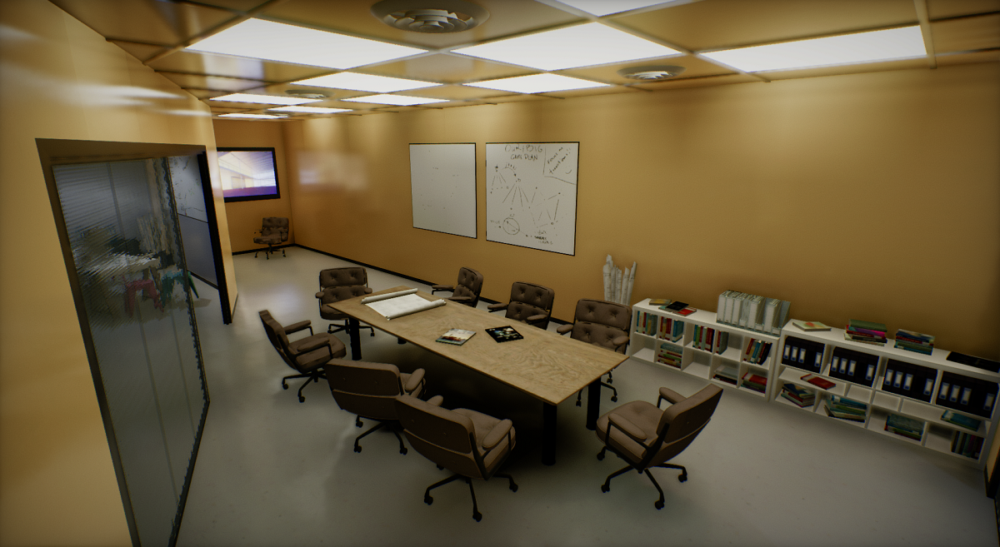
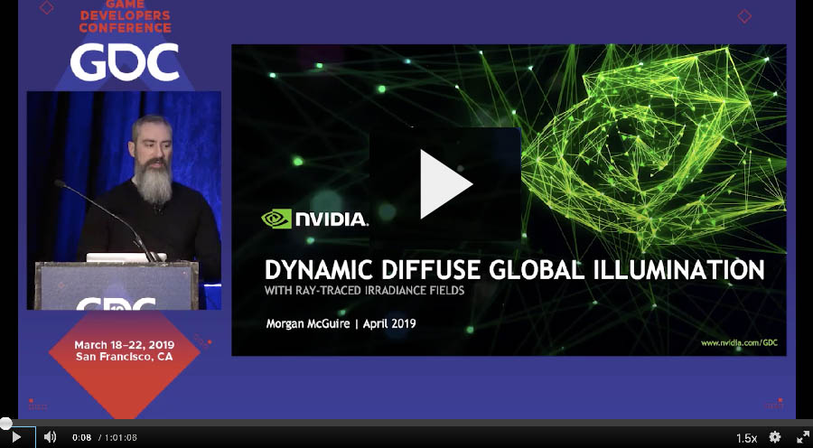
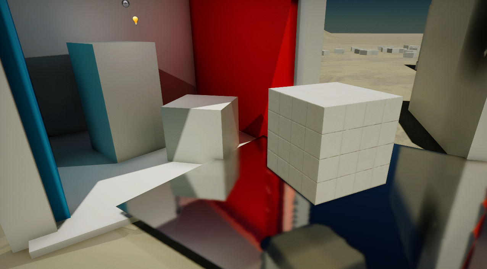
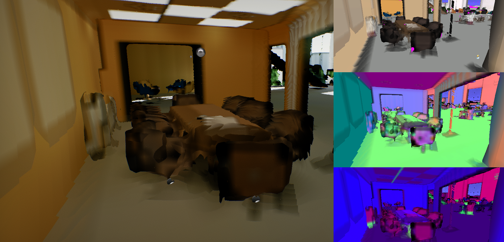
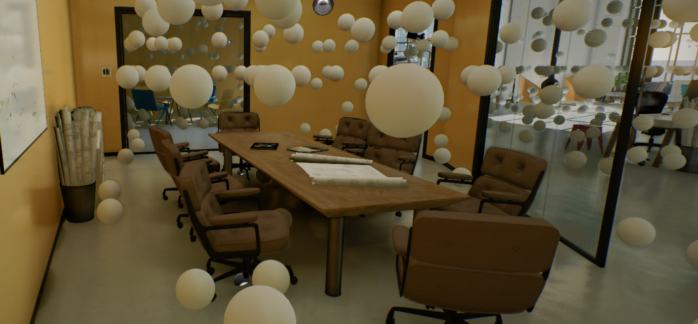

# Realtime Global Illumination

When creating large worlds or dynamic environments where lighting conditions are constantly changing (eg. because the time of day changes), you can use **Realtime Global Illumination** to render indirect light passing through the scene.

This documentation page explains how to use GI in your projects. It also includes some useful tips and tricks at the end.

## Tutorial

To learn how to quickly set up Realtime Global Illumination see [this tutorial](how-to-setup-gi.md).

## Dynamic Diffuse Global Illumination

[Dynamic Diffuse Global Illumination](https://morgan3d.github.io/articles/2019-04-01-ddgi/) (**DDGI**) is an algorithm implemented in Flax to render dynamic global illumination with indirect lighting. 

It uses light probes (world-space, automatically placed) to gather indirect lighting at a fixed location and then later sample it in materials (opaque, transparent and volumetric). To prevent light leaking, a common problem of light probe-based solutions, the DDGI algorithm renders a low-resolution depth buffer around each probe and applies the *Chebyshev* visibility weight.

DDGI probes are placed around the camera and are split into a series of cascades to cover the whole scene. When the camera moves though the scene, the probes are scrolled to maintain GI coverage.

### DDGI Algorithm

Flax's implementation of the DDGI algorithm uses custom a **Software Ray Tracing** solution and an automatically **scrolled probes volume** with up to **4 cascades**. Watch the video below to learn more about the technical and artistic aspects of this rendering feature:

Implementation is based on the following papers:
* "Dynamic Diffuse Global Illumination with Ray-Traced Irradiance Probes", Journal of Computer Graphics Tools, April 2019, Zander Majercik, Jean-Philippe Guertin, Derek Nowrouzezahrai, and Morgan McGuire
* "Scaling Probe-Based Real-Time Dynamic Global Illumination for Production", [https://jcgt.org/published/0010/02/01/](https://jcgt.org/published/0010/02/01/)
* "Dynamic Diffuse Global Illumination with Ray-Traced Irradiance Fields", [https://jcgt.org/published/0008/02/01/](https://jcgt.org/published/0008/02/01/)

### Using DDGI

In the Post Process *Global Illumination* settings of the [Graphics Settings](../../../editor/game-settings/graphics-settings.md) or in a [PostFX Volume](../../post-effects/post-fx-volumes.md) set **Mode** to **DDGI**.

Then you can adjust the following options:

| Option | Description |
|--------|--------|
| **Intensity** | Global Illumination indirect lighting intensity scale. Can be used to boost or reduce the GI effect. |
| **BounceIntensity** | Global Illumination infinite indirect lighting bounce intensity scale. Can be used to boost or reduce the GI effect for light bouncing on the surfaces. |
| **Temporal Response** | Defines how quickly GI blends between the the current frame and the history buffer. Lower values update GI faster, but with more jittering and noise. If the camera in your game doesn't move much, we recommend values closer to 1. |
| **Distance** | Draw distance of the Global Illumination effect. Scenes outside the range will use fallback irradiance. |
| **Fallback Irradiance** | The irradiance lighting outside the GI range used as a fallback to prevent a pure-black scene outside the Global Illumination range. |

Additional relevant options in the [Graphics Settings](../../../editor/game-settings/graphics-settings.md):

| Option | Description |
|--------|--------|
| **GI Quality** | The Global Illumination quality. Controls the quality of the GI effect. |
| **GI Probes Spacing** | The Global Illumination probes spacing distance (in world units). Defines the quality of the GI resolution. Adjust to 200-500 to improve performance and lower frequency GI data. |
| **Global Surface Atlas Resolution** | The Global Surface Atlas resolution. Adjust it if the atlas "flickers" due to overflow (eg. to 4096). |

You can adjust the maximum atlas resolution in Graphics Settings with the *Global Surface Atlas Resolution* property. Larger scenes where a high view distance is required should use a bigger atlas size to cover as many of the objects with gi as possible.

### Ray Traced Reflections

In addition to diffuse lighting, the specular lighting can be improved with Global Illumination by changing the **Trace Mode** to **Software Tracing** in the *Screen Space Reflections* category (in the Graphics Settings or in a PostFx Volume).

This uses our custom Software Tracing of the Global Surface Atlas as a fallback method to the default *Screen Tracing* (also known as *Screen Space Reflections*), which does screen-space, depth buffer tracing with scene color sampling.

This screen space rendering method however comes with one major limitation, that is that pixels that are visible on-screen can be used in reflections. With software raytracing using the Global SDF and the Global Surface Atlas, full-scene raytracing is used which provides reflections even for off-screen objects.

Using this feature can have a significant performance impact (between 0.5-1ms of GPU time), but drastically enhances the look of the scenes by making the lighting more realistic and complete.

### Software Ray Tracing

The key difference between the original DDGI algorithm and the Flax implementation is the use of custom **software raytracing instead of hardware raytracing**. That's because we wanted to support using realtime GI even on older hardware which often does not support RTX-features.

Our implementation uses *Signed Distance Fields* rasterized into the [Global SDF](../../models/sdf.md) to perform ray tracing in the scene. However, this returns only the intersection point between ray and scene geometry, while the GI also needs to evaluate the direct and bounced indirect lighting. 

To solve this, we implemented the **Global Surface Atlas**, which is a render pass that renders the surfaces scene objects which are near the camera into one giant atlas texture with projections of the object sides. This works similar to GBuffer rendering where materials output low-resolution color, emissive, roughness, normal, depth, etc. Then we light those pixels to evaluate direct and indirect lighting depending on the materials of the surfaces. Global Surface Atlas allows sampling these surfaces at an arbitrary location in the world, which makes it possible to evaluate lighting at the Global SDF trace hit location.

### Debug Visualization

The image above shows the Debug visualization of the Global Surface Atlas (access this via **View -> Debug View Global Surface Atlas** in any 3D viewport).

The main part of the view contains the rasterized Global SDF as well as sampled atlas lighting. **That's what the Software Raytracer sees** and what is used for evaluating Global Illumination, thus **it's essential to use this viewport to inspect the scene** when working on GI in your levels. 

On the right, starting from the top, you can see the Diffuse color of the Atlas surfaces, Normal vectors and packed other properties (AO, roughness, metalness).

As you can see, the Global Surface Atlas is a low-resolution representation of the scene, and combined with Global SDF has a **precision between 10-20cm nearby camera**. It can efficiently **cover a scene up to 500m** to have global lighting even far away from the camera. 

### Debugging the Surface Atlas

A common problem when working with DDGI in Flax is the inefficient representation of object surfaces in the Global Surface Atlas. In many cases that is caused by inaccurate SDF mesh representation, and in less frequent cases the object representation in the atlas is missing.

The debug viewport for Surface Atlas highlights **missing surface pixels with a pink color** inside the Diffuse viewport (the one in the upper right corner). This will usually be large meshes with interiors because the object projections are performed from 6 sides (top, bottom, left, right, front and back), so it misses the interior sides. 

Some minimal pink color spots can appear and are normal and not a bigger problem, but should still be minimized in order to achieve good indirect lighting quality. There are several ways to improve this in your scenes:

* Try splitting large objects into smaller parts (eg. house building walls split into 4 parts with separate roof and floor),
* Setting up LODs for meshes (Surface Atlas always uses the lowest LOD for rasterization).

### Debugging DDGI Probes

Use **View -> Debug View -> Global Illumination** to preview DDGI probes in a viewport. This is useful to see if the automatic probe relocation causes problems.

### DDGI Tips & Tricks

* Setup proper [Global SDF](../../models/sdf.md) for a scene.
* Use `StaticFlags` on static scene objects to optimize rendering.
* If an object surface changes color/ emissive frequently (eg. animated in a shader or toggled at runtime), remove `StaticFlags.Lightmap` from it. This will cause it to be updated frequently instead of being cached.
* Use LODs for complex meshes (Global Surface Atlas rasterization is faster for meshes with a lower triangle count).
* A material's **Position Offset is not supported** and might cause lighting issues.
* **Meshes need to have simple interiors** (eg. house model with separate walls) - use Global Surface Atlas debug view to analyze your content.
* Large emissive surfaces like a TV screen might need additional light sources to correctly cover specular lighting.
* Small emissive objects might flicker due to imperfections caused by reduced rendering resources resolution.

### DDGI Cost

 Total GPU memory usage of DDGI is between 200-400 MB (depending on quality and content):
* DDGI uses up to 69 MB of GPU memory (depending on quality) *(nice)*
* Global Surface Atlas uses around 49 MB of GPU memory (or more when using higher resolution)
* Global SDF uses up to 130 MB of GPU memory (depending on the quality)
* Models SDFs can use several MBs of GPU memory
