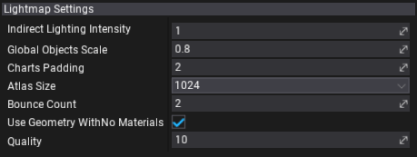

# Static Lighting Configuration

Lightmaps can be configured using various parameters:
* per-light **Indirect Lighting Intensity** - can be used to boost or reduce light influence into static lighting
* per-model/mesh **Scale In Lightmap** - can be used to boost or reduce lightmap quality for the given object (higher scale results in higher resolution of the lightmap texture for the given object)
* per-scene **lightmap baking settings**

# Lightmap Settings

Select [Scene](../../../get-started/scenes/index.md) actor to edit lightmap settings per-scene.

| Property | Description |
|--------|--------|
| **Indirect Lighting Intensity** | Controls how much all lights will contribute indirect lighting. |
| **Global Objects Scale** | Global scale for objects in lightmap to increase quality |
| **Charts Padding** | Amount of pixels space between charts in lightmap atlas |
| **Atlas Size** | Single lightmap atlas size (width and height) |
| **Bounce Count** | Amount of indirect light GI bounce passes |
| **Compress Lightmaps** | Enable/disable compressing lightmap textures (3 textures per lightmap with RGBA data in HDR) |
| **Use Geometry With No Materials** | Enable/disable rendering static light for geometry with missing or empty material slots |
| **Quality** | GI quality (range  [0;100]) |
