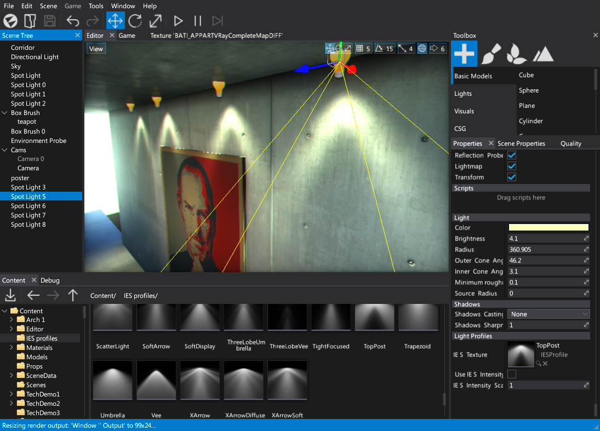
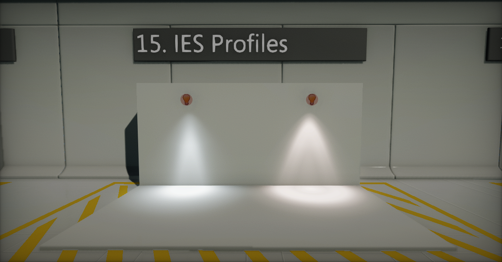

# IES Light Profiles

**IES Profiles** are assets that contain information about light intensity of the light build around the arc. They are used to simulate real-life lights emission properties. Using IES Profiles for [Point Lights](light-types/point-light.md) and [Spot Lights](light-types/spot-light.md) adds more realism and highly recommended for architectural visualizations.

## Importing IES Profiles

Flax supports importing IES Profiles from `.ies` files. Importing process works the same as for other assets except they don't need any additional import settings.

To get IES profiles goto the lighting manufacturer site (e.g. [Philips](http://www.usa.lighting.philips.com/support/support/literature/photometric-data)). Almost all major lighting manufactures provide them free of charge.

## Using IES Profiles

After importing IES Profile simply drag and drop it to the point or spot light `IES Texture` property.
Additionally you can use imported IES brightness and scale it.

