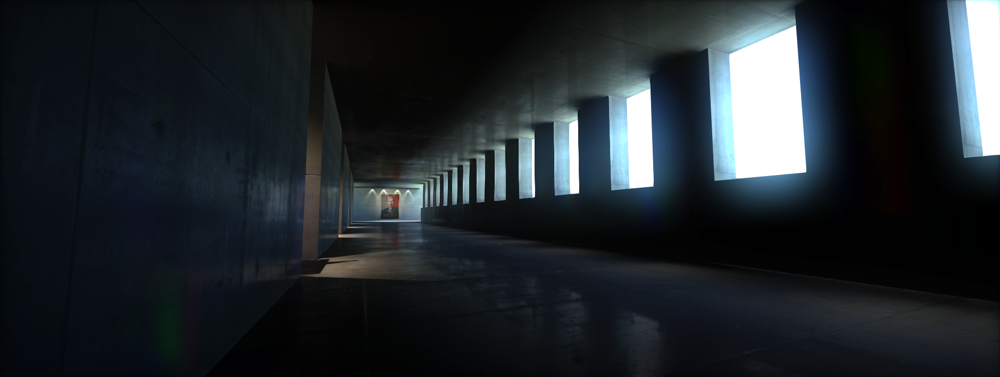

# Lighting

In this section you can learn more about the advanced lighting features available in Flax Engine.
All subpages break down the major aspects of the lighting the environment. Follow these instructions to create realistic looking scenes.

## In this section

* [Light Types](light-types/index.md)
 * [Directional Light](light-types/directional-light.md)
 * [Point Light](light-types/point-light.md)
 * [Spot Light](light-types/spot-light.md)
 * [Sky Light](light-types/sky-light.md)
* [Shadows](shadows.md)
* [IES Light Profiles](ies-profiles.md)
* [Sky and Skybox](sky-skybox/index.md)
 * [Sky](sky-skybox/sky.md)
 * [Skybox](sky-skybox/skybox.md)
* [Reflections](reflections/index.md)
 * [Environment Probe](reflections/env-probe.md)
* [Global Illumination](gi/index.md)
 * [Lightmap UVs](gi/lightmap-uvs.md)
 * [Lightmapping](gi/lightmapping.md)
 * [Lightmap Settings](gi/settings.md)

