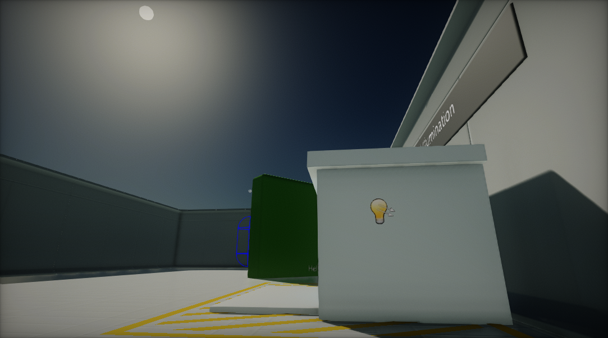
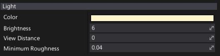
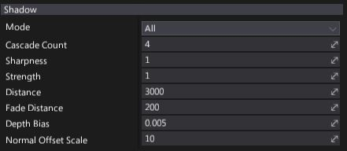

# Directional Light

**Directional Light** emits light uniformly from a single direction. Directional Lights are useful for simulating large, distant light sources such as the sun.

## Light Properties

| Property | Description |
|--------|--------|
| **Color** | Light emission color. |
| **Brightness** | Light brightness parameter. Controls intensity of the light emitted by this actor. |
| **View Distance** | Controls light visibility range. The distance at which the light be completely faded. Use value 0 to always draw a light. |
| **Minimum Roughness** | Controls the minimum roughness value used to clamp material surface roughness during shading. Can help with softening specular highlights. |

## Shadow Properties

| Property | Description |
|--------|--------|
| **Mode** | Describes how visual element casts shadows. Possible options:  <table><tbody><tr><th>Option</th><th>Description</th></tr><tr><td>**None**</td><td>Never render shadows.</td></tr><tr><td>**Static Only**</td><td>Render shadows only in static views (env probes, lightmaps, etc.).</td></tr><tr><td>**Dynamic Only**</td><td>Render shadows only in dynamic views (game, editor, etc.).</td></tr><tr><td>**All**</td><td>Always render shadows.</td></tr></tbody></table> |
| **Cascade Count** | The number of cascades used for slicing the range of depth covered by the light during rendering shadows. Values are 1, 2 or 4 cascades; a typical scene uses 4 cascades. |
| **Sharpness** | Controls shadows sharpness. Can be used to tweak the penumbra width. |
| **Strength** | Controls dynamic shadows blending strength. Default is 1 for fully opaque shadows, value 0 disables shadows. |
| **Distance** | Light shadows rendering distance (in world units). |
| **Fade Distance** | Light shadows fade off distance (in world units). |
| **Depth Bias** | Controls dynamic shadows depth bias value. Depth bias used for shadow map comparison. |
| **Normal Offset Scale** | Controls dynamic shadows normal vector offset scale. A factor specifying the offset to add to the calculated shadow map depth with respect to the surface normal. |
| **Contact Shadows Length** | The length of the rays for contact shadows computed via the screen-space tracing. Set this to values higher than 0 to enable screen-space shadows rendering for this light. This improves the shadowing details. Actual ray distance is based on the pixel distance from the camera. |

> [!Note]
> To learn more about shadows in Flax see [this page](../shadows.md).

## Volumetric Fog Properties

| Property | Description |
|--------|--------|
| **Scattering Intensity** | Controls how much this light will contribute to the [Volumetric Fog](../../fog-effects/volumetric-fog.md). When set to 0, there is no contribution. |
| **Cast Shadow** | If checked, light will cast a volumetric shadow to [Volumetric Fog](../../fog-effects/volumetric-fog.md). Also shadows casting by this light should be enabled in order to make it cast volumetric fog shadow. |

> [!Note]
> To learn more about Volumetric Fog effect see [this page](../../fog-effects/volumetric-fog.md).
