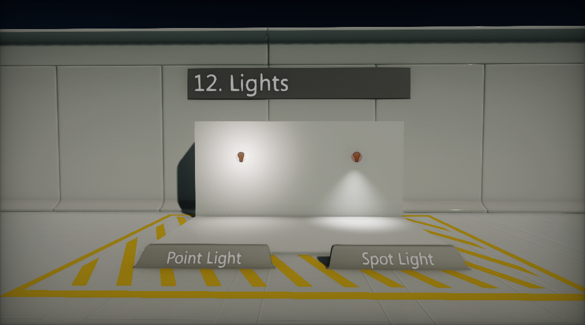
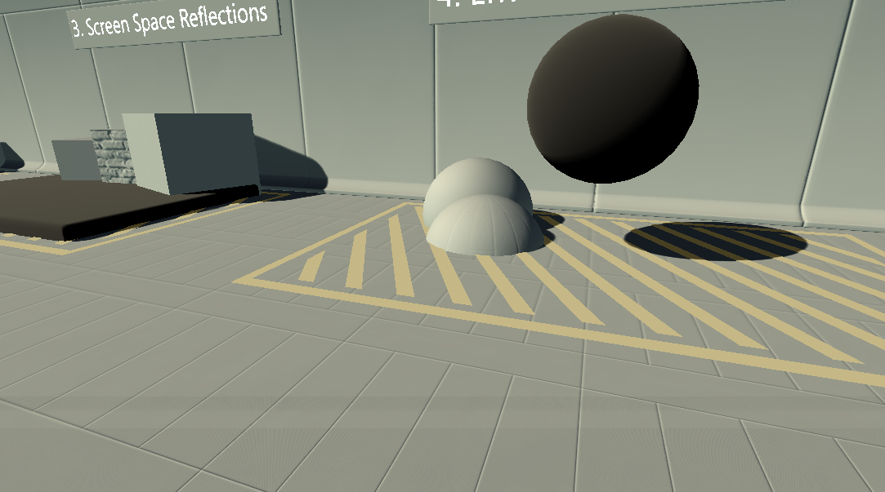
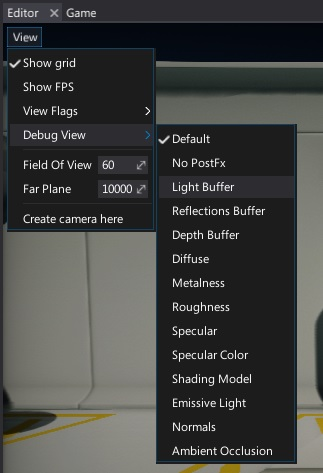

# Light Types

Flax supports 4 different types of lights:
- **Directional** Light
- **Point** Light
- **Spot** Light
- **Sky** Light

Each light type has a little different usage and own set of properties. This section covers details about them and describes how to use lights in you scenes.

## In this section

* [Directional Light](directional-light.md)
* [Point Light](point-light.md)
* [Spot Light](spot-light.md)
* [Sky Light](sky-light.md)

## Visualizing

Flax Editor provides in-build option to debug *light buffer* contents right inside the editor viewport. To do this, click the **View** widget and select option **Debug View -> Light Buffer**. This will change view mode. To revert choose *Default* option.

> [!Note]
> To learn more about *Debug View* and other debugging tools see related page [here](../../debugging-tools/debug-view.md).
> 