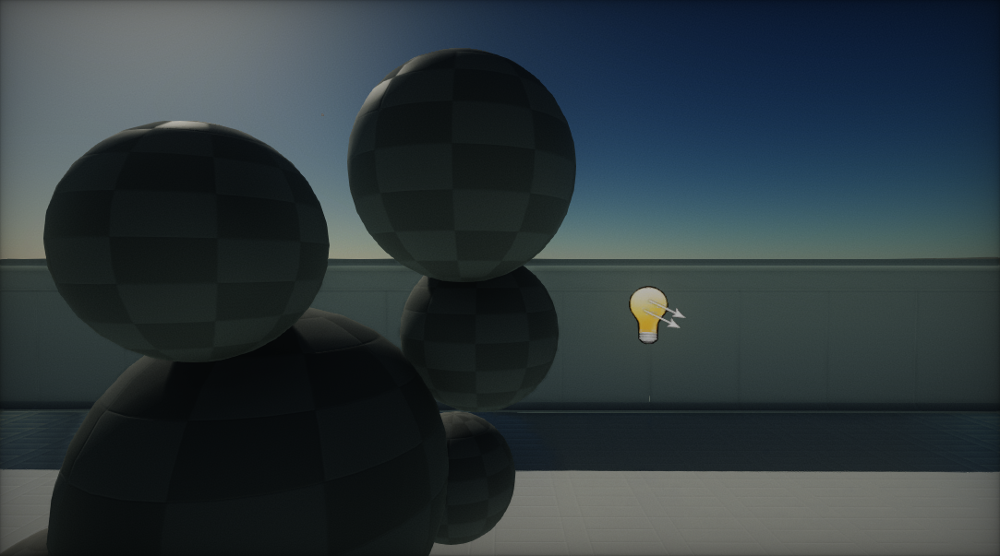
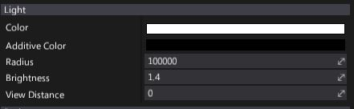
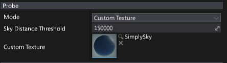

# Sky Light

A **Sky Light** draws an ambient light emitted by the [skybox](../sky-skybox/skybox.md), [sky](../sky-skybox/sky.md) or other distant parts of the scene. It helps with [image-based lighting (Wikipedia)](https://en.wikipedia.org/wiki/Image-based_lighting).

Sky lights are a very good choice for outdoor scenes where a lot of sky is visible. Under the hood a Sky Light uses a [cube texture](../../textures/cube-textures.md) and samples it (low mip map) to simulate realistic directional irradiance. A Sky Light can use a custom texture or a baked one. To update the capture, press the **Bake** button under the object properties.

## Light Properties

| Property | Description |
|--------|--------|
| **Color** | Light emission color. |
| **Additive Color** | Additional light color to add. Source texture colors are sumed with it. Can be used to apply a custom ambient color. |
| **Radius** | Light range (in world units). Use a very high value to apply light globally. |
| **Brightness** | Light brightness parameter. Controls the intensity of the light emitted by this actor. |
| **View Distance** | Controls light visibility range. The distance at which the light becomes completely faded. Use a value of 0 to always draw a light. |

## Probe Properties

| Property | Description |
|--------|--------|
| **Mode** | Defines the sky light source mode. Possible options: |
| **Sky Distance Threshold** | Distance from the light at which any geometry should be treated as part of the sky (in world units).  Possible options: <table><tbody><tr><th>Option</th><th>Description</th></tr><tr><td>**Capture Scene**</td><td>The captured scene will be used as a light source.</td></tr><tr><td>**Custom Texture**</td><td>The custom cube texture will be used as a light source.</td></tr></tbody></table>|
| **Custom Texture** | Custom light texture. Used only if *Mode* is set to *Custom Texture*. |

If **Mode** is set to **Capture Scene**, then use the **Bake** button to update the captured image.

> [!Note]
> To learn more about cube textures in Flax see [this page](../../textures/cube-textures.md).

## Volumetric Fog Properties

| Property | Description |
|--------|--------|
| **Scattering Intensity** | Controls how much this light will contribute to the [Volumetric Fog](../../fog-effects/volumetric-fog.md). When set to 0, there is no contribution. |
| **Cast Shadow** | If checked, light will cast a volumetric shadow to [Volumetric Fog](../../fog-effects/volumetric-fog.md). Also shadow casting by this light should be enabled in order to make it cast volumetric fog shadows. |

> [!Note]
> To learn more about Volumetric Fog effect see [this page](../../fog-effects/volumetric-fog.md).
