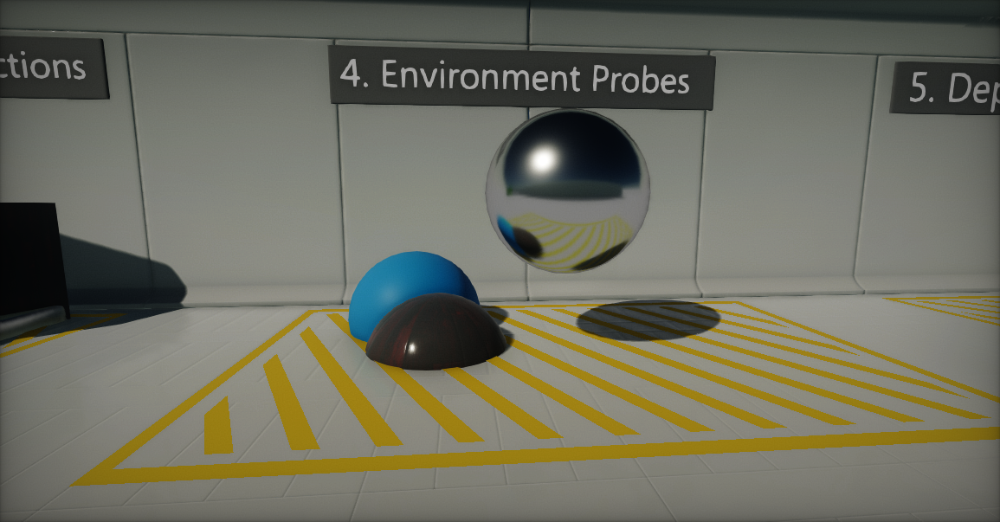
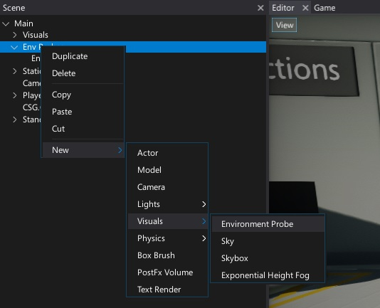
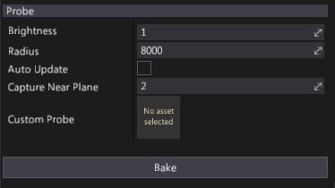
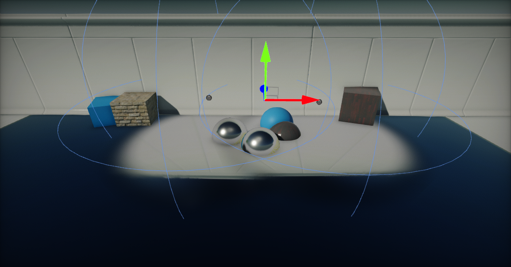

# Environment Probe

[Environment Probe](http://docs.flaxengine.com/api/FlaxEngine.EnvironmentProbe.html) actor uses cube texture and applies it onto the objects as reflection source. This technique is called reflection mapping and comes very handy to reproduce reflective surfaces like metals, marbles or shiny plastics.

## Creating a new reflection probe

Creating reflection probes is done similar to other actor types. Simply right click on a actor node in the *Scene* window, and select option **New -> Visuals -> Environment Probe**.

Creating probes at runtime via script is also possible but not recommended. It's better to toggle existing probes visibility or modify **Brightness** property to fade in or out.

Alternatively you can use a *Toolbox* window and drag and drop environment probe actor from group **Visuals** into a scene.

## Properties

| Property | Description |
|--------|--------|
| **Brightness** | Controls intensity of the reflection color from the probe. Can be used to fade in or out reflection. |
| **Radius** | Reflection probe influence range. |
| **Auto Update** | If checked, probe will be baked by auto every time actor is transformed (moved, rotated, or scaled). |
| **Capture Near Plane** | Defines a near clipping plane used for rendering probe. Use higher value to clip geometry near the probe. |
| **Custom Probe** | If specified, environment probe will use custom [CubeTexture](http://docs.flaxengine.com/api/FlaxEngine.CubeTexture.html) as a reflections source. |

To capture the scene around the reflection probe press the **Bake** button. It will render the scene in each 6 directions into a cube map and filter it. During reflection probes rendering only actors with [StaticFlags.ReflectionProbe](http://docs.flaxengine.com/api/FlaxEngine.StaticFlags.html) enabled will be visible.

Updated environment probe cube textures are stored in a *SceneData* folder. To read more about see the `Scene Data storage` section down below.

## Blending

Flax Engine renders reflection probes using a dedicated pass using screen space shader into a dedicated buffer. Then mixes final reflection color into the light buffer. This gives opportunity to perform high quality **per-pixel relfections color blending**. Rendering starts from drawing probes with the highest radius and then the smaller ones (**probes are sorted by radius**). Also reflection color is being faded on the edges of the probe bounds. This results in a smooth transition and reduces any flickering. Especially for dynamic objects that move quickly through the scene.

## Scene Data storage

By default Flax uses a dedicated content directory for **scene data assets**. It's used by the lightmaps, CSG meshes and also Environment Probes. Reflection probes cube textures are located in: **Content/SceneData/'scene_name'/EnvProbes**. If you want to reuse baked reflection probe or modify it you can access textures in there. Also Environment Probe actor contains a dedicated public property [EnvironmentProbe.Probe](http://docs.flaxengine.com/api/FlaxEngine.EnvironmentProbe.html#FlaxEngine_EnvironmentProbe_Probe) which can be used to access the cube texture being in use.

To learn more about the scene assets see [Scene Data Storage](../../../get-started/scenes/scene-data.md) page.