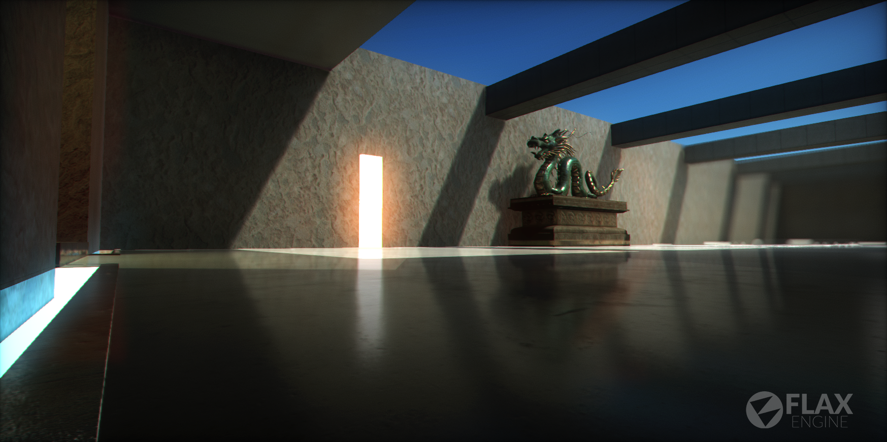
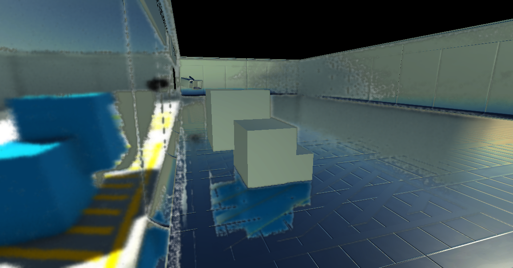
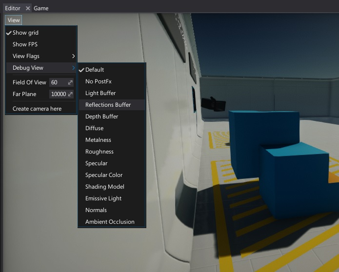

# Reflections

One of the key aspects in bringing realism into your scenes is creating a proper **reflection environment**.
Many materials like metals, marbles or shiny plastics rely on having reflections in all directions.
Flax Engine offsers wide variety of features to setup scenes for reflections.

## Environment Probes

The best way to add reflections into your scene is to use an **Environment Probe** actor. It's a dedicated object that captures the scene around its origin and creates a 360-degree cubemap that is later used to calculate per-pixel reflections on materials.

Reflection probes should generally be placed at strategic points, where the appearance of a reflective object would change noticeably (eg. tunnels, areas near buildings and places where the ground colour changes). When a reflective object passes near a probe, the reflection sampled by the probe can be used for the object’s reflection map. Furthermore, when several probes are nearby or even overlap, Flax can interpolate between them to allow for gradual changes in reflections. Thus, the use of reflection probes can create quite convincing reflections with acceptable processing overhead.

To learn more about placing and using *environment probes* see this dedicated [page](env-probe.md).

## Screen Space Reflections

Using environment probes may be very limited, and in many siturations objects may suffer from invalid reflection color. For those situations, using the **Screen Space Reflections** (*SSR*) effect helps with creating realistic local reflections. This effect is rendered in screen space, which means only objects that are already on the screen can be reflected (it doesn't work for offscreen or obscured objects).

This means SSR works well in enclosed areas such as corridors and rooms, but less well in open spaces, where you'd expect more of the world to be reflected. They also work best on bumpy surfaces, which hide imperfections in reflections, and less well on very glossy, mirror-like surfaces. Missing reflections are noticeable in mirrors, for example. As a fallback, values from existing Environment Probes are used for reflection color.

To learn more about using *Screen Space Reflections* see the dedicated [page](../../post-effects/screen-space-reflections.md).

## Visualizing

Flax Editor provides a built-in option to debug full scene reflections right inside the editor viewport. To do this, click the **View** widget and select the option **Debug View -> Reflections Buffer**. This will change theview mode. To revert choose *Default* option.

> [!Note]
> To learn more about *Debug View* and other debugging tools see the related page [here](../../debugging-tools/debug-view.md).