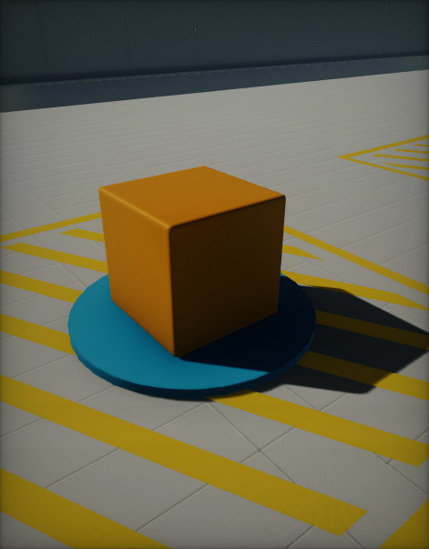
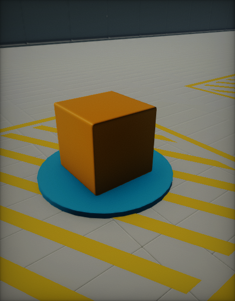
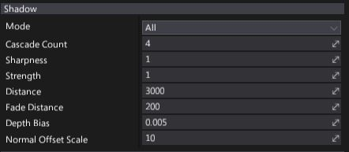

# Shadows

Using **shadows** brings a significant information and realism into a scene.

| **With shadows** | ***Without shadows*** |
|--------|--------|
|||

## Shadow mapping

Flax Engine uses clasical **shadow mapping** technique to render light shadows. Basically, it renders a **shadow map** from the light source. If the light can see the pixel, the light is illuminated. If it can not, the pixel is in shadow. Learning by using various shadow sampling techniques may be smoothened to simulate shadow penumbra.

## Settings

Every [light type](light-types/index.md) contains a settings group related to the shadows rendering.

