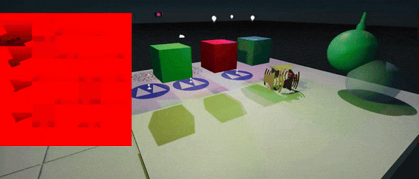
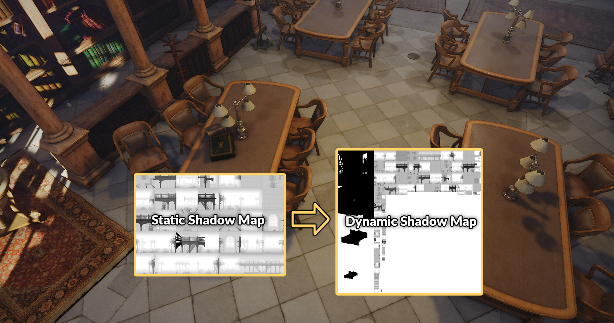

# Shadows

Using **shadows** brings significant information and realism into a scene.

| **With shadows** | ***Without shadows*** |
|--------|--------|
|||

## Shadow mapping

Flax Engine uses the classical **shadow mapping** technique to render light shadows. Basically, it renders a **shadow map** from the light source. If the light can see the pixel, the light is illuminated. If it can not, the pixel is in shadow. Learning by using various shadow sampling techniques may be smoothened to simulate a shadow penumbra.

### Shadow Atlas

Engine **draws shadow projections into a single shadow map atlas** to optimize performance, allow variable update rate and shadows caching. Each light can allocate the slots in the atlas. Spot lights use 1 projection, point lights 6, directional lights equal to CSM Count. Slot **resolution is calculated based on the screen size of the light**. This allows for reduction of shadows quality for lights that are small or are far away from the camera.

### Static Shadows

Shadow Map Atlas will support automatic shadow caching for static lights and static geometry. Lights marked with *Static Flag* `Shadows` can prerender static geometry into the intermediate shadow map. Then when updating the shadow, cached static shadow can be copied and only dynamic objects are rendered. This drastically improves both GPU and CPU performance in complex scenes with point/spot lights that are casting shadows.

### Update Rate

Lights can define the update rate for shadow updates. Value `1` means that the shadow will be updated every frame, value `0.5` defines every 2nd frame update, and so on. The inverted update rate equals the difference in frame in-between updates. This frame gap can be non-integer and a fractional part is accumulated thus while updates can happen only at sequential frames the total update average statistics will be close to the specified value.

Lowering the update rate for the shadow improves the performance as the shadowmap rendering is called less often thus CPU and GPU performance increases.

This rate can be additionally lowered when light is far away from the view via *Update Rate At Distance* property. For example, if light is near view, it will get normal frequent shadow updates but this rate will be scaled down linearly once camera start to move away from the light.

## Contact Shadows

**Contact Shadows** are local-shadows, ray-traced in screen-space, and customizable per light. They can enrich the scene lighting by adding more details to the geometry. This feature can be controlled via the **Contact Shadows Length** value which defines the length of the rays for contact shadows computed via screen-space tracing. Set this to values higher than 0 to enable screen-space shadow rendering per-light. This improves the shadowing details. The actual ray distance is based on the pixel distance from the camera.

## Settings

Every [light type](light-types/index.md) contains a settings group related to shadow rendering.

