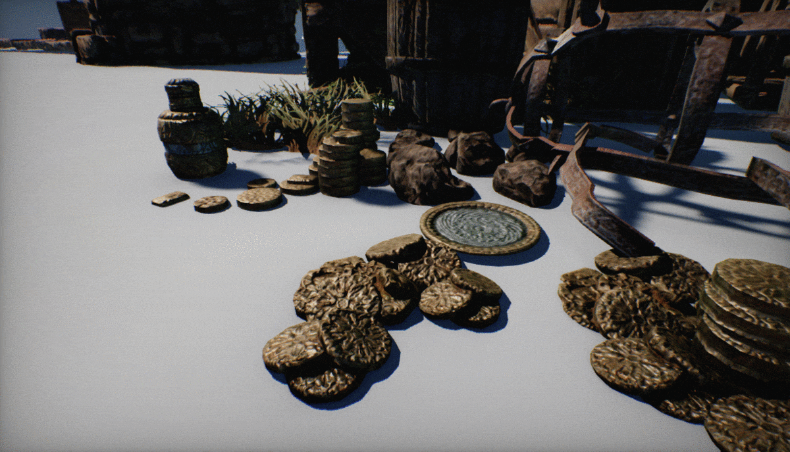

# Shadows

Using **shadows** brings significant information and realism into a scene.

| **With shadows** | ***Without shadows*** |
|--------|--------|
|||

## Shadow mapping

Flax Engine uses the classical **shadow mapping** technique to render light shadows. Basically, it renders a **shadow map** from the light source. If the light can see the pixel, the light is illuminated. If it can not, the pixel is in shadow. Learning by using various shadow sampling techniques may be smoothened to simulate a shadow penumbra.

## Contact Shadows

**Contact Shadows** are local-shadows, ray-traced in screen-space, and customizable per light. They can enrich the scene lighting by adding more details to the geometry. This feature can be controlled via the **Contact Shadows Length** value which defines the length of the rays for contact shadows computed via screen-space tracing. Set this to values higher than 0 to enable screen-space shadow rendering per-light. This improves the shadowing details. The actual ray distance is based on the pixel distance from the camera.

## Settings

Every [light type](light-types/index.md) contains a settings group related to shadow rendering.

