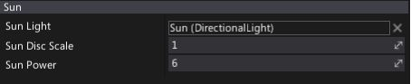

# Sky

The **Sky** actor gives an approximation of light scattering through a planetary atmosphere. This can give your outdoor levels a much more realistic look.

## Properties

| Property | Description |
|--------|--------|
| **Sun Light** | Reference to a [Directional Light](../light-types/directional-light.md) actor that will be used for sun approximation. |
| **Sun Disc Scale** | Size of the sun disc rendered on a sky. |
| **Sun Power** | Sun intensity parameter used to adjust the brightness. |
