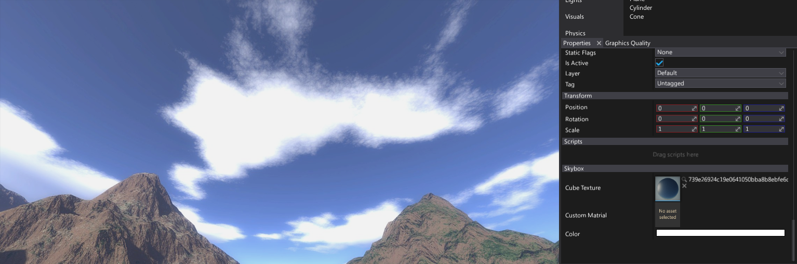
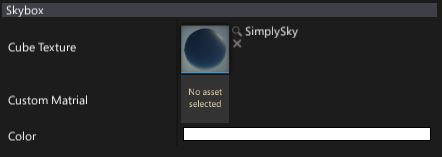
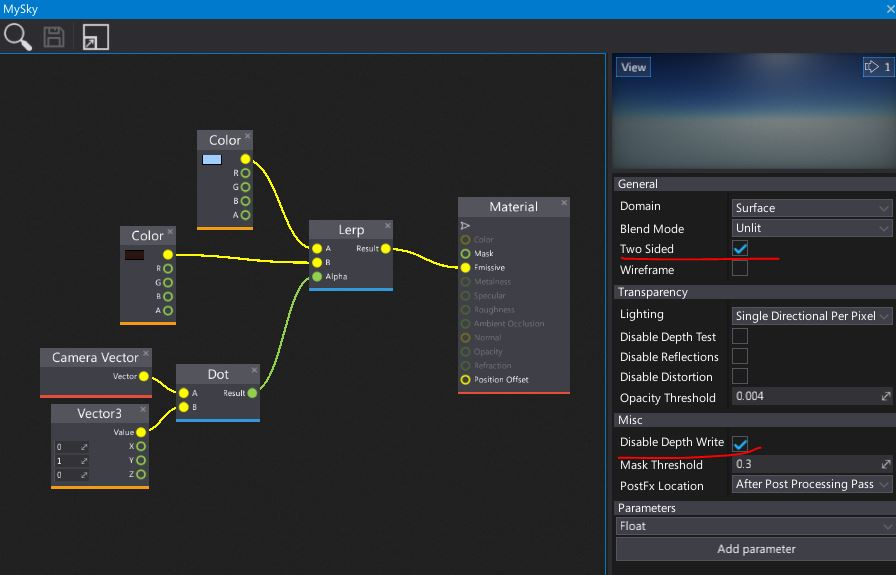

# Skybox

Using a **Skybox** creates a background for your scene. Typical skybox contains skies, clouds, mountains, and other distant scenery. Skyboxes use pre rendered cube textures.

> [!Note]
> To learn more about importing and using cube textures see related documentation [page here](../../textures/cube-textures.md).

## Properties

| Property | Description |
|--------|--------|
| **Cube Texture** | Cube texture used to draw a skybox |
| **Custom Material** | Custom material asset to override the default one. |
| **Color** | Skybox texture color multiplier |

## Custom skybox material

By default skybox uses provided cube texture and samples it creating illusion of 3D environment. However, this behaviour can be overridden by specifying a **custom material**. Then it will be rendered with a sphere model.

> [!Note]
> Custom material should be **Two Sided** and has checked option **Disabled Depth Write**.

Here is a sample material that can be used for a simple **2-gradient sky**:

