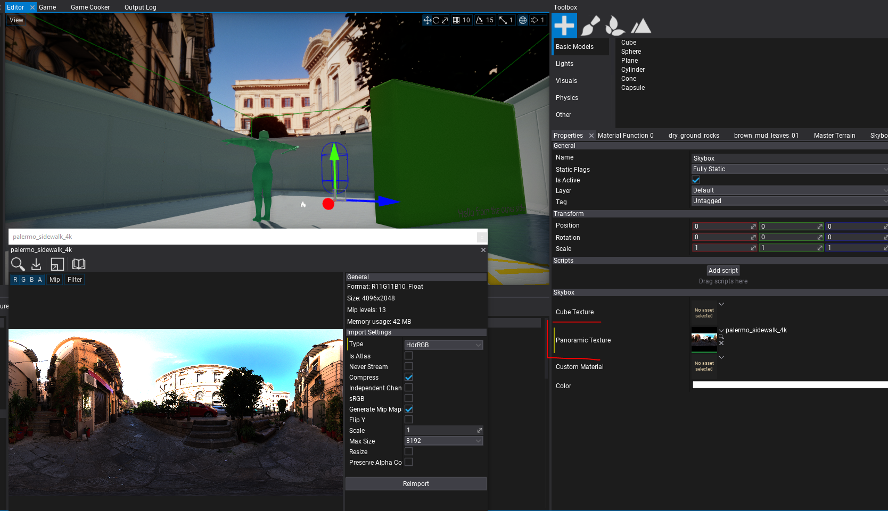
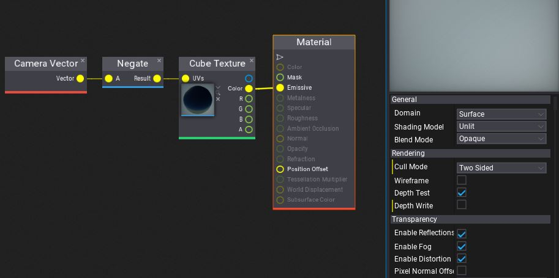

# Skybox

Using a **Skybox** creates a background for your scene. A typical skybox contains skies, clouds, mountains, and other distant scenery. Skyboxes use pre-rendered cube textures or panoramic textures.

> [!Note]
> To learn more about importing and using cube textures see the related documentation [page here](../../textures/cube-textures.md).

## Properties

| Property | Description |
|--------|--------|
| **Cube Texture** | The cube texture to draw. |
| **Panoramic Texture** | The panoramic texture to draw. It should have a resolution ratio close to 2:1. |
| **Custom Material** | Custom material asset to override the default one. |
| **Color** | Skybox texture color multiplier |
| **Exposure** | The skybox texture exposure value. Can be used to make the skybox brighter or dimmer. |

## Panoramic texture

If a panoramic texture is assigned it will be mapped into the 360 degree of the sphere. It should have a resolution ratio close to 2:1 - Longitude / Latitude (Panoramic) skybox: 2:1 aspect ratio (eg. 8192/4096, 4096/2048, 2048/1024).

## Custom skybox material

By default, a skybox uses the provided cube texture and samples it creating an illusion of a 3D environment. However, this behaviour can be overridden by specifying a **custom material**. The customer material will be rendered with a sphere model.

To create such a material ensure to:
* Change the **Cull Mode** to **Two Sided**
* Uncheck the **Depth Write** option

When editing a sky box shader in the *Material Window* you can **uncheck Show -> Default Scene** for a better live preview.

Here is a sample material that can be used for a simple **2-gradient sky**:

Here is a sample material that can be used for a simple **cubemap-sky**:

