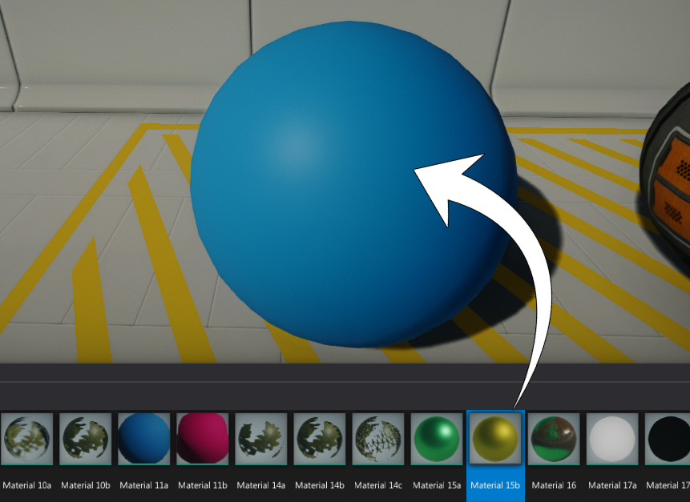
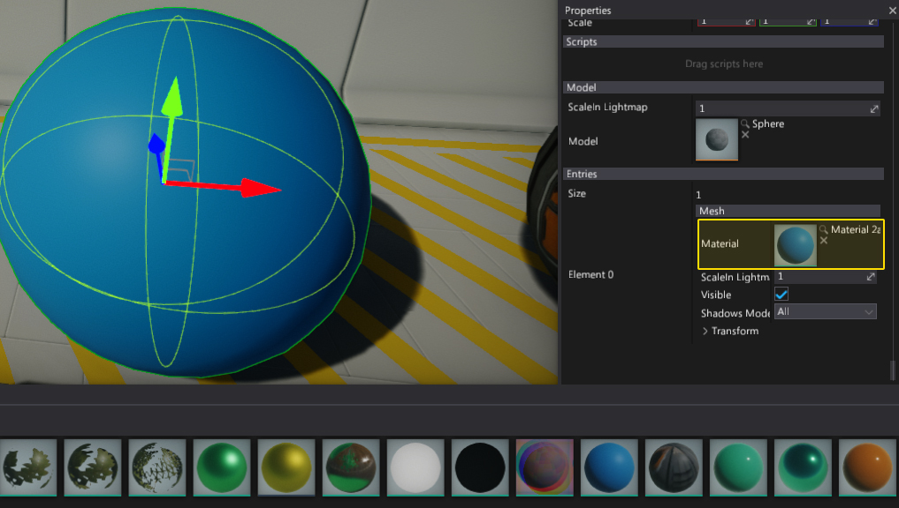
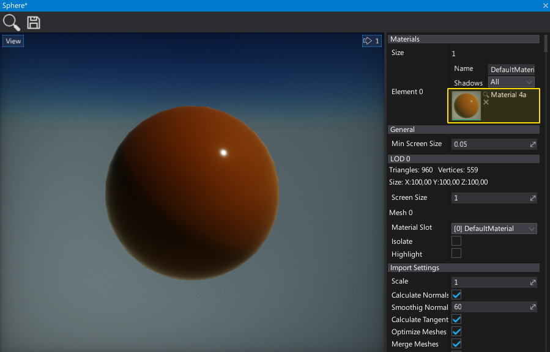

# Materials Basics


A **Material** defines the appearance of the model's surfaces and how they react to light. Each material describes not only its color but also how it reflects and emits light. All those properties are used by the Flax rendering pipeline to produce realistic lighting (*Physically Based Rendering*).

# Creating a new material

1. In the *Content* window navigate to the *Content* folder

2. Right click in the empty area

3. Select the option *New* -> *Material*

    

4. Specify a new material name and press *Enter*

5. Double click on a material

    

6. The [Material Editor](../material-editor/index.md) window is displayed

# Material nodes

The first and most important thing to know about material editing is that they are made of nodes. Each node generates a snippet of HLSL code. In that way, connected node networks produce the output of the full material's source code. This means that the user creates a material using visual scripting instead of writing code.


The above picture shows a sample of a mahogany floor's surface properties. However it's important to say that the material node's network does not need to be so simple. In many cases, artists create complex materials to achieve the desired look.

To learn more about the materials editor you can find more documentation in the [Material Editor](../material-editor/index.md) section.

# Using textures

The most common way to supply details to material surfaces is by using **Textures**. In the case of materials, textures are simply images that provide some sort of pixel-based data. This data may be the color of an object, how shiny it is, its transparency, and a variety of other aspects. There is an old-school mode of thought that *texturing* is how you apply color to your game models. While the process of creating textures is still critical, it is important to think of textures as a component of materials, and not as the end result themselves.

A single material may use several different textures for different purposes. For instance, a simple material may have a diffuse color texture, a roughness map and a normal map. 

To use a texture in a material, simply drag & drop it from the *Content* window into the material surface. It will automaticly create a proper texture sampling node. Alternativly you can create a new *Texture* or *Normal Map* node.


To learn more about textures pipeline you can find more documentation in the [Textures](../../textures/index.md) section.

# Applying a material to a model

There are several ways to apply materials to the model:

- *Drag & Drop* the material asset right onto the model



- *Drag & Drop* the material asset into the properties window



- Assign the material to the model material slot



- Set the material using a C# script

```cs
public class SetMaterial : Script
{
    [Tooltip("Material to assign to the model")]
    public Material Material;

    public override void OnStart()
    {
        Actor.As<StaticModel>().SetMaterial(0, Material);
    }
}
```

