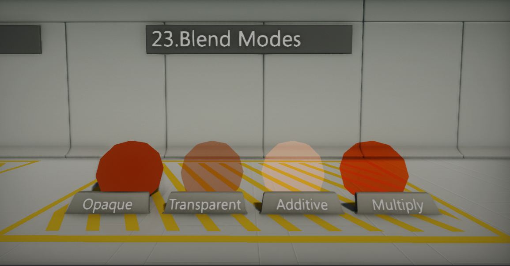

# Blend Modes

The material **Blend Mode** property describes how to mix the material surface color with the background colors. In a more specific way, the process can be described as blending the material pixels (*source color*) with the contents of the frame buffer (*destination color*) during rendering. Flax supports various blending modes that may be useful in different cases. To set material blend mode use the [Material Properties](../material-properties/index.md) panel.

## Opaque

Opaque materials are the most common choice for many surface types. This mode does not perform any blending operation but overrides the contents of the material background. This is the most performant blending mode (uses Deferred Rendering path by default).

## Transparent

Transparent materials are using the **Opacity** input value to define how much of the background color can go though the object. Use transparent materials to create glass or ice materials. Transparent materials use the Forward Rendering path.

## Additive

Additive materials are simply adding the surface color to the background. As a result, it appears as a lightening up effect. This blend mode can be useful to create special effects such as smoke, fire, or a hologram. Additive materials use the Forward Rendering path.

## Multiply

Multiply materials are blended with the background pixels using the multiplication operation. This makes them appear as they can be used to color the background. Multiply materials use the Forward Rendering path.
