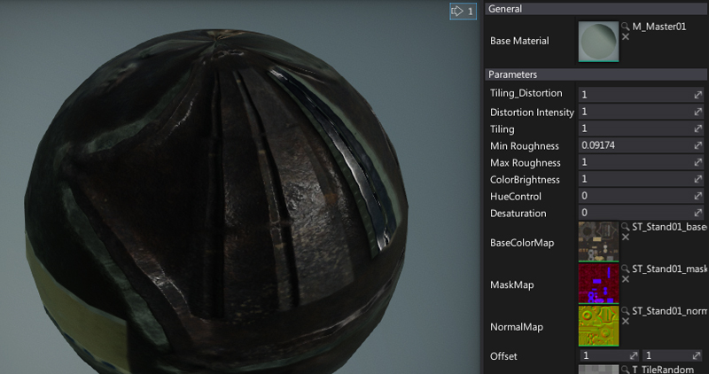
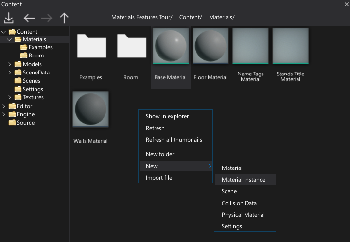
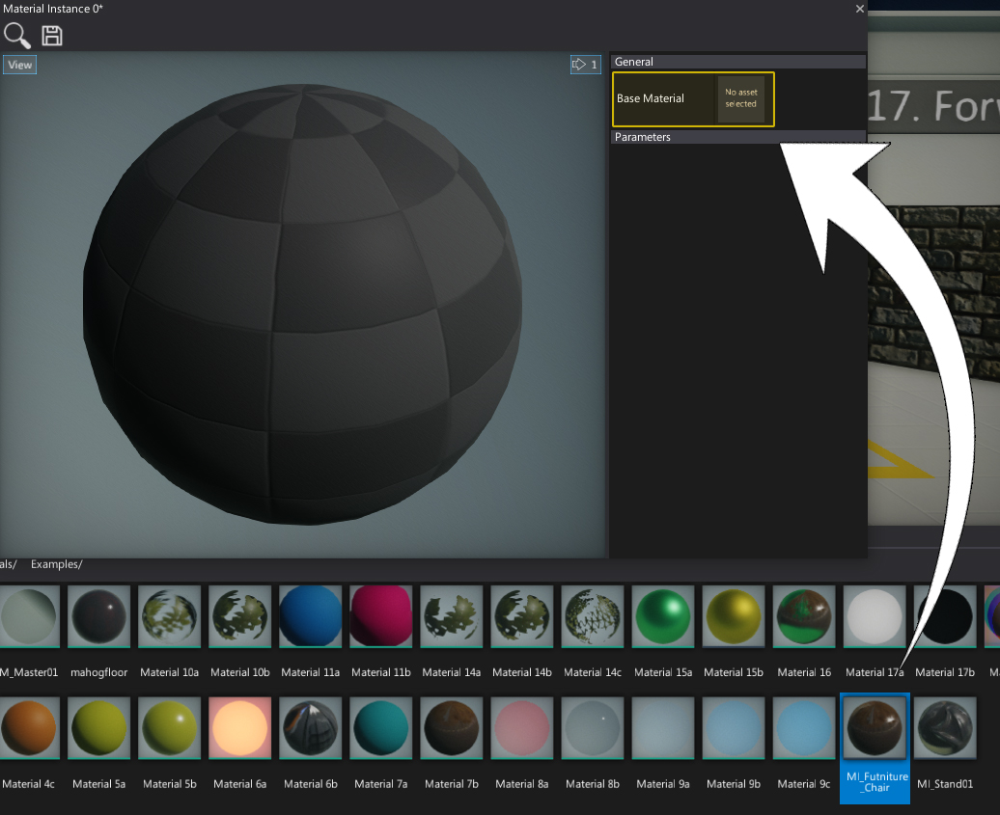
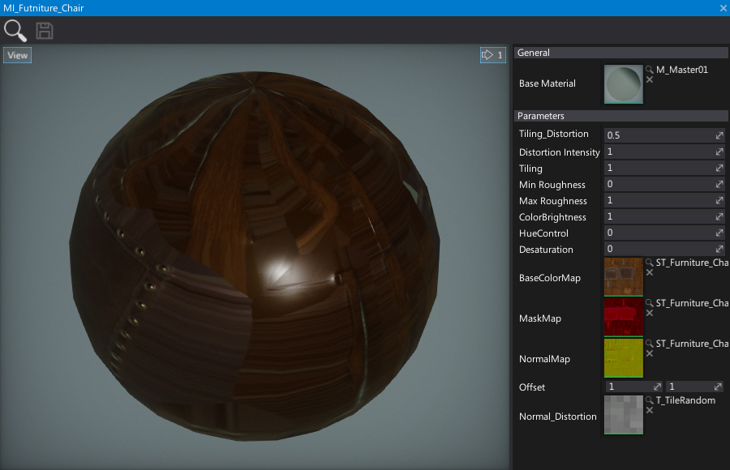

# Instanced Materials



**Materials instancing** is a technique reffering to reusing the same material asset but with modified parameters values.
In that way the base material appearance can be modified without an exensive recompilation of the material. Also, materials and shaders compilation is available only in the editor (no shaders compilation at runtime) so using material instances is one of the ways to customize the look of the objects in game.

With that being said *instanced materials* can be dynamically modified at runtime or even generated from code to randomize material parameters per object.

## Creating Material Instance

There are two ways to create `MaterialInstance` asset.

- By using *Content* window



# [C#](#tab/code-csharp)
```cs
public class MyScript : Script
{
	[Tooltip("Base material asset to override its properties")]
	public Material BaseMaterial;

	public override void OnStart()
	{
		// Create dynamic material instance and modify parameter
		var instance = BaseMaterial.CreateVirtualInstance();
		instance.SetParameterValue("Color", new Color(0xff00ff));

		// Assign instance to the material
        Actor.As<StaticModel>().SetMaterial(0, instance);
	}
}
```
# [C++](#tab/code-cpp)
```cpp
#pragma once

#include "Engine/Core/Types/Variant.h"
#include "Engine/Scripting/Script.h"
#include "Engine/Content/AssetReference.h"
#include "Engine/Content/Assets/MaterialInstance.h"
#include "Engine/Level/Actors/StaticModel.h"

API_CLASS() class GAME_API MyScript : public Script
{
API_AUTO_SERIALIZATION();
DECLARE_SCRIPTING_TYPE(MyScript);

    // Base material asset to override its properties
    API_FIELD() AssetReference<MaterialBase> BaseMaterial;

    // [Script]
    void OnStart() override
    {
        // Create dynamic material instance and modify parameter
        CHECK(BaseMaterial);
        auto instance = BaseMaterial->CreateVirtualInstance();
        instance->SetParameterValue(TEXT("Color"), Color::FromRGB(0xff00ff));

        // Assign instance to the material slot
        ((StaticModel*)GetActor())->SetMaterial(0, instance);
    }
};

inline MyScript::MyScript(const SpawnParams& params)
    : Script(params)
{
}
```
***

To learn more about using material instances from code go to the C# scripting API [here](http://docs.flaxengine.com/api/FlaxEngine.MaterialInstance.html).

## Editing parameters

After creating new *Material Instance* asset, double-click on it in a *Content* window.
In shown Material instance editor window you can pick a base material for the instance and customize its properties.
All your changes will be visible live in both editor window and in the game.
This makes parameters adjusting easier.

To set base material, simply drag & drop it from the Content window or any asset picker right to the *Base Material* property.



Then all the public material parameters may be modified.



