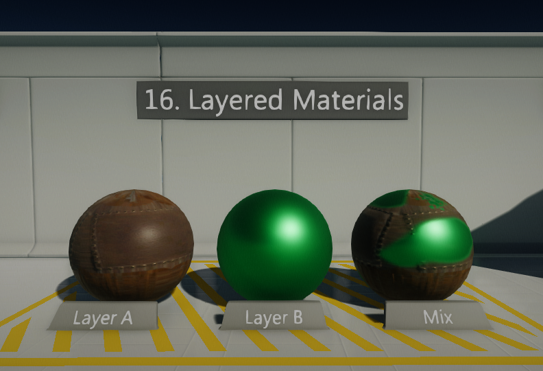
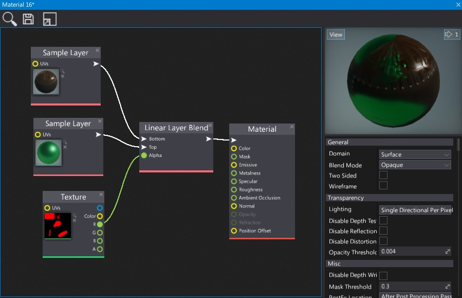

# Layered Materials

**Layered Materials** can be described as *"materials inside the material"*. This feature provides a way to mix multiple materials into a single one. This technique allows to create a material of many *layers* which gives many oportunities when creating complex surfaces or using shared assets database for larger project.

## Layers

The easiest way to create a layered material is to use *Sample Layer* nodes to get the other material properties (white arrow connection type). Then blend it using for e.g. *Linear Layer Blend* node which interpolates all material attributes between bottom and top layers using the given alpha parameter.
Using dedicated surface mask textures helps with blending between layers.

## Advantages

- Reduce complexity for more advanced materials
- Easier workflow
- Can be used to create materials database for the game (archetypes)
- Can reduce draw calls (e.g. use single material with blending per character)

## Caveats

- Can generate more instructions per material
- Layers must have the same *Domain*
- Requries using layer mask textures