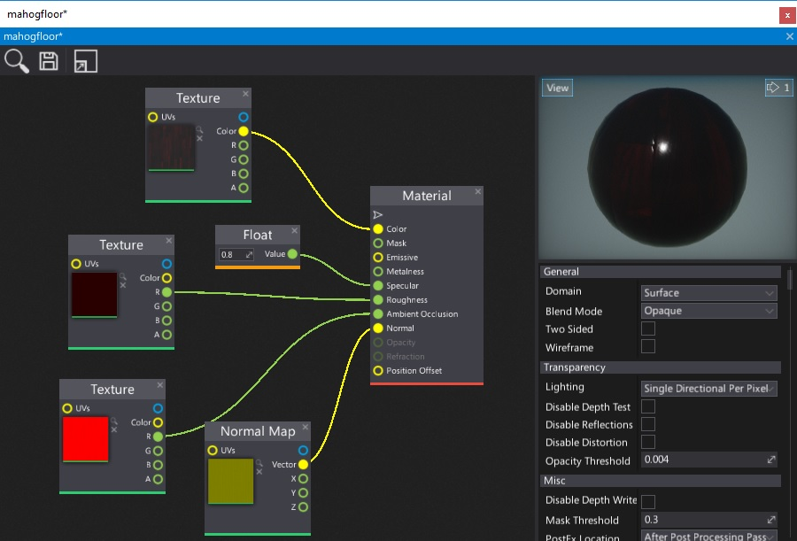
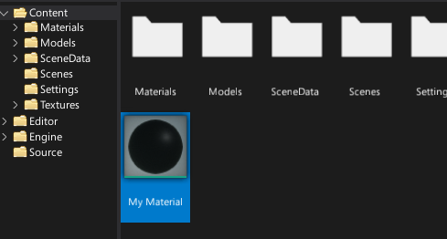
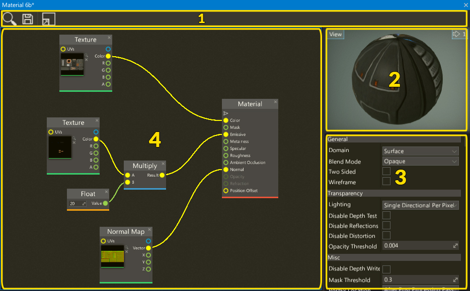
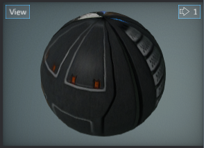
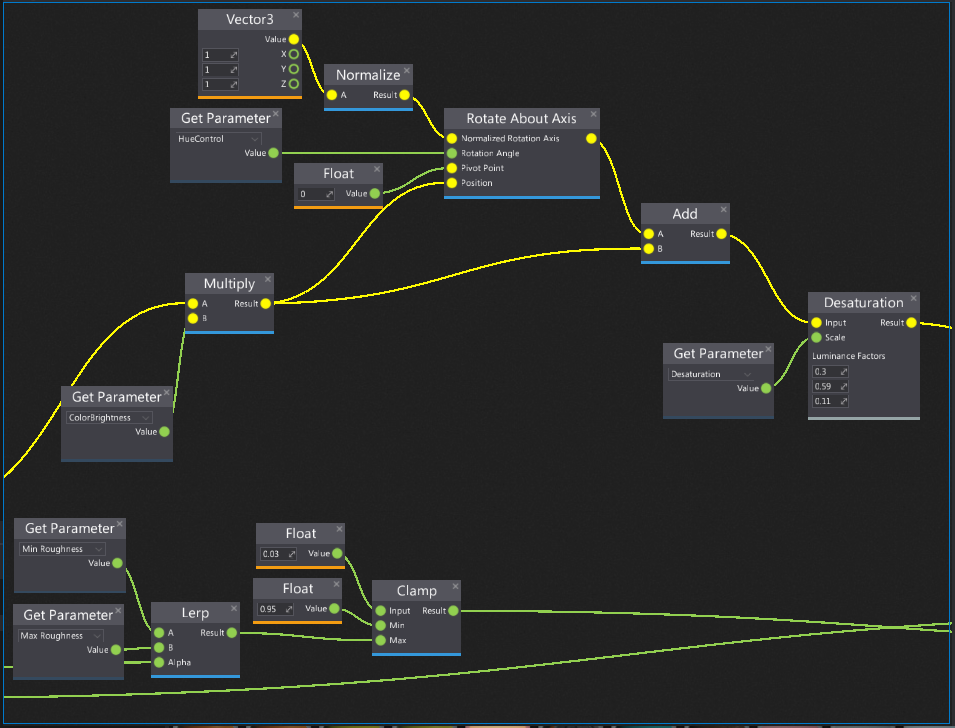
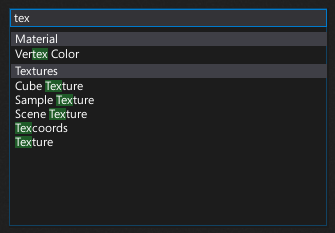
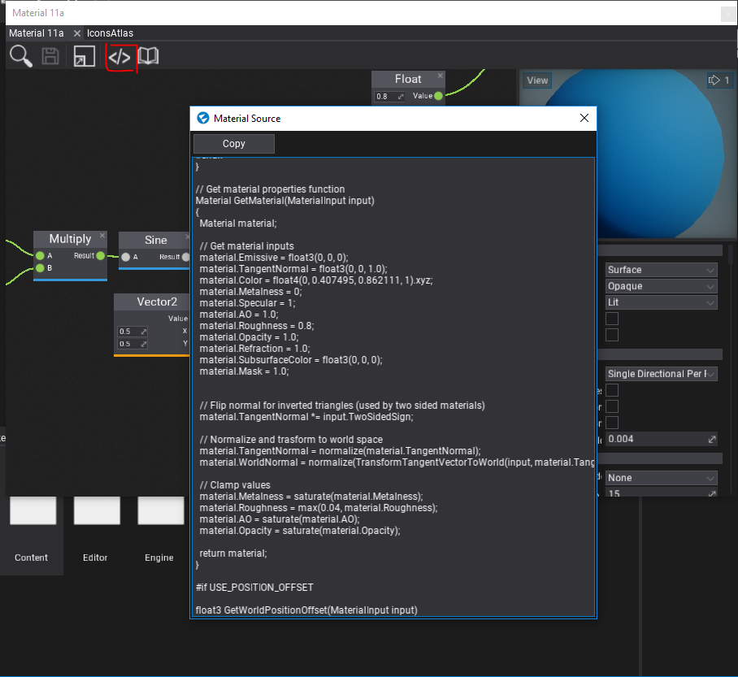

# Material Editor

The **Material Editor Window** is a tool used to create and modify material assets. It enables developers to spawn and connect material nodes to create a material graph.

This page describes some basic ideas behind the material creation process and shows how to work with the materials editor.

# Opening the material editor

To open the material editor simply double click on a material asset (in the *Content* window or in any asset picker control).

# Interface

The material editor window UI consists of a toolstrip, viewport, properties panel and surface graph.

1. Toolstrip
2. Viewport
3. Properties Panel
4. Surface Panel

## Toolstrip

The following table lists the options in the toolstrip and what they do.

| Icon | Description |
|--------|--------|
|  | Shows and selects the asset in the *Content* window |
|  | Saves the asset to the file |
|  | Shows the whole material graph on the surface |
|  | Shows the generated shader source code |
|  | Shows the online materials documentation page |

## Viewport

The viewport panel shows a preview of the current material. During material editing (removing nodes, connecting boxes, etc.) the material is being updated live and all the changes can be seen in the viewport.

You can navigate in the viewport by using the **right mouse button** or zoom in/out by pressing right mouse button and using the **mouse scroll wheel**.

Like all viewports in an editor, this one also comes up with a *View* widget menu. By pressing that button you can debug material channels, preview different view modes or even change the camera field of view angle. To learn more about using editor viewports and related tools please read the [debugging tools](../../debugging-tools/index.md) page.

## Properties panel

This panel contains all material asset properties and allows editing them.

Additionally there is a dropdown menu and *Add parameter* button in the bottom of the panel. It's used to add new material parameters. Simply select new parameter type from the menu and press the button to spawn the new one.

To learn more about material properties see the dedicated [Material Properties](../material-properties/index.md) page.

## Surface

The most important part of the material editor window is a **surface**. This panel contains a graph of all material nodes that belong to this material. By default, each material contains a single `Material` node. This node has a series of inputs, each associated with a different aspect of the material (as shown in the picture below).

To learn more about material inputs see the dedicated [Material Inputs](../material-inputs.md) page.

# Navigation controls

Controls in the Material Editor generally match the controls of other tools in the Flax Editor. For example, the material node graph can be navigated as with other linked object editors, the material preview mesh can be oriented as per other mesh tools, etc.

## Mouse controls

| Control | Action |
|--------|--------|
| **RMB** drag on background | Pan nodes graph  |
| **RMB** on background | Show node creation menu |
| **RMB** on node | Show node edit menu |
| **LMB** drag on background | Select nodes with rectangle tool |
| **LMB** on node | Select node |
| **Ctrl + LMB** on node | Toggle selection of node |
| **LMB** on node header | Move selected nodes |
| **Mouse Wheel** | Zoom in/out |

## Keyboard controls

| Control | Action |
|--------|--------|
| **Ctrl + S** | Save the asset |
| **Ctrl + A** | Select all nodes |
| **Ctrl + C** | Copy selected nodes to the clipboard |
| **Ctrl + V** | Paste nodes from the clipboard |
| **Ctrl + X** | Cuts the selected nodes to the clipboard |
| **Ctrl + D** | Duplicate selected nodes |
| **Delete** | Delete selected nodes |
| **Escape** | Deselect nodes |
| **Arrow keys** | Move selected nodes |
| **//** | Create comment around selected nodes |

# Adding a new node

In order to add a new material node right click on a surface background and select a node type from a popup or type its name to find it.

# Material Shader Source Code

The Material Editor Window allows previewing the generated source code of the material shader. To see it use the toolstrip button.

