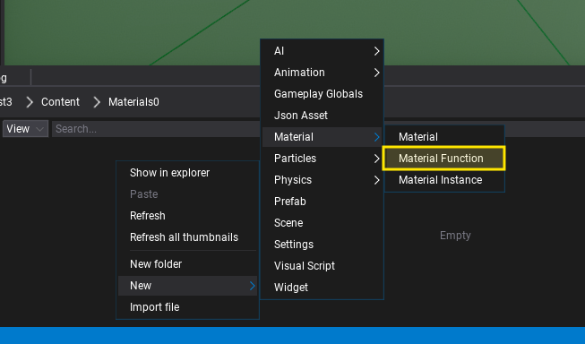
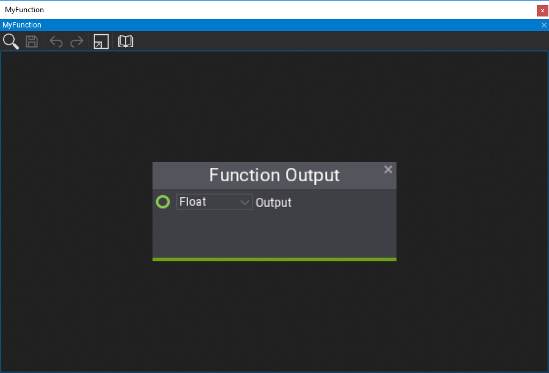
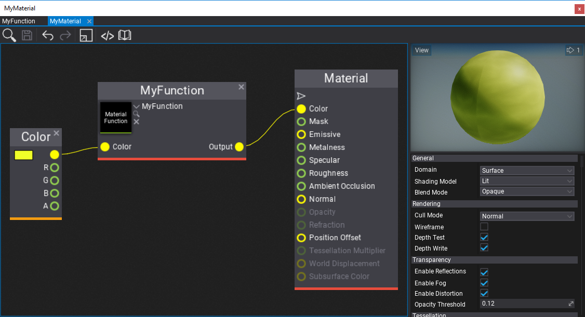

# Material Functions

A **Material Function** is an asset that contains a reusable material graph that contains a set of customizable inputs and outputs. Material functions can be used in materials and other material functions to implement custom logic that can be reused multiple times. For instance, you can create a custom tri-planar mapping function and call it in multiple terrain shaders. Material functions are a great way of improving content creation and technical art.

## How to create a Material Function

The first step is to *right-click* in the *Content* window and choose the option **New -> Material -> Material Function**. Then specify its name and confirm with *Enter*. Open the asset editor by double-clicking on it.

Now, you can let your creativity out and implement literally anything here. A Material Function is a graph of normal material nodes but it contains custom **Function Output** and **Function Input** nodes on the graph that represent the function arguments and returned values. A Material function can use textures and perform complex calculations enclosed in a reusable graph.

By default, a new function will contain a single *Float* output. You can edit the returned value type using the combobox and rename the output variable by double-clicking on the name label (*Output* by default).

Below is an example of a function that gets the *Color* input of type *Vector3* and multiplies it by the *R* channel of a sampled texture. Material functions can have multiple inputs and outputs that accept basic types and texture references too. Input nodes contain a **Default Value** box that is optional and can be used to assign the default value of the input if caller doesn't specify it.

## How to use Material Function

A material function can be used in any other material function (excluding cyclic references) or material asset. To use it you can simply drag and drop the asset item into the target graph or use *right-click* and pick the **Material Function** node, then pick the asset you've created. The node will populate the input and output boxes according to the function signature.

Finally, Flax will automatically update all materials using the material function if you modify it so you can freely work on the art content easily.

