# Material Inputs

This page explains all the material inputs. By connecting values to these inputs (e.g. constants, textures, and parameters), you can define almost any physical surface.

Not all material inputs are used all the time. For instance, An *Unlit* material uses only Emissive, Mask and Position Offset, since rest of the inputs are not applicable. It's important to remember this during creating new materials.

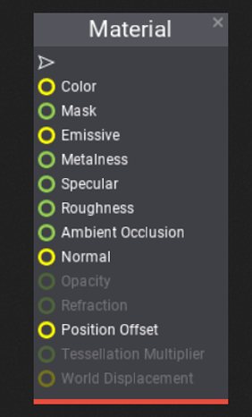

## Color

The **Color** input defines the material surface base color. It's a `Float3` value (*RGB* format).
For non-metal materials it defines diffuse color. For metals, it's used as the specular color of the surface.

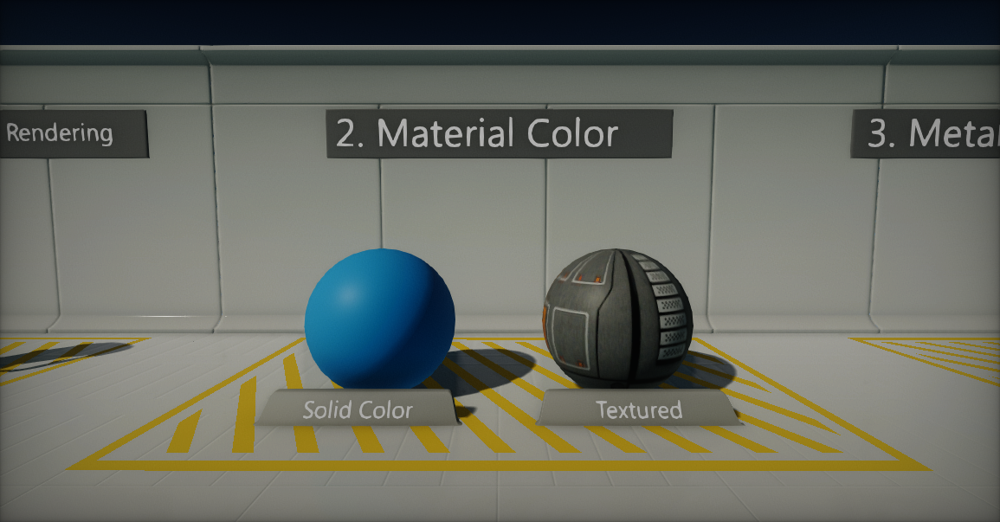

## Mask

The **Mask** input allows clipping material pixels that are under a certain value (see *Mask Threshold* in [Material Properties](material-properties/index.md)). Unlike *Opacity*, a mask can also be used for opaque materials which makes it a perfect solution when you need materials that define complex solid surfaces such as wire mesh, chain link fences, and so on. The opaque portions will still respect lighting.
The default value is 1.

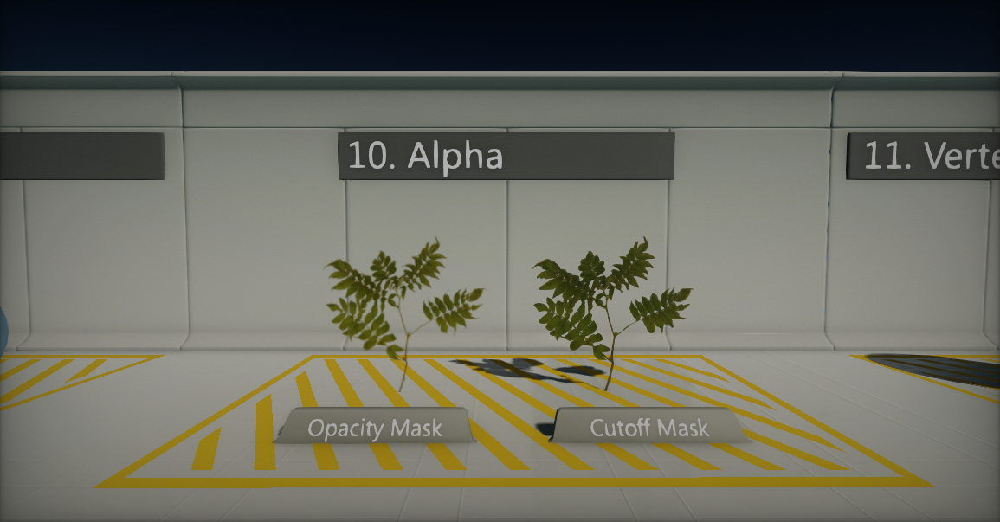

## Emissive

The **Emissive** input defines the material surface light emission. It's an HDR `Float3` value (*RGB* format) so values greater than 1 are allowed as HDR lighting is supported.
Materials using this property may appear to glow because they are emitting light. Also if an object using an emissive material is marked as static (see [StaticFlags](http://docs.flaxengine.com/api/FlaxEngine.StaticFlags.html)) then light emission will be handled properly in static lighting.

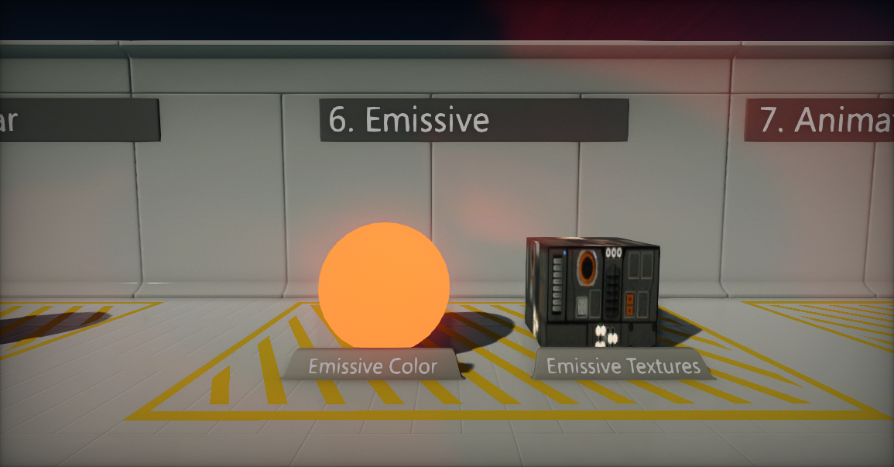

## Metalness

The **Metalness** input simply controls how *"metal-like"* a surface is. Non-metals use values of 0, metals have metalness values of 1. For pure surfaces, such as pure metal, pure stone, pure plastic, etc. this value will be 0 or 1, not anything in between. When creating hybrid surfaces like corroded, dusty, or rusty metals, you may find that you need some value between 0 and 1.
The default value is 0.

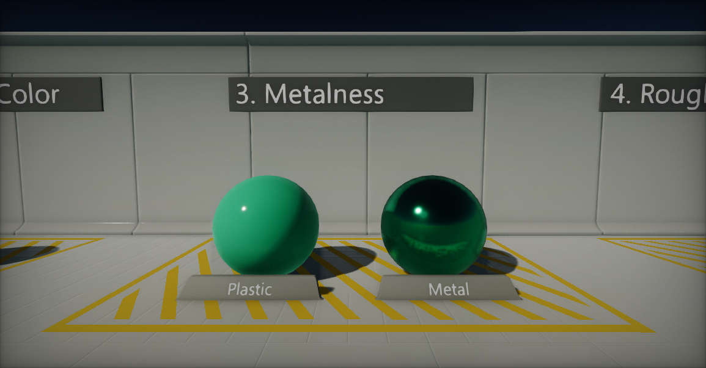

## Specular

The **Specular** input can be used to increase or decrease the specular highlight of the material.
The default value is 0.5.

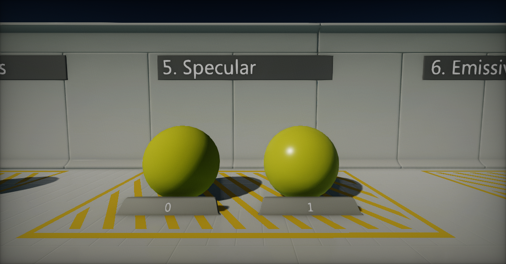

## Roughness

The **Roughness** input controls how *"rough"* a surface is. More glossy materials (roughness near 0) will reflect more light, while rough materials (roughness near 1) will appear completely matte or diffuse.
The default value is 0.4.

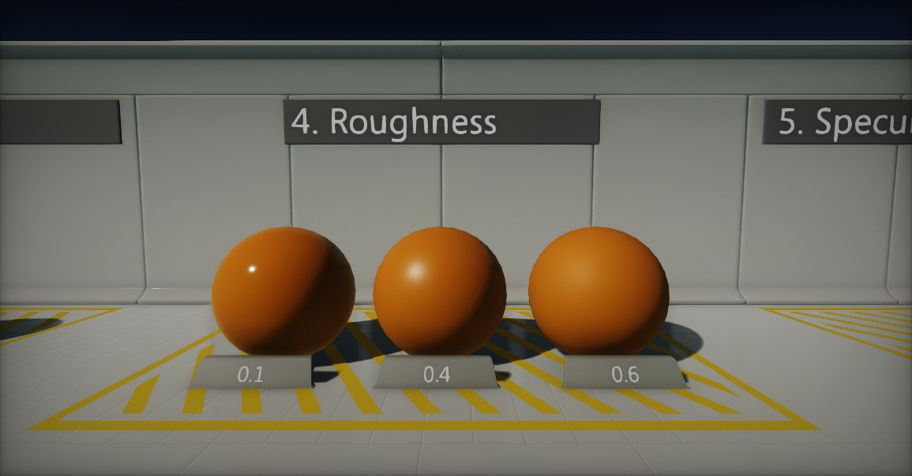

## Ambient Occlusion

The **Ambient Occlusion** input helps with simulating the self-shadowing effect that happens within certain surface types. Generally, this input will be connected to an AO map of some type, which is often created within 3D modeling packages such as *Maya*, *3ds Max*, or *ZBrush*.
The default value is 1.0.

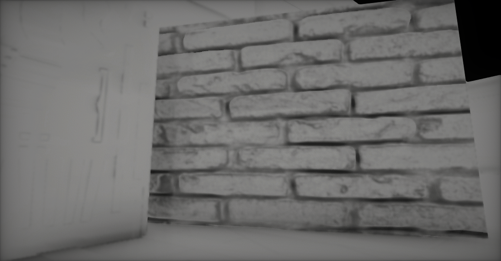

## Normal

The **Normal** input defines macro surface normals. It takes the *normal map* to provide per-pixel normal perturbation of the normal vector of the mesh. Normal maps create the appearance of bumps and indents in the surface.

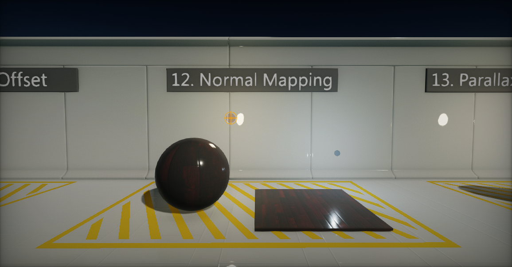

## Opacity

The **Opacity** input controls the transparency of the surface. A value of 0 defines a completely transparent object, while a value of 1 represents the fully opaque surface. The higher the value, the more visible object will be.
The default value is 1.

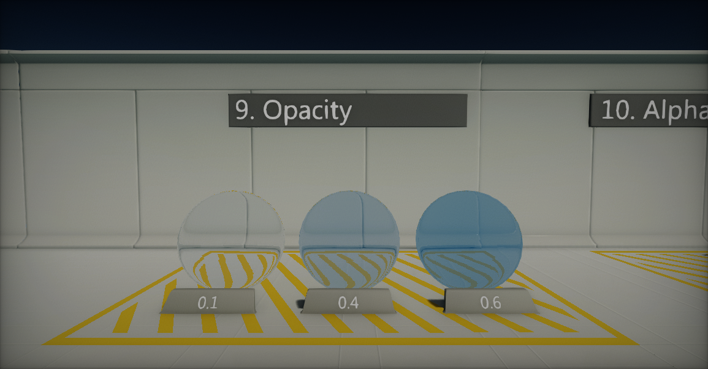

## Refraction

The **Refraction** input controls simulation of the light refraction of the surface. This is useful for creating glass and water materials which refract light that passes through them. One of the most common examples is to use the material node *Fresnel* and lerp between two values (for e.g. 1 and 1.4) to create a realistic glass effect on a transparent material.
The default value is 1.

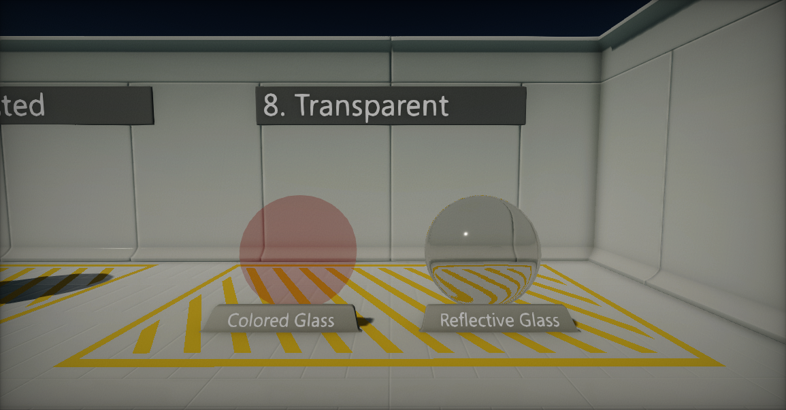

## Position Offset

The **Position Offset** input allows moving rendered geometry vertices in world space. This is especially useful for making objects move, change shape, rotate or morph. It can also be used for ambient animation.

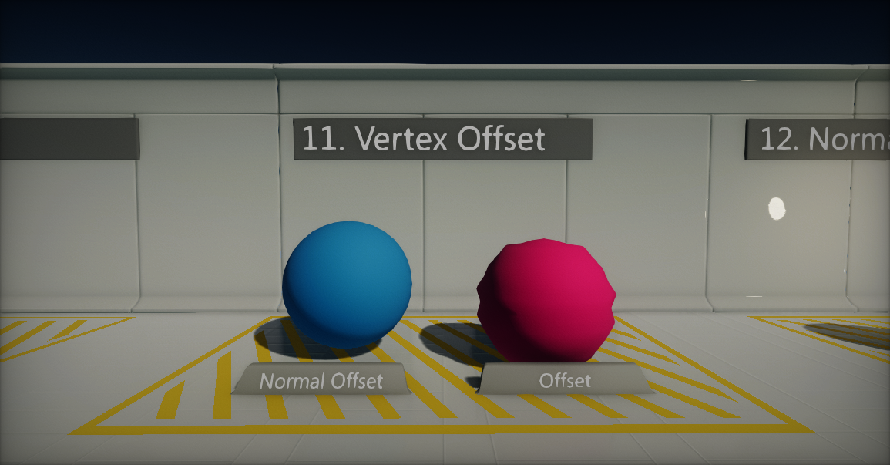

## Tessellation Multiplier

The **Tessellation Multiplier** input controls the amount of tessellation along the surface geometry. It allows more detail to be added where needed. As with World Displacement, for this to be enabled, the Tessellation Mode property must be set to something other than None.

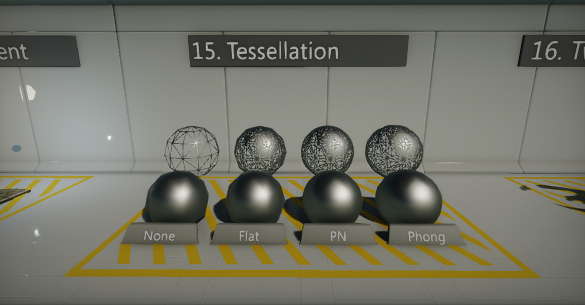

## World Displacement

The **World Displacement** input works very much like Position Offset, but it uses Tessellation vertices rather than the base vertices of the mesh. In order for this to be enabled, the Tessellation Mode property must be set to something other than None.

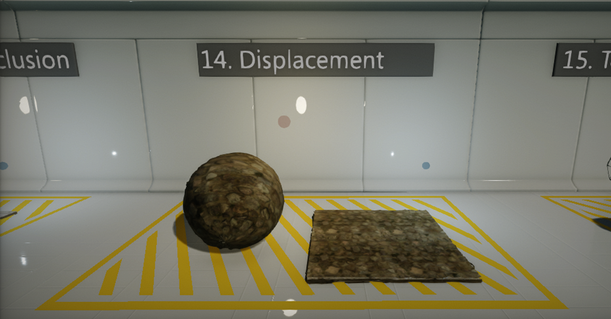

## Subsurface Color

The **Subsurface** shading model tries to simulate the light scattering effect through the material. **Subsurface Color** input defines the color of the volume inside the material. Use **Opacity** to define the thickness of the material.

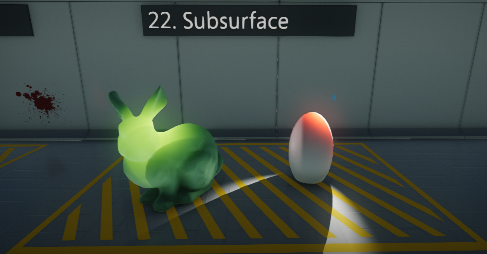

