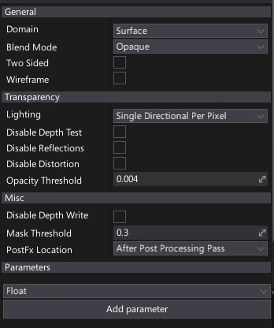
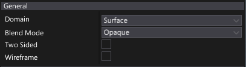
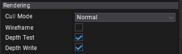
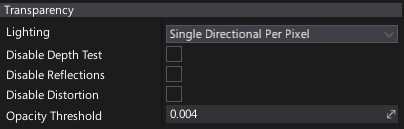
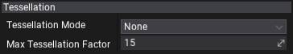

# Material Properties

This page breaks down all the available material properties. These options are accesible per material via [Material Editor](../material-editor/index.md) window.

## General

| Property | Description |
|--------|--------|
| **Domain** | Specifies how material is going to be used. Certain materials used for postFx or 2D rendering requrie additional instructions for the rendering pipeline to be generated. Because of this, it's important to specify material domain that covers those cases. Possible options: <table><tbody><tr><th>Option</th><th>Description</th></tr><tr><td>**Surface**</td><td>The surface material. Can be used to render the scene geometry including models and skinned models.</td></tr><tr><td>**Post Process**</td><td>The [Post Process Material](../../post-effects/post-fx-materials.md). Can be used to perform custom post-processing of the rendered frame.</td></tr><tr><td>**Decal**</td><td>The [Decal Material](../../decals/index.md). Can be used to apply custom overlay or surface modifications to the object surfaces in the world.</td></tr><tr><td>**GUI**</td><td>The GUI shader. Can be used to draw custom control interface elements or to add custom effects to the GUI.</td></tr><tr><td>**Terrain**</td><td>The terrain shader. Can be used only with landscape chunks geometry that use optimized vertex data and support multi-layered blending.</td></tr><tr><td>**Particle**</td><td>The particle shader. Can be used only with particles geometry (sprites, trails and ribbons). Supports reading particle data on a GPU.</td></tr><tr><td>**Deformable**</td><td>The deformable shader. Can be used only with objects that can be deformed (eg. spline models).</td></tr></tbody></table>|
| **Shading Model** | Specifies how material inputs and properties are combined to result the final surface color. Possible options: <table><tbody><tr><th>Option</th><th>Description</th></tr><tr><td>**Unlit**</td><td>The unlit material. Emissive channel is used as an output color. Can perform custom lighting operations or just glow. Won't be affected by the lighting pipeline.</td></tr><tr><td>**Lit**</td><td>The default lit material. The most common choice for the material surfaces.</td></tr><tr><td>**Subsurface**</td><td>The subsurface material. Intended for materials like vax or skin that need light scattering to transport simulation through the object.</td></tr></tbody></table>To learn more about shading models see the related documentation [here](../shading-models/index.md).|
| **Blend Mode** | Specifies how blend material with the environment. Possible options: <table><tbody><tr><th>Option</th><th>Description</th></tr><tr><td>**Opaque**</td><td>The opaque material. Used during *GBuffer* pass rendering. This is a default value.</td></tr><tr><td>**Transparent**</td><td>The transparent material. Used during *Forward* pass rendering.</td></tr><tr><td>**Additive**</td><td>The additive blend. Material color is used to add to color of the objects behind the surface. Used during Forward pass rendering.</td></tr><tr><td>**Multiply**</td><td>The multiply blend. Material color is used to multiply color of the objects behind the surface. Used during Forward pass rendering.</td></tr></tbody></table>To learn more about blend modes see the related documentation [here](../blend-modes/index.md).|

## Rendering

| Property | Description |
|--------|--------|
| **Cull Mode** | Defines the primitives culling mode used during geometry rendering. |
| **Wireframe** | If checked, geometry using this material will be rendered in wireframe mode without a solid triangles fill. |
| **Depth Test** | If checked, enables performing depth test during material rendering. |
| **Depth Write** | If checked, enables writing to the depth buffer during material rendering. |

## Transparency

| Property | Description |
|--------|--------|
| **Enable Reflections** | If checked, enables reflections when rendering material. |
| **Enable Fog** | If checked, enables fog effect when rendering material. |
| **Enable Distortion** | If checked, enables distortion effect when rendering material. |
| **Pixel Normal Offset Refraction** | Enables refraction offset based on the difference between the per-pixel normal and the per-vertex normal. Useful for large water-like surfaces. |
| **Opacity Threshold** | Controls opacity values clipping point. |

## Tessellation

| Property | Description |
|--------|--------|
| **Tessellation Mode** | Mesh surface tessellation method. Applies only to materials with *Domain* set to *Surface*. Possible options: <table><tbody><tr><th>Option</th><th>Description</th></tr><tr><td>**None**</td><td>No tessellation.</td></tr><tr><td>**Flat**</td><td>Flat tessellation. Also known as dicing tessellation.</td></tr><tr><td>**PointNormal**</td><td>Point normal tessellation.</td></tr><tr><td>**Phong**</td><td>Geometric version of Phong normal interpolation, not applied on normals but on the vertex positions.</td></tr></tbody></table>|
| **Max Tessellation Factor** | Maximum triangle tessellation factor. Default value is `15`. Increase it to unlock even higher tessellation. Higher values reduce rendering performance. |

## Miscellaneous

| Property | Description |
|--------|--------|
| **Disable Depth Write** | If checked, disables depth buffer write when rendering material.|
| **Use Input World Space Normal** | If checked, material input normal will be assumed as world-space rather than tangent-space. |
| **Use Dithered LOD Transition** | If checked, material uses dithered model LOD transition for smoother LODs switching. |
| **Mask Threshold** | Controls mask values clipping point. |
| **Decal Blending Mode** | Specifies decal material blending mode. Applies only to materials with *Domain* set to *Decal*. Possible options: <table><tbody><tr><th>Option</th><th>Description</th></tr><tr><td>**Translucent**</td><td>Decal will be fully blended with the material surface.</td></tr><tr><td>**Stain**</td><td>Decal color will be blended with the material surface color (using multiplication).</td></tr><tr><td>**Normal**</td><td>Decal will blend the normal vector only.</td></tr><tr><td>**Emissive**</td><td>Decal will apply the emissive light only.</td></tr></tbody></table>|
| **PostFx Location** | Specifies when render post effect material. Applies only to materials with *Domain* set to *Post Process*.Possible options: <table><tbody><tr><th>Option</th><th>Description</th></tr><tr><td>**After Post Processing Pass**</td><td>Render material after post processing pass using *LDR* input frame.</td></tr><tr><td>**Before Post Processing Pass**</td><td>Render material before post processing pass using *HDR* input frame.</td></tr><tr><td>**Before Forward Pass**</td><td>Render material before forward pass but after *GBuffer* with *HDR* input frame.</td></tr><tr><td>**After Custom Post Effects**</td><td>Render material after custom post effects (scripted).</td></tr><tr><td>**Before Reflections Pass **</td><td>Render material before Reflections pass. After the Light pass. Can be used to implement a custom light types that accumulate lighting to the light buffer.</td></tr><tr><td>**After Anti-Aliasing Pass **</td><td>Render material The after AA filter pass. Rendering is done to the output backbuffer.</td></tr></tbody></table>|

## Parameters

Every material contains a collection of custom parameters. Those parameters can be accessed from the game logic code or be overriden using [Material Instances](../instanced-materials/index.md).

This section allows to add, edit and remove custom material parameters. Each parameter has a specified type and default value. Material parameters are identified by the name which means it has to be unique in order to prevent misleading.

To add new parameter choose a type from a dropdown menu and press **Add parameter** button. Then you can **right click on prameetr name** to rename or delete it.

To access material parameter value directly in a graph use **Get Parameter**. It allows to choose parameter with a dropdown menu and use it's value as shown in a picture below.

### Attributes

Every parameter can have a collection of customizable **attributes** that can customize it's display logic in UI or be used as metadata for other systems (eg. serialization).

To add attribute to parameter simply **right-click -> Edit attributes**, then use **+** button to add new attribute, set **Type** to one of the items from the dropdown list, adjust properties of the atrtribute and hit **OK** to confirm.

For instance, Tooltip Attribute can be used to display documentation note about parameter for other users. Range and Slider attributes can help to customize editing scalar values and Ediotr Group and Editor Order can organize the list of parameters. To learn about attribute types see [this page](../../../scripting/attributes.md).

