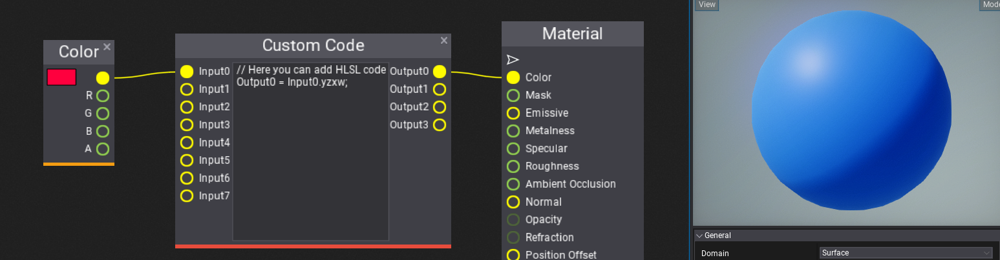
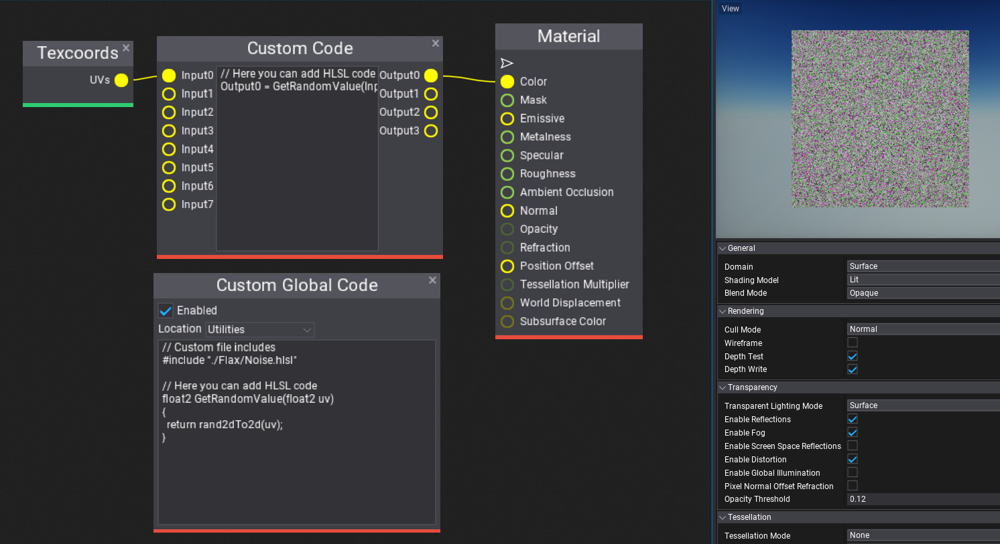
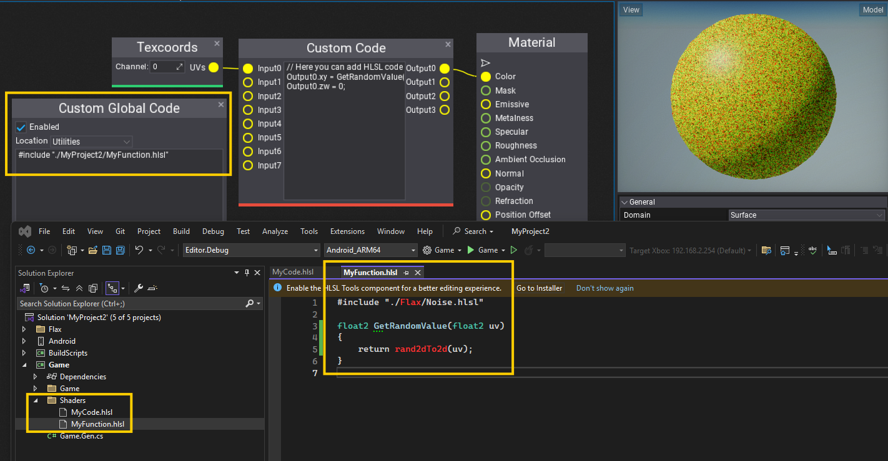

# Shader Code in Materials

This page shows how to use HLSL shader code inside [Materials](basics/index.md) and [Material Functions](material-functions.md).

Flax uses **HLSL** as a shading language as it's very popular in the industry and supports all major graphics rendering features. Additionally, engine will automatically compile HLSL shaders into target platform such as Vulkan or PS4 with full runtime support.
To learn about HLSL syntax see [Reference for HLSL](https://docs.microsoft.com/en-us/windows/win32/direct3dhlsl/dx-graphics-hlsl-reference) and [Programming guide for HLSL](https://docs.microsoft.com/en-us/windows/win32/direct3dhlsl/dx-graphics-hlsl-pguide).

For better understanding how shaders are handled by the engine see dedicated documentation section [here](../shaders/index.md).

## Custom Code



Custom Code node allows to write raw HLSL code which operates on fixed inputs and outputs. It's rather simple solution for small code chunks that can implement dynamic branching, dynamic loops or invoke shader functions from external sources (eg. shader library files).

## Global Custom Code



Global Custom Code node is more robust as it inlines code at a specific location in the material template. For example, it can inject global preprocessor macros, inject custom header file includes, add shader resources binding, or declare global functions.

Use **Location** dropdown to properly define place of code injection. You can see it in generated shader source code (click on toolbar button).

This node provides an easy way to include custom `.hlsl` files from the project source code folder which can implement certain functionalities in text-based format. To do so, create a shader file in `_project_/Source/Shaders`. Then you can include it via: `#include "./_project_name__/MyFile.hlsl"`. Where `_project_name__` is name of the project from the `_project_.flaxproj` file. This allows to include shaders from plugin projects. See [this page](../shaders/index.md) to learn more (esp. `Including shader files` and `Using shaders` sections).

## Custom Shader Code File

Custom Code node inside Editor has limitations and doesn't provide a full IDE editing experience, thus it's possible to easily use a standard `.hlsl` shader file and include it inside materials or material functions. Shader compiler will automatically detect any changes to the source file and reload any materials using it to provide a live editing experience inside the Editor.

Use `#include "./_project_name__/MyFunction.hlsl"` inside the **Global Custom Code** node which will inject the file `_project_/Source/Shaders/MyFunction.hlsl` into the shader compilation. 

> [!Tip]
> `_project_name__` is name of the project from the `_project_.flaxproj` file.

Example contents of `_project_/Source/Shaders/MyFunction.hlsl` file:

```hlsl
#include "./Flax/Noise.hlsl"

float2 GetRandomValue(float2 uv)
{
    return rand2dTo2d(uv);
}
```

Example usage, where shader file is included within Custom Global Code node, then function declared in that shader file is used within Custom Code node. Notice that the custom shader file can include other files and declare other resources or functions.


