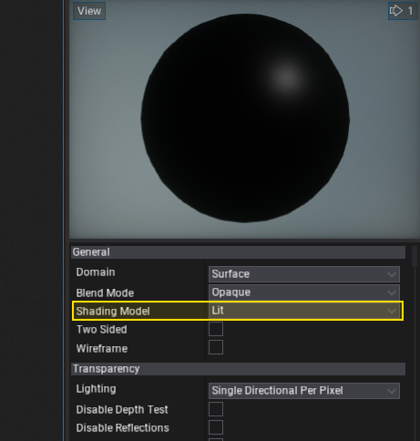
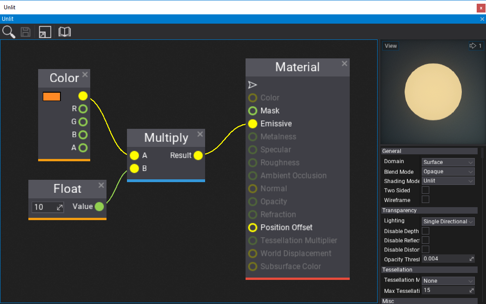
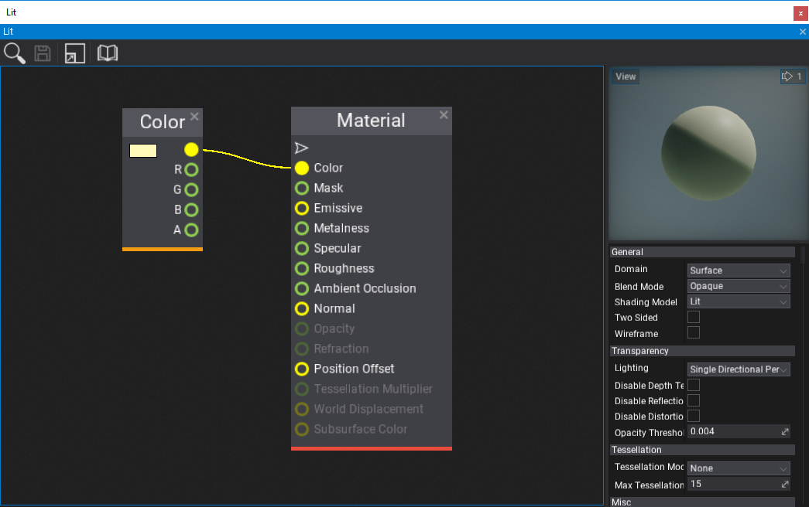
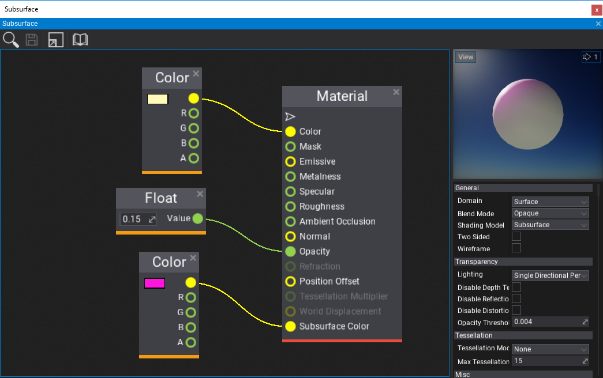

# Shading Models

Flax supports various **shading Models** that can be used by different game objects to achive desire look.
The most common choice is **Lit** material type (set as default). Use this page to learn more about using other shading models and how to use them in your game.

Material shading model can be changed in [Paterial Properties](../material-properties/index.md).

## Unlit

The unlit material does not use shading algorithm and all lights or reflections are ignored by this material. Unlit material uses **emissive** channel as an output color. It can be used to perform custom lighting operations or just glow. It won't be affected by the lighting pipeline.

## Lit

The default lit material is the most common choice for the material surfaces. It can be used to define plastic, wood, metalic or glass surfaces. By using **Roughness**, **Ambient Occlusion** and **Specular** inputs you can define the microsurface properties used by the BRDF shading function.

## Subsurface

**Subsurface** shading model is intended to be used by materials like skin, jade, wax or foliage. It works similar to *Lit*, except it, support light scattering through the material. This can be controlled by the **Subsurface Color** input which defines the color of the material internal volume and **Opacity** input that describes the material local thickness (value 1 means fully opaque, value 0 means light can easily pass through). The default opacity value is *1*, which does not result in a very convincing effect. Use values closer to 0 to give more transparency for light scattering (eg. `0.1`).

