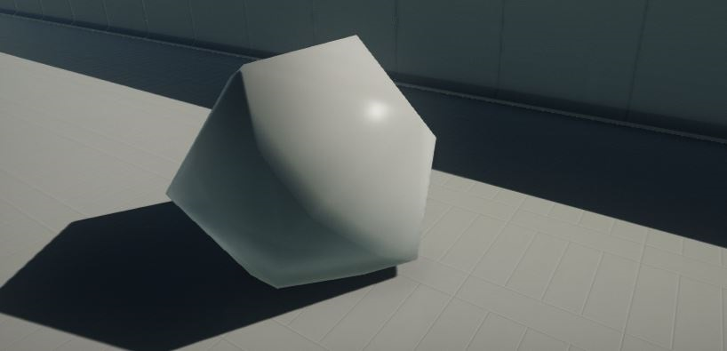
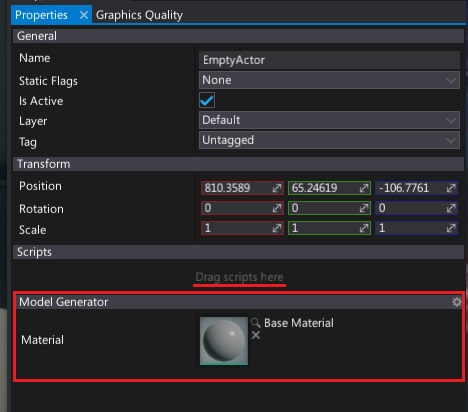

# HOWTO: Generate procedural model



In this tutorial you will learn how to create a simple icosahedron mesh.

This sample uses two C# API methods: [Content.CreateVirtualAsset<T>](http://docs.flaxengine.com/api/FlaxEngine.Content.html#FlaxEngine_Content_CreateVirtualAsset__1) and [Model.UpdateMesh](http://docs.flaxengine.com/api/FlaxEngine.Model.html#FlaxEngine_Model_UpdateMesh_FlaxEngine_Vector3___System_Int32___FlaxEngine_Vector3___FlaxEngine_Vector2___FlaxEngine_Color32___) to generate procedural model resource.

## Tutorial

* Create new C# script `ModelGenerator`

* Write mesh data generating function

```cs
private void UpdateMesh(Model model)
{
    const float X = 0.525731112119133606f;
    const float Z = 0.850650808352039932f;
    const float N = 0.0f;
    var vertices = new[]
    {
        new Vector3(-X, N, Z),
        new Vector3(X, N, Z),
        new Vector3(-X, N, -Z),
        new Vector3(X, N, -Z),
        new Vector3(N, Z, X),
        new Vector3(N, Z, -X),
        new Vector3(N, -Z, X),
        new Vector3(N, -Z, -X),
        new Vector3(Z, X, N),
        new Vector3(-Z, X, N),
        new Vector3(Z, -X, N),
        new Vector3(-Z, -X, N)
    };
    var triangles = new[]
    {
        1, 4, 0, 4, 9, 0, 4, 5, 9, 8, 5, 4,
        1, 8, 4, 1, 10, 8, 10, 3, 8, 8, 3, 5,
        3, 2, 5, 3, 7, 2, 3, 10, 7, 10, 6, 7,
        6, 11, 7, 6, 0, 11, 6, 1, 0, 10, 1, 6,
        11, 0, 9, 2, 11, 9, 5, 2, 9, 11, 2, 7
    };
    model.UpdateMesh(vertices, triangles, vertices);
}
```

* Create model asset and model actor in `Start` function

```cs
public MaterialBase Material;

private void Start()
{
    var model = Content.CreateVirtualAsset<Model>();
    UpdateMesh(model);

    var childModel = Actor.GetOrAddChild<ModelActor>();
    childModel.Model = model;
    childModel.LocalScale = new Vector3(100);
    childModel.Entries[0].Material = Material;
}
```

* Add the script and set the material



* See the result


