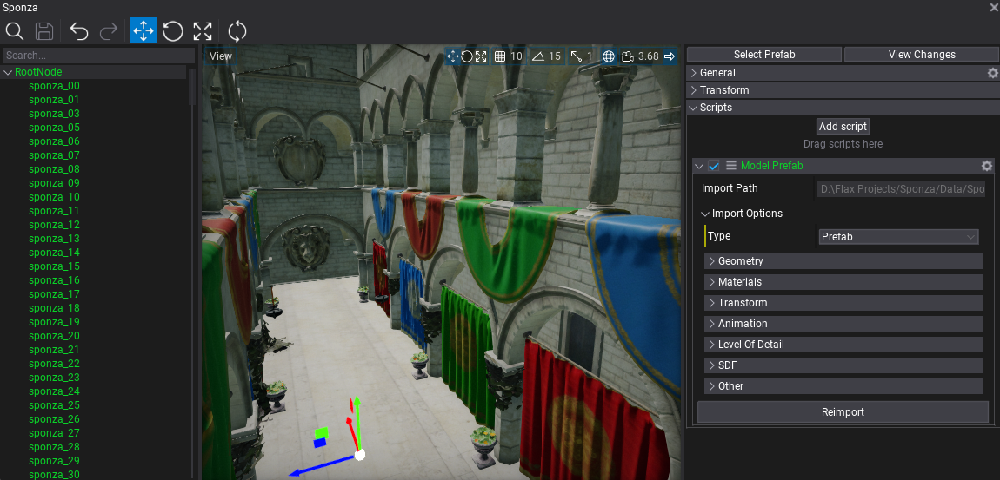
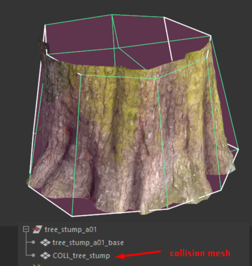
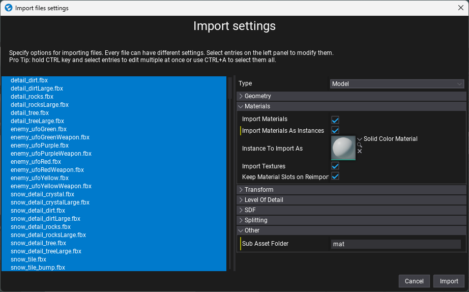

# Importing models

Importing model files works in the same way as importing other asset types. Simply drag and drop model files from a file *Explorer* window (*Finder* on MacOS) into the *Content* window or use the *Import* button.

After choosing the files an **Import file settings** dialog is displayed. It's used to specify import options per model. In most cases the default values are acceptable and you can just press the **Import** button.

> [!Note]
> Using the **Import file settings** dialog you can select more than one model at once (or use **Ctrl+A** to select all) and specify import options at once.

Every model can be re-imported (the relative path to the source file is cached) and import settings modified using the [Model Window](model-window.md).

## Supported file types

Flax Engine supports importing the following list of file types as models:
- `.fbx` - currently recommended format
- `.gltf`
- `.glb`
- `.obj`
- `.x`
- `.dae`
- `.blend`
- `.lwo`
- `.lws`
- `.lxo`
- `.ply`
- `.q3o`
- `.q3s`
- `.stl`

## Importing model LODs

Flax supports up to 6 model levels of detail. To import them use `LODx` (where `x` is an LOD index, zero-based) postfix for object nodes in the model file. Also when importing a model ensure to check the **Import LODs** option.

Example usage (from Blender):

## Importing into Prefab

The models importing system supports importing all source file contents (meshes, nodes, animations, materials, textures, etc.) into a prefab scene inside the engine. This allows to customize the imported objects easily and is especially useful for more complex scenes. When importing a file select type to **Prefab**, then you can customize other import options (each mesh can override settings after import).

Imported prefab can be opened and customized. After adding it to a scene any changes in the prefab will be synced in all instances across the whole project. The root object of the created prefab contains `ModelPrefab` script that stores saved import options and source file path (relative to the project folder or absolute). You can use it to reimport the source asset (eg. to sync with the source file or with different import options).

## Importing collision mesh

Flax supports automatic collision mesh importing from a source model. To import a collision mesh use a custom name prefix for collision meshes in the model file (eg. `COLL_` or `UCX_` prefix) and specify that prefix in the import option **Collision Meshes Prefix**. The engine will extract those collision meshes and create a separate collision data asset

Example usage:

For ease of use after you add a model to a scene you can use *Right-click* and select the option **Add mesh collider**. The editor will automatically pick up the imported collision mesh (or generate a new one) and add it to the model in the scene so it has a collision for physics. You can change the `Collision Type` between convex and triangle mesh - convex is more optimized but less accurate.

## Reusing materials when importing multiple models

When importing a large set of models importer will create materials for each one of them which might not be efficent. To optimize it you can:
* select all models (eg. with `Ctrl+A`) to edit them in batch,
* check `Import Materials As Instances` to create material instances rather than materials,
* assign the `Instance To Import As` material to be used as a base (it can contain common parameters like `Color` to be overriden by the importer in instances),
* set `Sub Asset Folder` to the folder name where imported materials and textures will be placed for all of the models (eg. `mat`)
* import.

## Model import settings

Flax uses the same import settings data schemes for **models**, **skinned models** and **animations** because they can all be imported from the same source files (eg. `.fbx` or `.dae`).

| Property | Description |
|--------|--------|
| **Type** | The type of the imported asset. Possible options: <table><tbody><tr><th>Option</th><th>Description</th></tr><tr><td>**Model**</td><td>The model asset.</td></tr><tr><td>**Skinned Model**</td><td>The skinned model asset.</td></tr><tr><td>**Animation**</td><td>The animation asset.</td></tr><tr><td>**Prefab**</td><td>The prefab scene.</td></tr></table></tbody> |
|||
| **Geometry** ||
| **Calculate Normals** | If checked, model normal vectors will be recalculated. |
| **Smoothing Normals Angle** | Specifies the maximum angle (in degrees) that may be between two face normals at the same vertex position before they are smoothed together. Used only if *Calculate Normals* is checked. The default value is 175. |
| **Calculate Tangents** | If checked, model tangent vectors will be re-calculated. |
| **Smoothing Tangents Angle** | Specifies the maximum angle (in degrees) that may be between two vertex tangents before their tangents and bi-tangents are smoothed. Used only if *Calculate Tangents* is checked. The default value is 45. |
| **Optimize Meshes** | If checked, model meshes geometry will be optimized. Duplicated or invalid vertices will be removed. Index buffer will be reordered to improve performance and other modifications will be applied. However, importing time will be increased. |
| **Merge Meshes** | If checked, meshes with the same materials will be merged. Helps with rendering performance. |
| **Import LODs** | If checked, the model importer will try to find LODs and import them. See the *Importing model LODs* section to learn more. |
| **Import Vertex Colors** | If checked, vertex colors will be imported (channel 0 only, if exists). |
| **Import Blend Shapes** | If checked, blend shapes will be imported (morph targets). |
| **Calculate Bone Offset Matrices** | Enable skeleton bones offset matrices recalculating. |
| **Lightmap UVs Source** | Specifies model lightmap texture coordinates source. Can import them from the source model or generate them with built-in tool. Possible options: <table><tbody><tr><th>Option</th><th>Description</th></tr><tr><td>**Disable**</td><td>Don't use lightmap UVs.</td></tr><tr><td>**Generate**</td><td>Generate lightmap UVs from model geometry. Requires proper normal/tangent vectors. Highly increases the importing time.</td></tr><tr><td>**Channel 0**</td><td>Use input mesh texture coordinates channel 0.</td></tr><tr><td>**Channel 1**</td><td>Use input mesh texture coordinates channel 1.</td></tr><tr><td>**Channel 2**</td><td>Use input mesh texture coordinates channel 2.</td></tr><tr><td>**Channel 3**</td><td>Use input mesh texture coordinates channel 3.</td></tr></table></tbody>|
| **Collision Meshes Prefix** | If specified, all meshes that starts with this prefix in the name will be imported as a separate collision data asset (excluded used for rendering). |
| **Collision Type** | The type of collision that should be generated if the mesh has a collision prefix specified. |
|||
| **Data Format** ||
| **Position Format** | The imported vertex positions data format to use by meshes. Changing this affects memory usage of the mesh data, performance and overall quality. Possible options: <table><tbody><tr><th>Option</th><th>Description</th></tr><tr><td>**Float32**</td><td>XYZ channels with 32-bit precision (12 bytes per vertex).</td></tr><tr><td>**Float16**</td><td>XYZ(W) channels with 16-bit precision (8 bytes per vertex).</td></tr><tr><td>**Automatic**</td><td>Selects the most memory-efficient format that can represent positions within a max error defined in project Build Settings.</td></tr></table></tbody>|
| **Tex Coord Format** | The imported vertex texture coordinates data format to use by meshes. Changing this affects memory usage of the mesh data, performance and overall quality. Possible options: <table><tbody><tr><th>Option</th><th>Description</th></tr><tr><td>**Float16**</td><td>XY channels with 16-bit precision (4 bytes per vertex).</td></tr><tr><td>**UNorm8**</td><td>XY channels with 8-bit precision (2 bytes per vertex). Valid only for normalized UVs within range [0; 1], scaled or negative UVs won't work.</td></tr></table></tbody>|
|||
| **Transform** ||
| **Scale** | Custom uniform scale applied to the imported model data. |
| **Rotation** | Custom import geometry rotation applied to the imported model data. |
| **Translation** | Custom import geometry offset applied to the imported model data. |
| **Use Local Origin** | If checked, the imported geometry will be shifted to its local transform origin. |
| **Center Geometry** | If checked, the imported geometry will be shifted to the center of mass. |
|||
| **Animation** ||
| **Duration** | Specifies the imported animation duration mode. Can use the original value or be overriden by settings. Possible options: <table><tbody><tr><th>Option</th><th>Description</th></tr><tr><td>**Imported**</td><td>The imported duration.</td></tr><tr><td>**Custom**</td><td>The custom duration specified via keyframes range.</td></tr></table></tbody>|
| **Frames Range Start** | Imported animation first frame index. Used only if Duration mode is set to Custom. |
| **Frames Range End** | Imported animation last frame index. Used only if Duration mode is set to Custom. |
| **Default Frame Rate** | The imported animation default frame rate. Can specify the default frames per second amount for imported animations. If the value is 0 then the original animation frame rate will be used. |
| **Sampling Rate** | The imported animation sampling rate. If value is 0 then the original animation speed will be used. |
| **Skip Empty Curves** | If checked, the imported animation will have tracks with no keyframes or unspecified data removed. Disable it to leave the data as it is. |
| **Optimize Keyframes** | If checked, the imported animation channels will be optimized to remove redundant keyframes. This option helps with getting better animation sampling performance. |
| **Enable Root Motion** | If checked, enables root motion extraction support from this animation. |
| **Root Node Name** | The custom node name to be used as a root motion source. If not specified the actual root node will be used. |
|||
| **Generate LODs** | If checked, the importer will generate a sequence of LODs based on the base LOD index. |
| **Base LOD** | The index of the LOD from the source model data to use as a reference for following LODs generation. |
| **LOD Count** | The amount of LODs to include in the model (all remaining ones starting from Base LOD will be generated). |
| **Triangle Reduction** | The target amount of triangles for the generated LOD (based on the higher LOD). Normalized to range 0-1. For instance 0.4 cuts the triangle count to 40%. |
|||
| **Import Materials** | If checked, the importer will create materials for model meshes as specified in the file. |
| **Import Materials As Instances** | If checked, the importer will create the model's materials as instances of a base material. |
| **Instance To Import As** | The material used as the base material that will be instanced as the imported model's material. |
| **Import Textures** | If checked, the importer will import texture files used by the model and any embedded texture resources. |
| **Keep Material Slots on Reimport** | If checked, the importer will try to keep the model's current material slots, instead of importing materials from the source file. |
|||
| **Split Objects** | If checked, the imported mesh/animations are split into separate assets. Used if *Object Index* is set to -1. |
| **Object Index** | The zero-based index for the mesh/animation clip to import. If the source file has more than one mesh/animation it can be used to pick a desired object. The default `-1` imports all objects. |
|||
| **Sub Asset Folder** | If specified, the specified folder will be used as a sub-directory name for automatically imported sub assets such as textures and materials. Set to whitespace (single space) to import to the same directory. |

## Tips

If the model appears to be missing something or there is more than you expected, make sure the model you imported is in fact what you believe it is. For example Blender defaults to export everything unless you tick the "selection only" box. An easy way to check that is to import the file back in your modeller.

If you want to import all animation clips from the source file or import all model meshes as separate assets use the **Split Objects** option. It will split the source objects from the model file and import them as separate assets. It will support reimporting them easily because each split object gets own **Object Index** auto-assigned.
