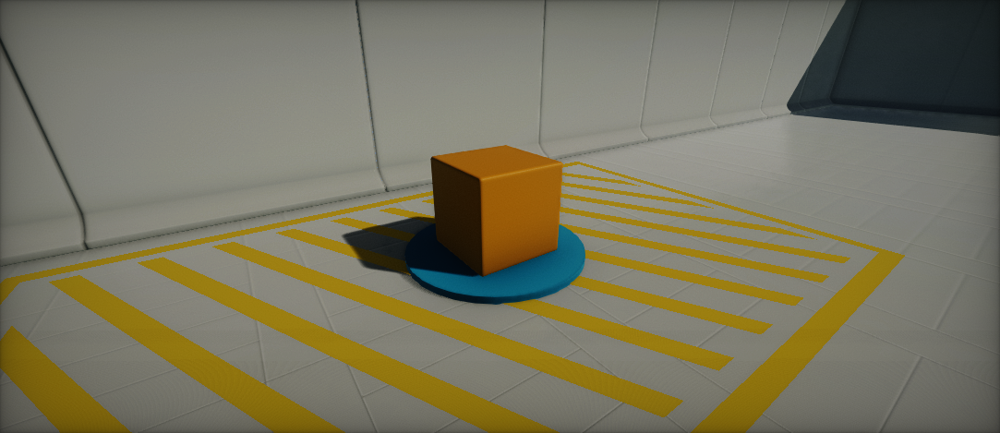
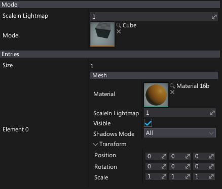

# Model Actor

**Model Actor** renders a model and allows to override some of its properties like shadows casting or material slots collection. Using model actors it the most common way to place models in you scene.

## Model Properties

| Property | Description |
|--------|--------|
| **Scale In Lightmap** | Model meshes scale in lightmap. Master parameter to scale all of the meshes. |
| **Model** | Model asset to use for rendering. |
| **Entries** | Colelction of model slots to override. See *Mesh Properties* section to learn more. |

## Mesh Properties

| Property | Description |
|--------|--------|
| **Material** | Material or Material Instance asset to use for rendering. |
| **Scale In Lightmap** | Mesh scale in lightmap. |
| **Visible** | If checked, mesh is visible. Allows to hide meshes using this entry. |
| **Shadows Mode** | Shadows casting mode by meshes using this entry. Possible options:  <table><tbody><tr><th>Option</th><th>Description</th></tr><tr><td>**None**</td><td>Never render shadows.</td></tr><tr><td>**Static Only**</td><td>Render shadows only in static views (env probes, lightmaps, etc.).</td></tr><tr><td>**Dynamic Only**</td><td>Render shados only in dynamic views (game, editor, etc.).</td></tr><tr><td>**All**</td><td>Always render shadows.</td></tr></tbody></table> |
| **Transform** | Local transformation (translation, rotation and scale) applied to the meshes using this slot. Can be used to a rotate plane wing or move a group of meshes. |
