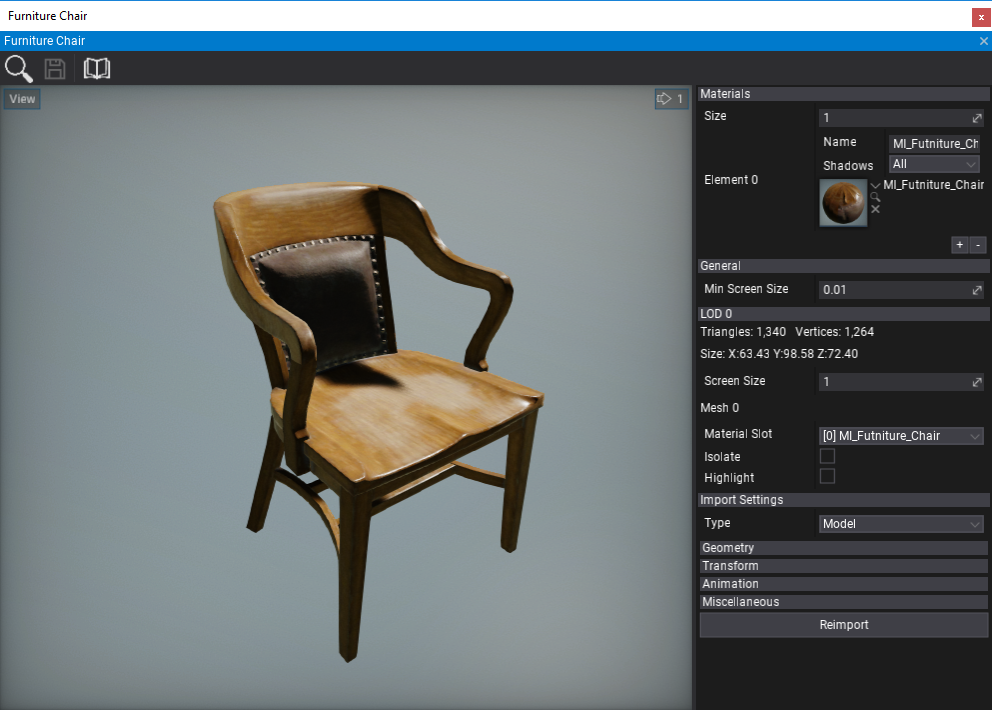
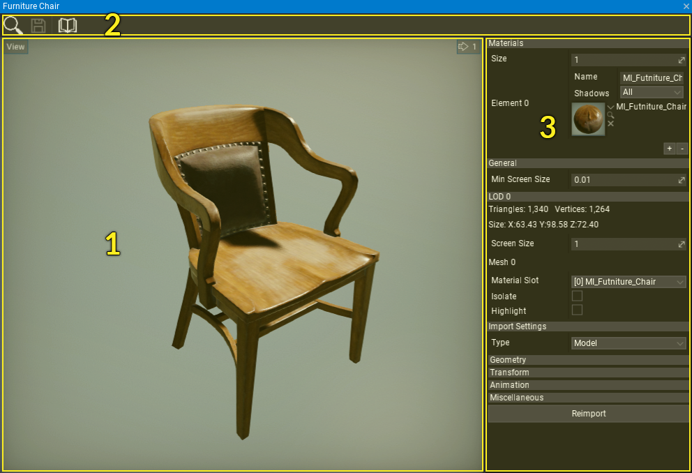
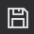
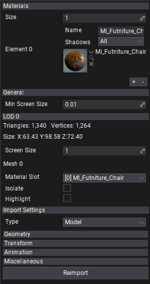

# Model Window

**Model Window** is the main tool to preview and reimport model assets. To show it simply double-click on a model in a *Content* window.

## Interface

The model window UI consists of a toolstrip, viewport and properties panel.

1. Viewport
2. Toolstrip
3. Properties Panel

### Toolstrip

The following table lists the options in the toolstrip and what they do.

| Icon | Description |
|--------|--------|
|  | Shows and selects the asset in the *Content* window |
|  | Saves edited model asset |
|  | Opens documentation |

### Viewport

The viewport panel shows the preview of the model. You can navigate in the viewport by using the **mouse buttons** and **WSAD** keys using the first-person view camera.

In the upper left corner, the viewport contains a widget **View ** button with many options for the viewport customization and model debugging (LOD preview, camera settings and more).

### Properties panel

This panel shows model asset properties.

- **Materials** - list of material slots used by this model.
- **General** - general model properties.
- **LOD** - properties of every model Level Of Detail (*LOD*). This includes LOD triangles/vertices stats, bounds, material slot binding for meshes and option to isolate or highlight mesh.
- **Import Settings** - model import options (restored from last import). You can modify them and press **Reimport** button to update the asset from the source image file

To learn more about model import options see dedicated [Model Import Settings](import.md) page.