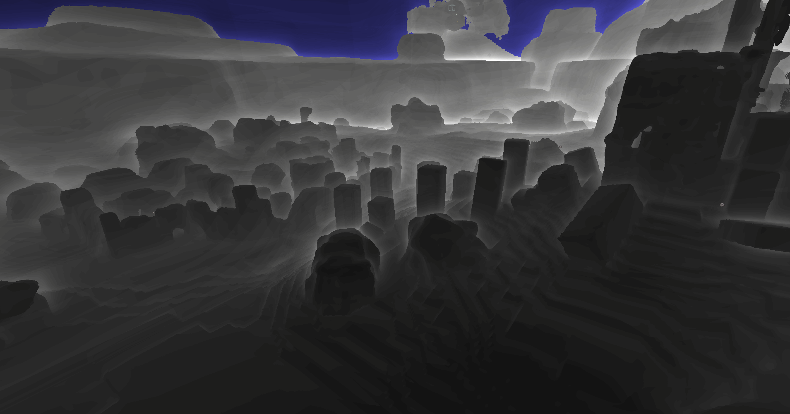
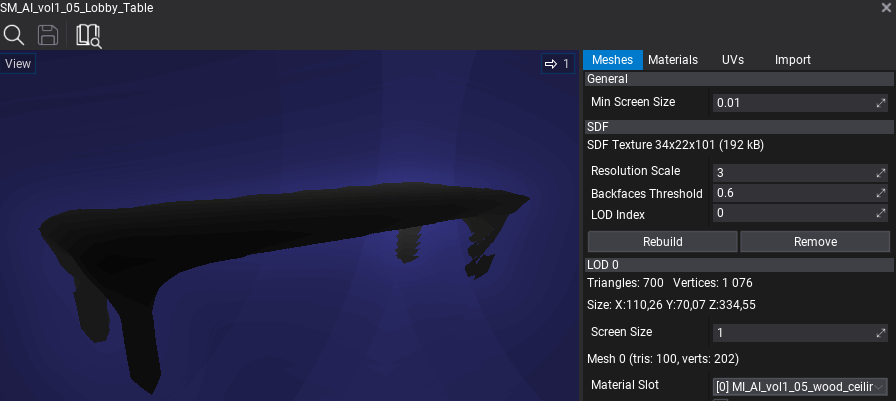
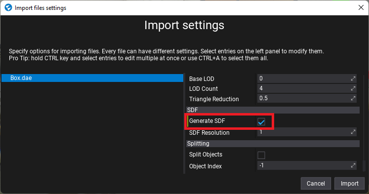
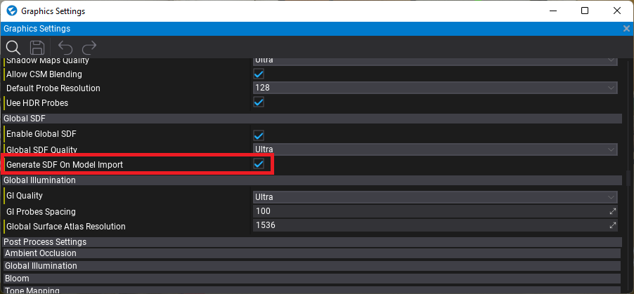
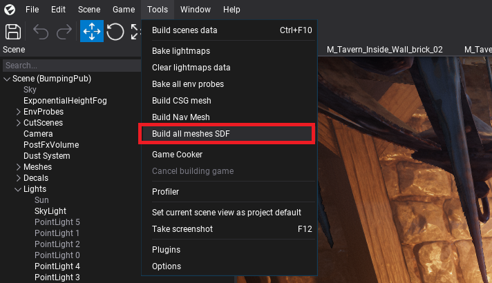
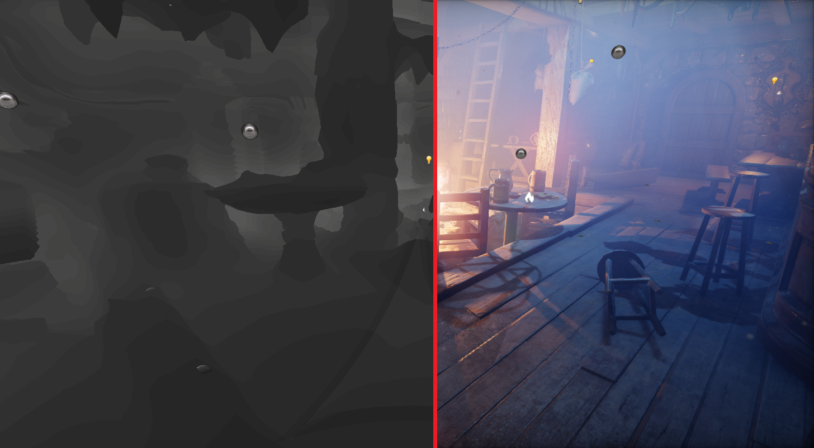
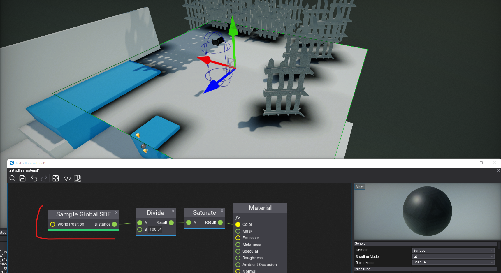
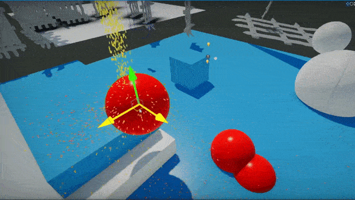
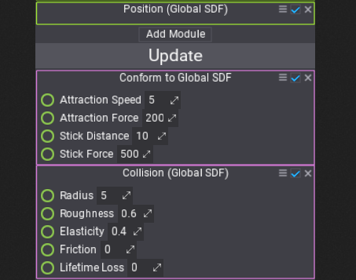

# Signed Distance Fields



**Signed Distance Fields**, shortened as **SDF**, are 3D textures where each texel contains the signed distance to the closest surface of an object. If this distance is negative, then the texel is inside the object. SDFs can roughly represent mesh geometry and allows efficently approaximating complex meshes. By having the ability to quickly sample the distance to the closest surface (and direction via SDF derivative) SDFs can be used for:
* procedural content creation (eg. foam in a river material at nearby river banks, dirt/moss in room corners),
* lighting, reflections and shadowing (eg. raytracing though an SDF volume to determine intersections),
* particle collisions and forces (eg. snow/rain falling on world surfaces, birds floc vfx avoiding objects).

## Model SDF



A model asset can contain an SDF texture baked for the meshes which can be created in the Model Window. It displays the resolution and GPU memory usage of the baked texture. You can adjust the bake options and *Rebuild* or *Remove* the data.

> [!Warning]
> Calculating an SDF texture is a very computationally expensive process and Flax uses the GPU or Job System to schedule asynchronious calculations which might *freeze the computer*.

| Option | Description |
|--------|--------|
| **Resolution Scale** | The SDF texture resolution scale used for building the texture. Higher values drastically increase memory usage and computation time but increase the quality of the mesh representation. |
| **Bake on GPU** | If checked, SDF generation will be calculated using GPU on Compute Shader, otherwise CPU will use Job System. GPU generation is fast but result in artifacts in various meshes (eg. foliage). |
| **Backfaces Threshold** | Custom threshold (in the range `0-1`) for adjusting mesh internals detection based on the percentage of test rays hitting triangle backfaces. Use lower values for more dense meshes. |
| **LOD Index** | Index of the model Level of Detail to use for SDF data building. By default the lowest quality LOD is used for fast building. |

### Model SDF on import



When importing model assets you can check the **Generate SDF** option to automatically calculate an SDF texture for eveyr imported model file. In projects that use DDGI or Global SDF you can enable the **Generate SDF On Model Import** option in [Graphics Settings](../../editor/game-settings/graphics-settings.md) which will change the default model import value to always generate SDFs on model import.



You can also use a small utility in the Editor under **Tools -> Build all meshes SDF** which will compute the SDF for all meshes on the scene. It might take some time and freeze your computer due to the large amount of data needed to be processed.



## Global SDF



Flax contains a feature called **Global Signed Distance Fields**, shorten as **Global SDF**, which rasterizes all models, foliage and terrains on a scene into a single Global Volume texture which represents a whole scene. This Global SDF provides up to 10cm of quality to nearby cameras and can cover 200m of world around the camera to efficently represent the scene. It uses 4 cascades to yeild higher precision for nearby cameras and improve performance for large worlds.

Global SDF is used by [Realtime Global Illumination](../lighting/gi/realtime.md) but can be accessed in Particles, Materials and Shaders. If you plan to use it in Content items, then check **Enable Global SDF** in the Graphics Settings. If checked, Global SDF rendering is enabled (before scene rendering). You can control its Quality just like other Graphics quality settings.

You can preview the Global SDF in every Editor viewport (both scene and model editors) with **View -> Debug View -> Global SDF**.

Every object (model, terrain, foliage) can control whether it's visible in Global SDF by using `DrawPass.GlobalSDF`.

### Global SDF in Content

#### GPU Graph Nodes



Materials and Particles can use nodes:
- `Sample Global SDF` - samples the Global SDF to get the distance to the closest surface (in world-space).
- `Sample Global SDF Gradient` - samples the Global SDF to get the gradient and distance to the closest surface (in world-space). Normalize gradient to get SDF surface normal vector.

#### GPU Full Scene Collisions





GPU Particles can access Global SDF manually (eg. via sampling) or with built-in simulation modules:
* `Position (Global SDF)` - places the particles on Global SDF surface (uses current particle position to snap it to SDF).
* `Collision (Global SDF)` - collides particles with the scene Global SDF.
* `Conform to Global SDF` - applies the force vector to particles to conform around Global SDF.

When creating more advanced VFX you can use Global SDF in your [Particle Emitter Functions](../../particles/particle-functions.md) to provide reusability of the logic component in the content.

#### Shaders

Global SDF can be sampled in custom shaders by using a utility header with constant buffer data and textures bound to GPU Context. Example:

```hlsl
// Include Global SDF utility
#include "./Flax/GlobalSignDistanceField.hlsl"

META_CB_BEGIN(0, Data)
//..constants..

// Place GlobalSDF data in constants buffer
GlobalSDFData GlobalSDF;
META_CB_END

// Provide shader resources with GlobalSDF texture and low-res mip
Texture3D<snorm float> GlobalSDFTex : register(t0);
Texture3D<snorm float> GlobalSDFMip : register(t1);

float TestSampleSDF(float3 worldPosition)
{
    // Sampling SDF at worldPosition
    float sdf = SampleGlobalSDF(GlobalSDF, GlobalSDFTex, GlobalSDFMip, worldPosition);
    return sdf;
}

float3 TestSampleNormalSDF(float3 worldPosition)
{
    // Sampling SDF Gradient (derivative) (+ distance at once)
    float sdf;
    float3 sdfGradient = SampleGlobalSDFGradient(GlobalSDF, GlobalSDFTex, GlobalSDFMip, worldPosition, sdf);
    float3 sdfNormal = normalize(sdfGradient); // normalize gradient to get normal vector
    return sdfNormal;
}

bool TestRayTraceSDF(float3 worldPosition, float3 worldDirection)
{
    // Initialize Global SDF trace input options
    GlobalSDFTrace trace;
    float minDistance = 0.0f;
    float maxDistance = 10000.0f;
    trace.Init(worldPosition, worldDirection, minDistance, maxDistance);

    // Raytrace
    GlobalSDFHit hit = RayTraceGlobalSDF(GlobalSDF, GlobalSDFTex, GlobalSDFMip, trace);

    // Process the result
    bool isHit = hit.IsHit();
    float3 hitPosition = hit.GetHitPosition(trace);
    return isHit;
}
```

C++ code for binding resources:

```cpp
// Include Global SDF render pass
#include "Engine/Renderer/GlobalSignDistanceFieldPass.h"

PACK_STRUCT(struct Data0
    {
    //..constants..

    // Place GlobalSDF data in constants buffer
    GlobalSignDistanceFieldPass::ConstantsData GlobalSDF;
    });

void Render()
{
    // Get Global SDF data for binding
    GlobalSignDistanceFieldPass::BindingData bindingDataSDF;
    if (GlobalSignDistanceFieldPass::Instance()->Render(renderContext, context, bindingDataSDF))
        return;

    // Bind constants buffer
    Data0 data;
    data.GlobalSDF = bindingDataSDF.Constants;
    auto cb0 = _shader->GetCB(0);
    context->UpdateCB(cb0, &data);
    context->BindCB(0, cb0);

    // Bind shader resources
    context->BindSR(0, bindingDataSDF.Texture ? bindingDataSDF.Texture->ViewVolume() : nullptr);
    context->BindSR(1, bindingDataSDF.TextureMip ? bindingDataSDF.TextureMip->ViewVolume() : nullptr);

    // draw or dispatch..
}
```

## SDF Tips & Tricks

* **Avoid non-uniform scale**, distance fields are inaccurate if a model has scale eg. *(10, 1, 1)*.
* Material **Position Offset is not supported** and might cause lighting issues.
* Use *Backfaces Threshold* to `1` to generate a Two Sided SDF for a mesh (eg. foliage or small prop).
* Enable the *Generate SDF On Model Import* option in Graphics settings to use it easily.
* If a model is used on levels with very large or very small scales (eg. *1000* or *0.0001*) then apply this scale to the import transform or adjust the SDF resolution scale on the asset to have similar SDF quality.
* Use Global SDF debug view to analyze the SDF scene (it should roughly match the actual scene geometry - that's what the GI algorithm sees).
* Use `StaticFlags` for static objects so Global SDF can optimize rasterization of static scene.
