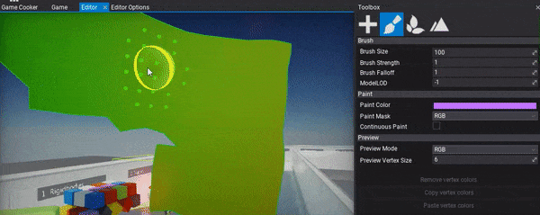
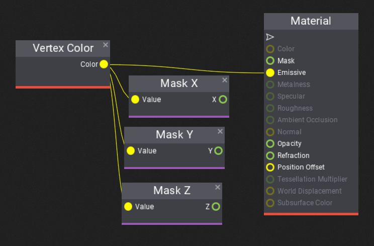

# Vertex Painting

**Vertex Painting** is a process of applying custom colors to the model geometry represented by the vertices of the mesh. This technique can be used to customize a model instance in the level. For instance, a wall material can use the red channel of the vertex color to display wet areas. Then, a level designer can paint wall vertices to make a certain part of the model appear wet.

Flax supports storing 4-channel RGBA (32-bit) color *per-vertex*. This color can be imported from the original model asset or created in the Editor.

## How to paint a model in the Editor?

The [toolbox](../../editor/windows/toolbox.md) window contains a tab with Vertex Painting utilities. Select it and then pick a model on a scene to paint. The window contains many options to adjust brush and paint options.

After selecting the model and tab, the editor will display its vertex colors. You can preview a single color channel or disable the debug view by using the **Preview Mode** option.
Now, you can use the left-mouse button to paint the vertices with a spherical brush in the editor viewport.

## How to access vertex colors in a material?

To read the painter vertices colors you can use a **Vertex Color** node in materials. That can be useful to adjust the object appearance.

