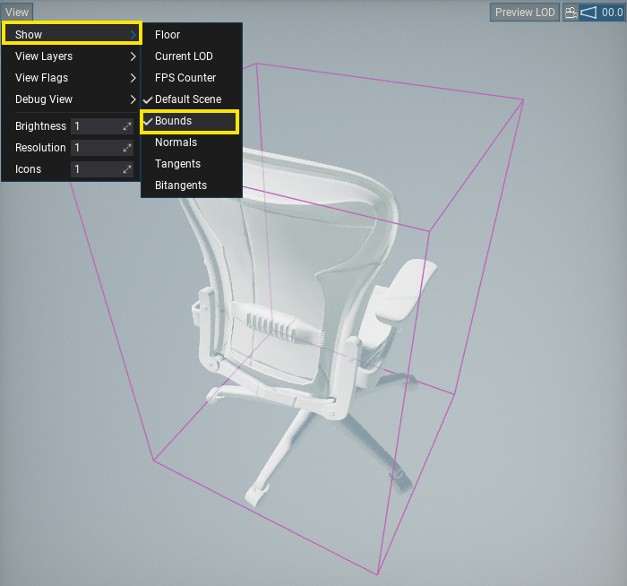
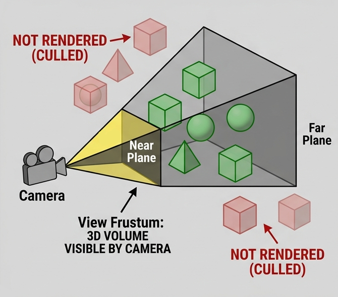
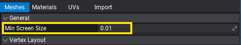
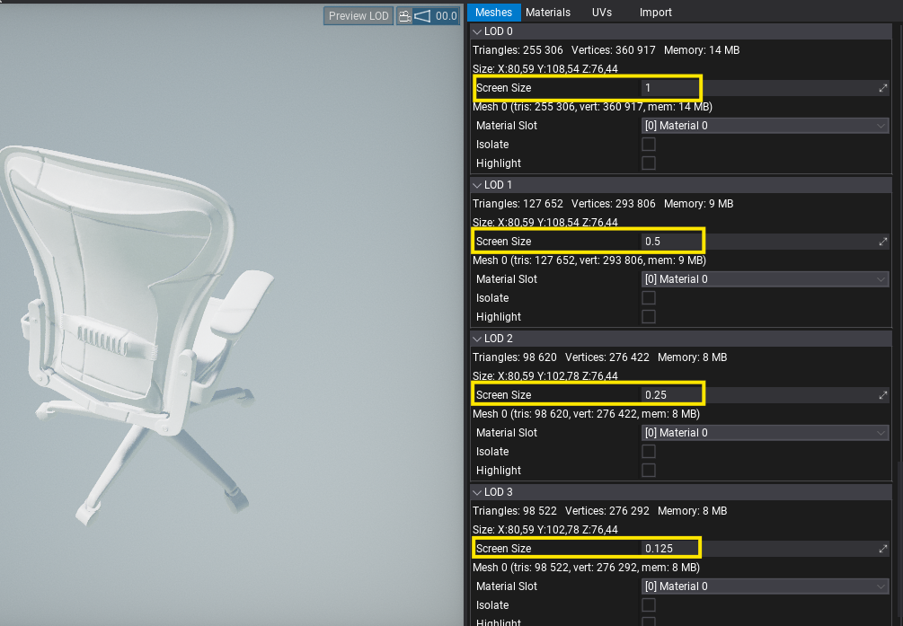
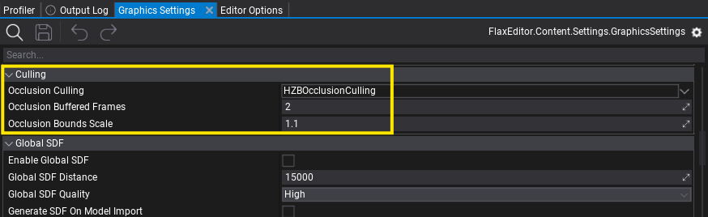

# Culling

Flax provides various methods of object culling for visibility and occlusion. These methods are useful for optimizing game performance. Each one of them aims to reduce the number of drawn objects on the screen, which improves performance. Follow this documentation to learn more about how to utilize culling.

## Object Bounds

Every drawable object has a set of bounds of an axis-aligned box and a sphere. Those bounds are used by engine by various systems but most primarly by rendering to cull objects. Meshes which objects are outside the view frustum or are occluded by others can be skipped during drawing.

In most cases, bounds are automatically calculated by the engine based on the contents they encapsulate. Variosu actors provide `BoundsScale` property to scale those bound sup or down for greather control. Use it to account for GPU-driven mesh distortion such as vertex displacement, which can break culling (mesh bounds on CPU are different than actual mesh on GPU after transformation).

To visualize model bounds open it in Editor and select option **View -> Show -> Bounds**. Some actors, such as Text Render, Particle Effect or Animated Model display actor bounds when selected.

## Frustum Culling

Flax automatically performs view frustum culling in order to prevent rendering objects that are outside the viewport. During multi-threaded scene rendering, objects are culled using their sphere bounds. Certain objects use their own internal culling structure too. For example, foliage uses a quad-tree hierarchy for optimized instance culling.

## Screen-Size Culling

Objects can be culled based on their size on the screen. It's a default method of selecting mesh LODs in the engine, as it doesn't depend on object distance to the camera but on the unified portion of the screen that the projected object bounds cover. The model has a *Min Screen Size* property that skips drawing if it's smaller than the specified portion of the screen (`0` disables it; e.g., `0.4` requires the object to cover `40%` of the screen or more). Similarly, it selects which LOD to use for object rendering.

Additionally, engine provides optimization options for certain rendering stages:
* `Graphics.Shadows.MinObjectPixelSize` - skips drawing too small objects into shadow maps (eg. 1px),
* `Graphics.MotionVectors.MinObjectScreenSize` - skips drawing too small objects into motion vectors buffer (eg. too far away).

## Occlusion Culling

Occlusion culling extends the default visibility check by determining whether an object is occluded by others to skip drawing it. This method can yield significant performance improvements in interiors-based games or open-worlds where lots of objects still end up in view but are obscured.

Flax provides an extendable interface for various occlusion culling implementation algorithms via `IOcclusionCulling`. It's used in unified way inside engine to perform visibility checks for the scene objects (incl. meshes and lights). Implementations can use hardware occlusion queries, software rasterization, Hi-Z tests, or any other method to determine if an object is visible in the current view frustum and not occluded by other geometry.

To setup Occlusion Culling, open Graphics Settings and set `Occlusion Culling` property to type your project needs. Flax provides in-built methods of occlusion to choose from.

Flag `ViewFlags.OcclusionCulling` can be used to toggle occlusion culling for specific views (eg. player inventory item preview).

### Hardware Occlusion Culling

**Hardware Occlusion Culling** is a system based on hardware occlusion queries implemented by the GPU driver. Those queries draw bounds of the objects using the current Depth Buffer to determine whether any pixel passes through depth and stencil tests. If the result is non-zero, then it means the object is most likely visible and should be rendered. If no pixel passes the depth test, then object is occluded an don't neeed to be rendered. Results are readback with a few frames of latency. This latency avoids hitches (CPU doesn't need to wait for GPU to finish the current frame) but can cause object-popping artifacts during fast motion.

### HZB Occlusion Culling

**HZB Occlusion Culling** is a system based on Hierarchical Z-Buffer visibility test. It builds a mipmap chain from the current Depth Buffer and runs a compute shader to test object bounding boxes against it. Results are readback with a few frames latency This latency avoids hitches (CPU doesn't need to wait for GPU to finish the current frame) but can cause object-popping artifacts during fast motion.

### Comparison

Comparison of the available occlusion culling methods:

| Method | Pros | Cons |
|--------|--------|--------|
| **Hardware Occlusion Culling** | Very precise. | Objects popping. Doesn't scale well in large scenes. |
| **HZB Occlusion Culling** | Accurate, more conservative than hardware queries. | Minor objects popping. |

Remember to [profile](../../editor/profiling/profiler.md) your scenes and content.

### Graphics Settings

Edit [Graphics Settings](../../editor/game-settings/graphics-settings.md) asset to customize the following options:

* **Occlusion Culling** - The type of the occlusion culling (implements `IOcclusionCulling`) that will be used to test visibility of the objects and skip rendering occluded ones. Can be left empty to use frustum-culling only.
* **Occlusion Buffered Frames** - The number of buffered frames for the visibility query results readback from GPU (to avoid stalls). The higher value the more latency but less CPU stalls (to wait for GPU results). Higher values increase object popping artifacts.
* **Occlusion Bounds Scale** - The object bounds scale for occlusion culling to reduce popping artifacts caused by latency of visibility readback from GPU to CPU. Higher values inflate bounds which improves visual stability but lowers occlusion culling efficiency.
