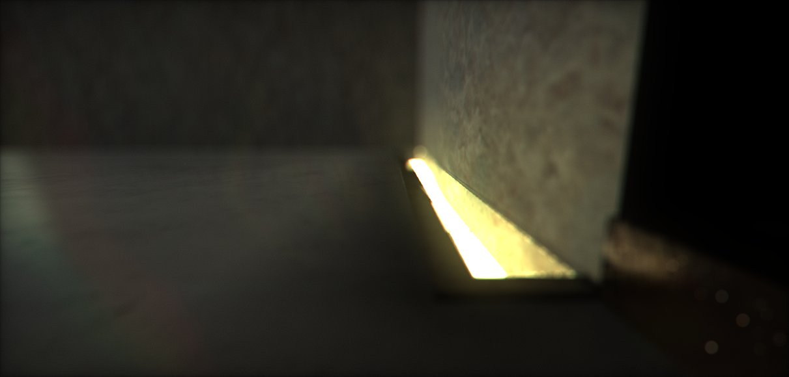
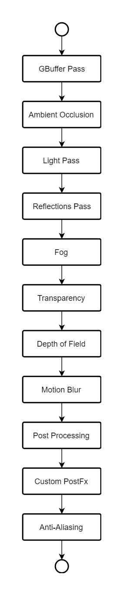

# Rendering Overview

The rendering system in Flax Engine uses the full power of the latest Graphics APIs (DirectX 12, Vulkan, etc.) pipeline to create rich effects including deferred shading, global illumination, full-scene reflections, and post processing.

## Rendering flow

Single frame rendering flow is shown in a graph below.

## Upscaling with Rendering Percentage

Flax supports performing scene rendering in lower resolution and upscaling the image into the window backbuffer. This allows improving game performance on slower devices. It can be configured via the `RenderingPercentage` property (per `SceneRenderTask`). To change the resolution scale for the game viewport use `MainRenderTask.Instance.RenderingPercentage` (you can preview it in the *Graphics Quality window* in the Editor). It's a scale of the rendering resolution relative to the output dimensions. If lower than 1 the scene and postprocessing will be rendered at a lower resolution and upscaled to the output backbuffer.

Flax performs upscaling by default using Catmull-Rom filtering with 9-taps. For more advanced upscaling you can use the open-source [AMD FidelityFX Super Resolution plugin for Flax Engine](https://github.com/FlaxEngine/FidelityFX-FSR).
