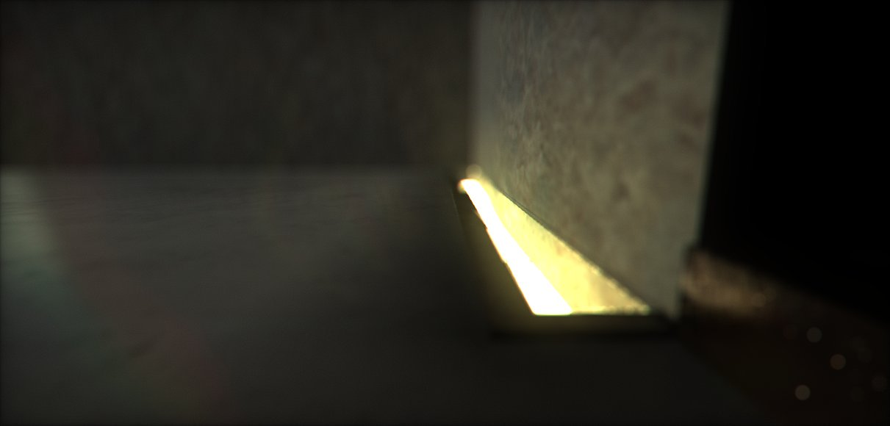
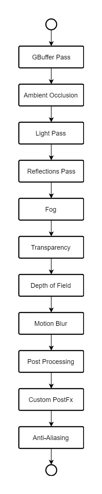

# Rendering Overview



The rendering system in Flax Engine uses the full power of the latest Graphics APIs (DirectX 12, Vulkan, etc.) pipeline to create rich effects including deferred shading, global illumination, full-scene reflections, and post processing. Follow this documentation section to learn more about rendering internals and how to fit it for your projects.

## In this section

* [Upscaling](upscaling.md)
* [Shading](shading.md)
* [Culling](culling.md)

## Rendering flow

Single frame rendering flow is shown in a graph below.



## Reverse Z

Flax renders scene with depth-inverse (`1` is near, `0` is far) to reduce Z-fighting and other depth buffer precision artifacts. To learn more, follow the [article from NVIDIA](https://developer.nvidia.com/content/depth-precision-visualized) explaining the theory and benefits behind using reverse Z.

Both C++ code and shaders are compiled with preprocessor define `REVERSE_Z` which toggles this feature (change `UseReverseZ` to `false` in `Flax.flaxproj` to disable it). Shaders can use various utility macros to remain compliant with hot code paths:
* `DEPTH_RANGE_MIN`/`DEPTH_RANGE_MAX` - depth range from near to far planes,
* `DEPTH_CMP` - depth values comparision function,
* `DEPTH_DIFF` - depth substraction function,
* `DEPTH_01` - depth normalization function (flips when using reversed z).

## Available Display Resolutions

You can get the available [screen resolutions and refresh rates](https://docs.flaxengine.com/api/FlaxEngine.GPUDevice.VideoOutputMode.html) using the following code:

# [C#](#tab/code-csharp)
```cs
// Monitors
GPUDevice.VideoOutput[] outputs = GPUDevice.Instance.VideoOutputs;

// Fullscreen modes (VideoOutputIndex maps mode into specific output)
GPUDevice.VideoOutputMode[] outputModes = GPUDevice.Instance.VideoOutputModes;
```
# [C++](#tab/code-cpp)
```cpp
#include "Engine/Graphics/GPUDevice.h"

// Monitors
const Array<GPUDevice::VideoOutput>& outputs = GPUDevice::Instance->VideoOutputs;

// Fullscreen modes (VideoOutputIndex maps mode into specific output)
const Array<GPUDevice::VideoOutputMode>& outputModes = GPUDevice::Instance->VideoOutputModes;
```
***

Depending on the connected screen(s), the same resolution might be available more than once, but with different refresh rates. If you only care about the resolutions and not the refresh rates, you will have to do some custom filtering to ensure that each resolution only exists once.
