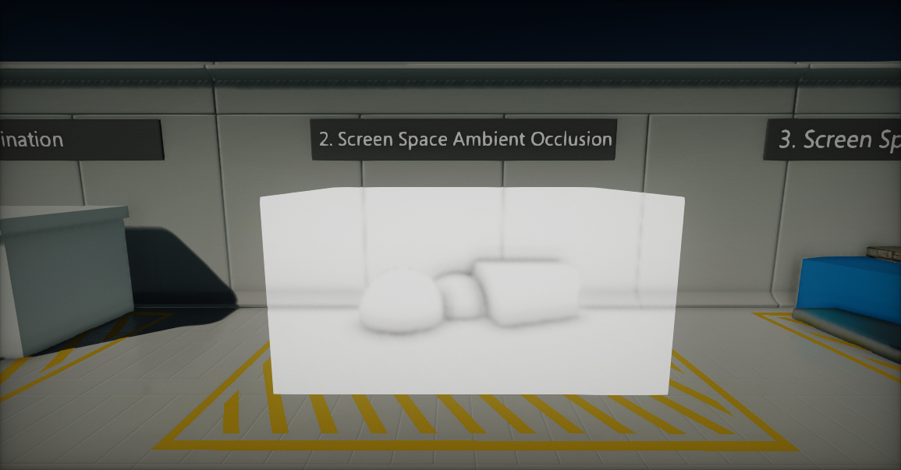
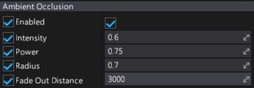

# Ambient Occlusion

The **Ambient Occlusion** effect is used to apply contact shadows to objects. It simulates real life shadowing and can help with creating a visual feel about the object locations in 3D space.

## Properties

| Property | Description |
|--------|--------|
| **Enabled** | If checked, effect will be rendered. |
| **Intensity** | The strength of the darkening effect in occluded areas. |
| **Power** | Ambient occlusion power parameter. Controls the occlusion gradient. |
| **Radius** | The radius of the occlusion sampling. |
| **Fade Out Distance** | Distance (in world units) beyond which the effect fades out. |
