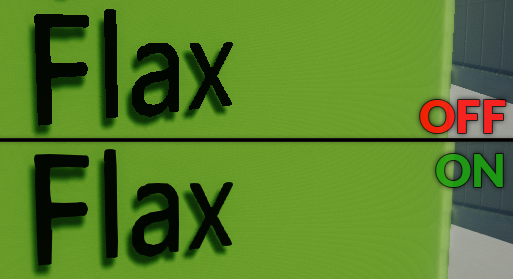

# Anti-Aliasing

The **Anti-Aliasing** effect is one of the most common ways to reduce pixel aliasing and smooth jagged geometry edges. Flax offers various AA implementations that are suitable for various types of games. The active anti-aliasing mode can be specified in a PostFx Volume per-level, per-camera or per game.

## Fast Approximate Anti-Aliasing

Fast-Approximate Anti-Aliasing (**FXAA**) is a cheap but solid single-pass post effect that has a low-performance impact and solid quality for most games. It is the most common choice for various games.

For more information, see: [FXAA Whitepaper](http://developer.download.nvidia.com/assets/gamedev/files/sdk/11/FXAA_WhitePaper.pdf).

## Temporal Anti-Aliasing

Temporal Anti-Aliasing (**TAA**) is an advanced effect where frames are accumulated over time in a dedicated history buffer to be used to smooth jittering edges. It applies sub-pixel jitter to a projection matrix and requires motion vectors.

| Property | Description |
|--------|--------|
| **Jitter Spread** | The diameter (in texels) inside which jitter samples are spread. Smaller values result in crisper but more aliased output, whilst larger values result in more stable but blurrier output. |
| **Sharpness** | Controls the amount of sharpening applied to the color buffer. TAA can induce a slight loss of details in high frequency regions. Sharpening alleviates this issue. High values may introduce dark-border artifacts. |
| **Stationary Blending** | The blend coefficient for stationary fragments. Controls the percentage of history samples blended into the final color for fragments with minimal active motion. |
| **Motion Blending** | The blending coefficient for moving fragments. Controls the percentage of history samples blended into the final color for fragments with significant active motion. |

## Subpixel Morphological Anti-Aliasing

Subpixel Morphological Anti-Aliasing (**SMAA**) is a high quality anti-aliasing effect. Depending on the art-style of your production it can work as well as TAA while avoiding some of the shortcomings of this technique. This effect is slower than FXAA.

For more information, see: [SMAA Publication](http://www.iryoku.com/smaa).

## Contrast Adaptive Sharpening

Contrast Adaptive Sharpening (**CAS**) is an additional filter pass that can run after FXAA or SMAA to increase the final image contrast and sharpness of the color edges.

| Property | Description |
|--------|--------|
| **Sharpening Amount** | The sharpening strength. |
| **Edge Sharpening** | The edge sharpening strength. |
| **Min Edge Threshold** | The minimum edge threshold. |
| **Over Blur Limit** | The over-blur limit. |
