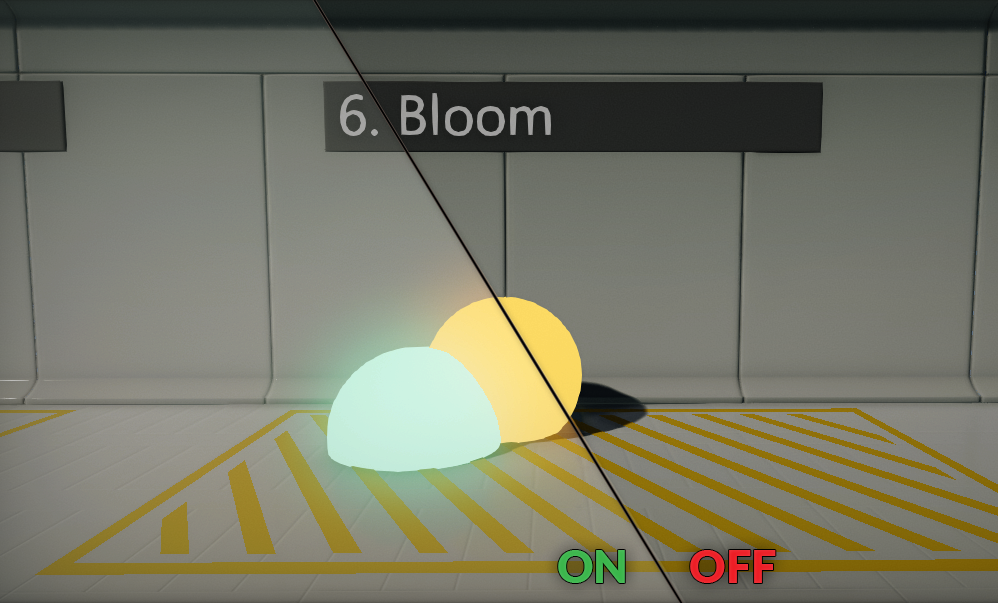
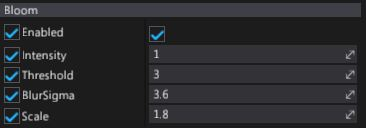

# Bloom

**Bloom** effect searches for the bright area of the input image to extend and bleed into the surrounding area. This simulates bright light overwhelming the camera so bright objects start to glow.

## Properties

| Property | Description |
|--------|--------|
| **Enabled** | If checked, bloom effect will be rendered. |
| **Intensity** | Bloom effect strength. Value 0 disabled is, while higher values increase the effect. |
| **Threshold** | Minimum pixel brightness value to start blowing. Values below the threshold are skipped. |
| **Blur Sigma** | This affects the fall-off of the bloom. It's the standard deviation (sigma) used in the Gaussian blur formula when calculating the kernel of the bloom. |
| **Limit** | Bloom effect brightness limit. Pixels with higher luminance will be capped to this brightness level. |
