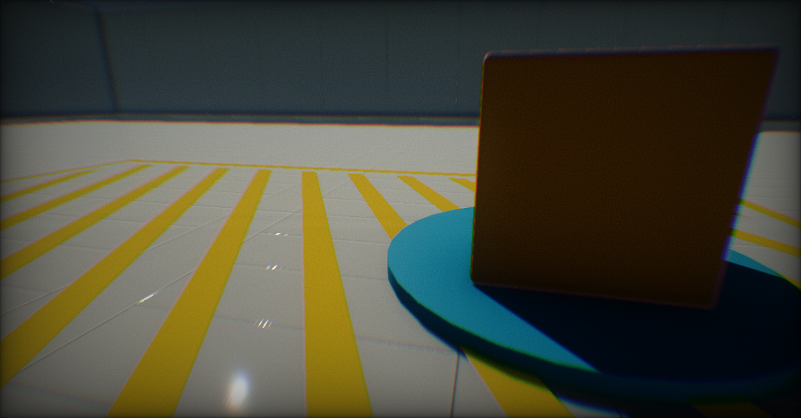
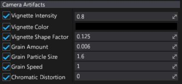

# Camera Artifacts

**Camera Artifacts** is a set of effects that helps to simulate real life cameras artifacts. This includes vignetting, noise grain, and chromatic distortion. All those effects are related to camera film and lenses.

## Properties

| Property | Description |
|--------|--------|
| **Vignette Intensity** | Strength of the vignette effect. Value `0` hides it. The default value is `0.8`. |
| **Vignette Color** | Color of the vignette. |
| **Vignette Shape Factor** | Controls shape of the vignette. Values near `0` produce rectangle shape. Higher values result in round shape. The default value is `0.125`. |
| **Grain Amount** | Intensity of the grain filter. Value `0` hides it. The default value is `0.005`. |
| **Grain Particle Size** | Size of the grain particles. The default value is `1.6`. |
| **Grain Speed** | Speed of the grain particles animation. |
| **Chromatic Distortion** | Controls chromatic aberration effect strength. Value `0` hides it. |
| **Screen Fade Color** | Screen tint color (alpha channel defines the blending factor). |
