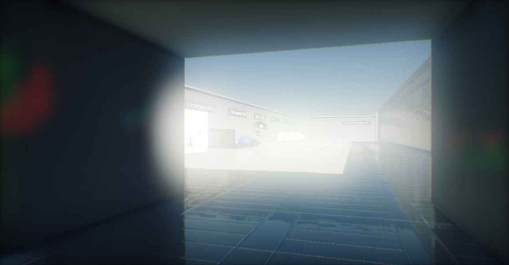

# Eye Adaptation

**Eye Adaptation**, or **automatic exposure**, is an effect used to simulate human eye adaptation to light exposure. In a similar way works light sensor in real cameras. It modifies the exposure to adapt the image brightness. For instance, if human moves from a bright environment into a dark environment, eyes are adjusting to the amount of incoming light.

## Properties

| Property | Description |
|--------|--------|
| **Technique** | Eye adaptation mode. Possible options: <table><tbody><tr><th>Option</th><th>Description</th></tr><tr><td>**None**</td><td>The adaptation is disabled (but controling exposure still works).</td></tr><tr><td>**Manual**</td><td>The scene exposure is controlled manually.</td></tr><tr><td>**Auto**</td><td>The scene exposure is calculated by auto.</td></tr></tbody></table>|
| **Speed Up** | Controls how quickly exposure goes up. |
| **Speed Down** | Controls how quickly exposure goes down. |
| **Exposure** | Custom exposure value. In *none* mode it's the scene expose, otherwise it's added to the calculated exposure. |
| **Key Value** | Key value for the adaptation. Used only in *manual* mode. |
| **Minimum Luminance** | The minimum value for the scene luminance range. |
| **Maximum Luminance** | The maximum value for the scene luminance range. |
