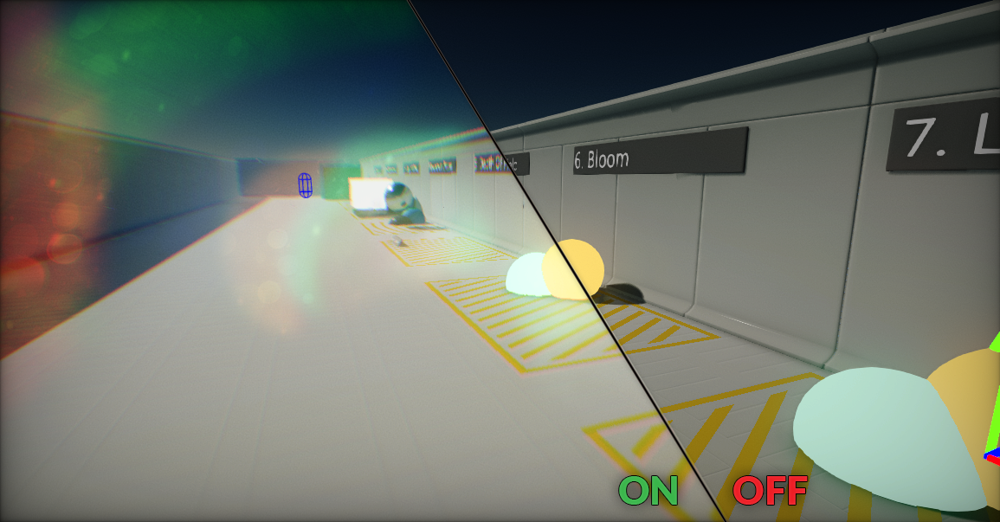

# Post Process Effects

**Post effects** (or **PostFx**) are usually applied to the rendered scene image but before UI drawing.
You can use post-effects to establish look of your scenes and add more realism to them.

## In this section

* [Ambient Occlusion](ambient-occlusion.md)
* [Anti-Aliasing](anti-aliasing.md)
* [Bloom](bloom.md)
* [Camera Artifacts](camera-artifacts.md)
* [Color Grading](color-grading.md)
* [Depth of Field](depth-of-field.md)
* [Motion Blur](motion-blur.md)
* [Eye Adaptation](eye-adaptation.md)
* [Lens Flares](lens-flares.md)
* [Screen Space Reflections](screen-space-reflections.md)
* [Tone Mapping](tone-mapping.md)
* [PostFx Volumes](post-fx-volumes.md)
* [PostFx Materials](post-fx-materials.md)

## Using post effects

As you can see in a picture below using postFx can dramatically change look of the game.

