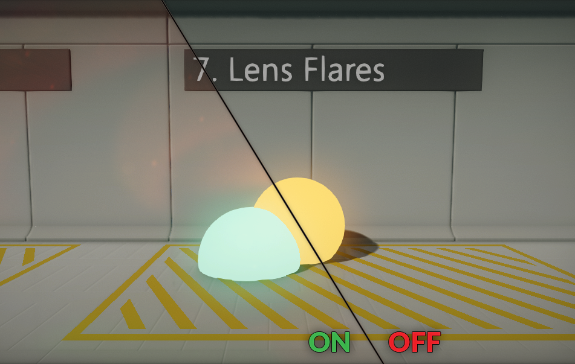
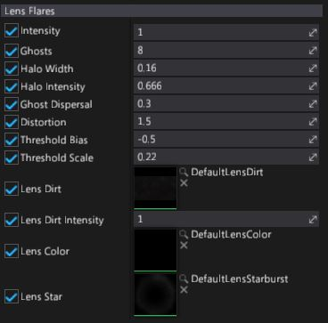

# Lens Flares

**Lens Flares** effect simulates the artifacts that are produced by the internal light transport inside a real-world camera lens. This includes light reflection and scattering.

The artifacts are generally aligned along the line defined by the original bright spot and the center of the screen. The most noticeable artifact is often exactly symmetrical to the real spot light with respect to the center of the screen.

## Properties

| Property | Description |
|--------|--------|
| **Intensity** | Strength of the effect. |
| **Ghosts** | Amount of *ghost* samples. |
| **Halo Width** | Lens flares halo width. |
| **Halo Intensity** | Lens flares halo intensity. |
| **Ghost Dispersal** | *Ghost* samples dispersal parameter. |
| **Distortion** | Lens flares color distortion parameter. |
| **Threshold Bias** | Input image brightness thresshold. Added to input pixels.  |
| **Threshold Scale** | Input image brightness thresshold scale. Used to multiply input pixels. |
| **Lens Dirt** | Fullscreen lens dirt texture. |
| **Lens Dirt Intensity** | Fullscreen lens dirt intensity parameter. Allows to tune dirt visibility. |
| **Lens Color** | Custom lens color texture (1D) used for lens color spectrum. |
| **Lens Star** | Custom lens star texture sampled by lens flares. |
