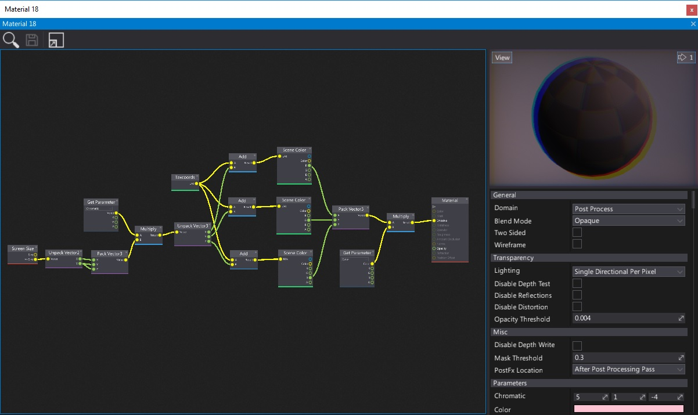
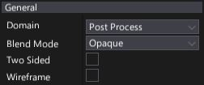
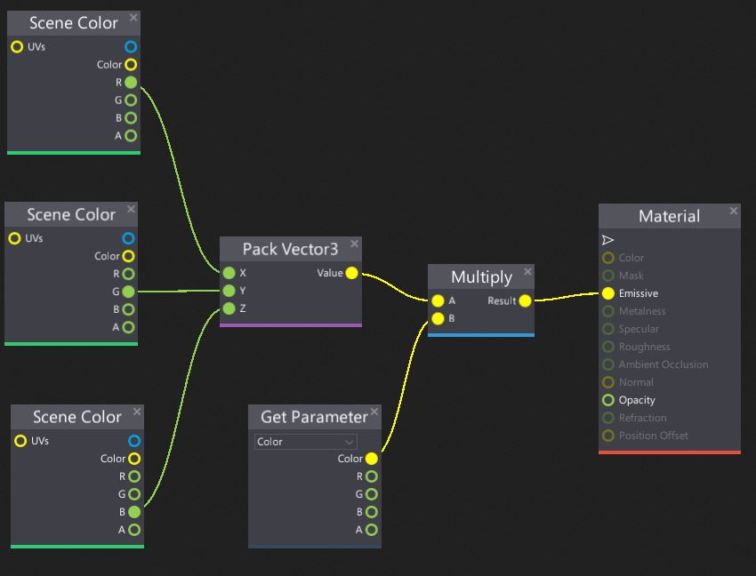
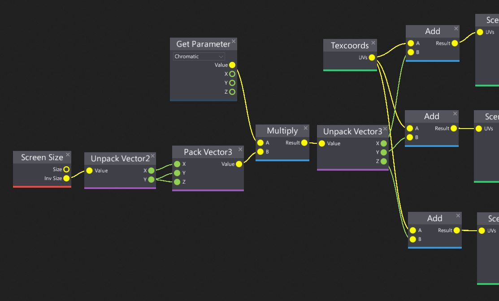
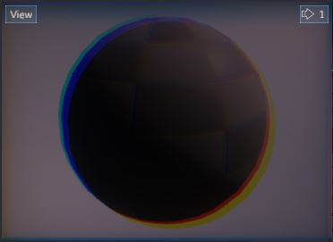
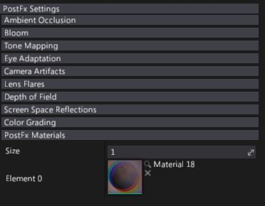
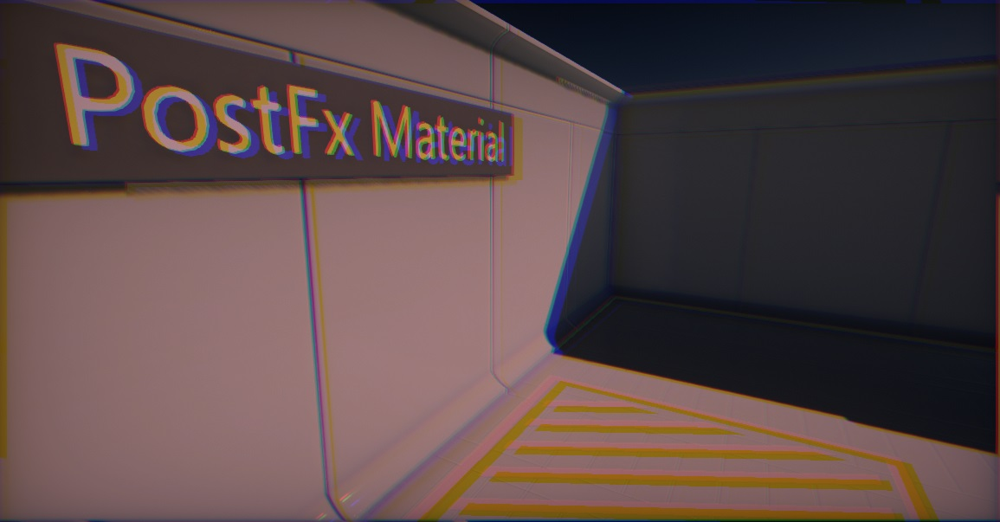
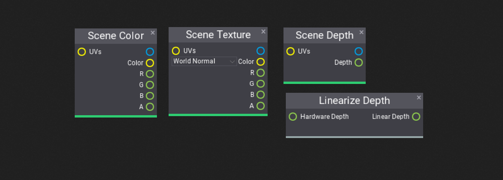
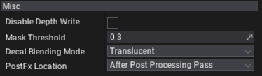

# Post Process Materials

**Post Process Materials** pipeline is a feature that allows game developers to create own post and mid image effects.
For example, you can create visual screen effect for player damage or change the overall look of your game.
Using Post Fx Materials is the easiest way to extend the graphics pipeline by the custom image processing in *screen space*.

To learn more about creating and using materials check out the related documentation [here](../materials/index.md).

## Creating a post process material

Post process material creation is similar to other material types.
Use the following tutorial steps to create simple distortion with coloring effect.

1. Create new material, and open it.

2. Change the **Domain** to **Post Process** (see [Material Properties](../materials/material-properties/index.md) to learn more).
     

3. Add **Color** (*Color* type) and **Chromatic** (*Vector3* type) parameters.
     

4. Create three **Scene Color** nodes, use single channel from each one (pack to *RGB* using **Pack Vector3** node) and multiply it by the **Color** (use constant or parameter). Connect output to the **Emissive** input.
     

5. Recreate the following graph that offset the color samples (in screen space) regarding to the **Chromatic** parameter value divided by the screen size.
     

6. Material is ready!
     

## Applying a post process material

There are several ways to apply PostFx material. The easiest one is to use [PostFx Volume](post-fx-volumes.md). Simply create new actor, select it and under **PostFx Materials** group set **Size** to `1`. Then drag and drop your postFx material into the free slot.

Enter camera into the volume to see the final effect result.

>[!Note]
>Single *PostFx Volume* can use up to `8` post-process materials. But you can stack them and use unlimited amount of post process materials. Hovewer keep in mind to maintain a solid performance because fullscreen effects rendering may slow down a game.

When extending the rendering pipeline with C# scripts and using [render tasks](http://docs.flaxengine.com/api/FlaxEngine.RenderTask.html) you can use [Renderer.DrawPostFxMaterial](https://docs.flaxengine.com/api/FlaxEngine.Renderer.html#collapsible-FlaxEngine_Renderer_DrawPostFxMaterial_FlaxEngine_GPUContext_FlaxEngine_RenderContext__FlaxEngine_MaterialBase_FlaxEngine_GPUTexture_FlaxEngine_GPUTextureView_) method. This allows to extend rendering and use custom drawing with [GPUTextures](http://docs.flaxengine.com/api/FlaxEngine.GPUTexture.html).

## Post process inputs

As a main input post process materials receive **Scene Color** which contains the pixels with the currently passed input buffer to the postprocessing. By defualt it's final rendered frame but if you change material location it can contains rendered scene before applying any AA or transparency and be in HDR format.

Usefull nodes:
* **Scene Color** - the input texture passed to the postfx material by the renderer (see material location options).
* **Scene Texture** - the general purpose access to common scene rendering buffers such as: Diffuse Color, Roughness, World Normal, Base Color, Metalness, etc. It can be used to implement custom effects such as normal-vector- based edge detection filter.
* **Scene Depth** - the depth buffer. Can be used to implement depth-based effects such as outlines rendering. *Depth* output of this node returns the linear depth value (in `0-1` range). To access hardware depth sample texture manually (eg. with Sample Texture node with Point Clamp filter).
* **Linearize Depth** - converts the hardwere depth buffer value (from current camera view) into the linear depth value (in `0-1` range). You can multiply output by *Far Plane* from *View* node to get depth in world units.

> [!Note]
> If you are experienced with Unreal then **PostProcessInput0** is **Scene Color** node in Flax for postprocess materials input.

## Post process material location

*Flax Engine* rendering pipeline is very complex. There are many effects that contribute into the final frame.
The same applies to the post process materials. Every material contains a property called **PostFx Location** (in **Misc** section). By editing it you can specify when your material should be rendered. Possible options:

| Option | Description |
|--------|--------|
| **After Post Processing Pass** | Render material after post processing pass using *LDR* input frame. |
| **Before Post Processing Pass** | Render material before post processing pass using *HDR* input frame. |
| **Before Forward Pass** | Render material before forward pass but after *GBuffer* with *HDR* input frame. |
| **After Custom Post Effects** | Render material after custom post effects (scripted). |

