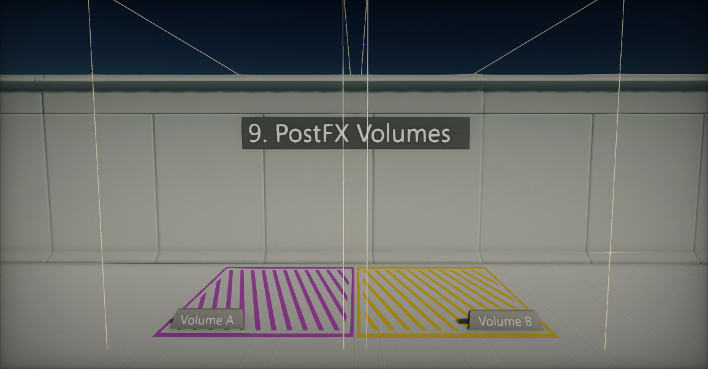
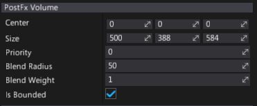
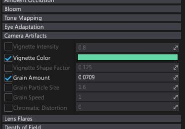

# PostFx Volumes

**PostFx Volume** is a special actor that overrides the default post-processing settings inside a defined volume in space.
By using it you can modify the depth of field, bloom, or other effects within a volume.
When the player camera moves into the volume, settings are blended.

Using post effect volumes allows to modify post processing in 3D space or per camera (simply attach postFx volume as camera child object). Flax Engine supports blending an unlimited number of volumes, however, blending too many volumes at once may have a negative impact on a CPU performance.

## Properties

| Property | Description |
|--------|--------|
| **Center** | Position of the bounds center (in local space of the actor). |
| **Size** | Size of the bounds box. |
| **Priority** | Blending priority. Volumes with higher priority are blended first. |
| **Blend Radius** | Bounds blending fall off radius. Used to smooth the settings transiion when camera enters the bounds. Used only if volume *Is Bounded*. |
| **Blend Weight** | Normalized (range 0-1) weight of the volume blending. Can be animated or modified at runtime to perform smooth transition when enabling the volume (instead of using binary option *Is Active*). |
| **Is Bounded** | If checked, settings blending will use object bounds. Otherwise it will have global effect. |

## Editing PostFx Settings

PostFx Volume supports *"per option"* value override which means, only selected options could be modified by the volume. This is very handy during games production when dealing with custom effects per level area.

To override the setting, simply select the checkbox dedicated to it and adjust the value as shown in a picture below.

