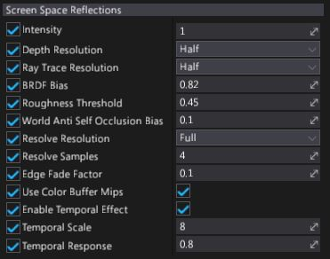

# Screen Space Reflections

**Screen Space Reflections** (shorten as **SSR**) effect adds local reflections to the objects pushing forward the realism of scenes. This effect is rendered in *screen space*, which means reflected can be only objects that are already on the screen (it doesn't work for offscreen or obscured objects).

This means SSR works well in enclosed areas such as corridors and rooms, but less well in open spaces, where you'd expect more of the world to be reflected. They also work best on bumpy surfaces, which hide imperfections in reflections, and less well on very glossy, mirror-like surfaces. Missing reflections are noticeable in mirrors, for example.
As a fallback value is used reflection color from placed Environment Probes.

## Algorithm

Flax Engine renders SSR in several passes:

1. The **raycast** pass performs screen space ray tracing over the depth buffer to find geometry intersections.
2. The **resolve** pass resolves the rays and calculates the reflection color.
3. The **temporal** pass uses the history buffer to blur constantly between the current and the previous frames. This reduces noise in the reflection, but produces an animated "jittering" effect that is sometimes noticeable. You can adjust or disable this step to create the effect you want.
4. The **combine** pass mixes the results of the effect with the rendered image.

## Properties

| Property | Description |
|--------|--------|
| **Intensity** | Reflections intensity scale (in range from 0 to 1). |
| **Depth Resolution** | Downscales the depth buffer to optimize raycast performance. *Full* gives better quality, but *half* improves performance. The default is half. |
| **Ray Trace Resolution** | The raycast resolution. There are two options: *full* and *half*. Full gives better quality, but half improves performance. The default value is half. |
| **BRDF Bias** | The reflection spread parameter. This value controls source roughness effect on reflections blur. Smaller values produce wider reflections spread but also introduce more noise. Higher values provide more mirror-like reflections. Default value is `0.82`. |
| **Roughness Threshold** | The maximum amount of roughness a material can have to reflect the scene. For example, if this value is set to `0.4`, only materials with a roughness value of `0.4` below above reflect the scene. The default value is `0.45`. |
| **Wolrd Anti Self Occlusion Bias** | The offset of the raycast origin. Lower values produce more correct reflection placement, but produce minor artifacts. We recommend values of `0.3` or lower. The default value is `0.1`. |
| **Resolve Resolution** | Calculates reflection color using raycast results. There are two options: *full* and *half*. Full gives the best results, but half improves performance. The default value is full. |
| **Resolve Samples** | The number of rays used to resolve the reflection color. Higher values produce less noise, but worse performance. The default value is `4`. Use 1 for the highest speed. |
| **Edge Fade Factor** | The point at which the far edges of the reflection begin to fade. This has no effect on performance. The default value is `0.1`. |
| **Use Color Buffer Mips** | If checked, downscales the input color buffer and uses blurred mipmaps chain when resolving the reflection color. This produces more realistic results by blurring distant parts of reflections in rough (high-roughness) materials. It also improves performance on most platforms. However, it uses more memory, so you might want to disable it on (for example) mobile platforms. |
| **Enable Temporal Effect** | If checked, enables the temporal pass. This reduces noise, but produces an animated "jittering" effect that is sometimes noticeable. The temporal effect is enabled by default. |
| **Temporal Scale** | Controls intensity of the temporal effect. Lower values produce reflections faster, but with more noise. The default value is `8`. |
| **Temporal Response** | Defines how quickly reflections blend between the reflection in the current frame and the history buffer. Lower values produce reflections faster, but with more jittering. Note the jittering in the reflection below. If the camera in your game doesn't move much, we recommend values closer to `1`. The default value is `0.8`. |

>[!Note]
>If the temporal effect is disabled, the other temporal properties have no effect.
