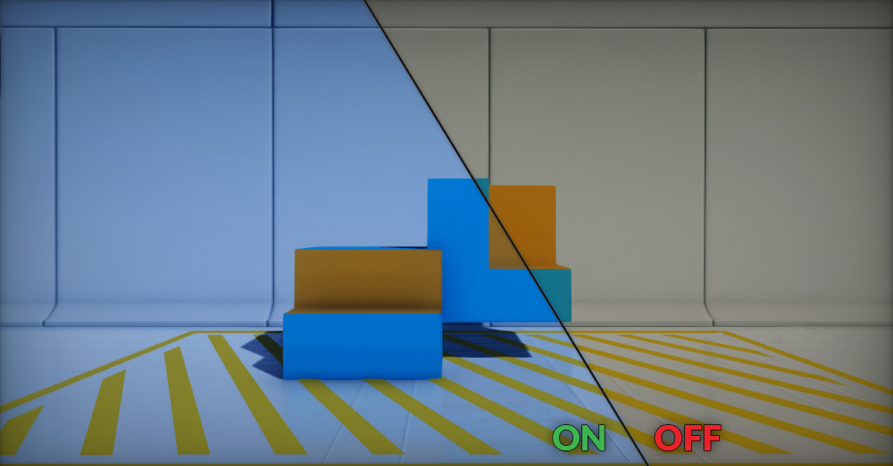
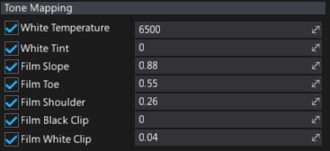

# Tone Mapping

**Tone Mapping** takes high dynamic range (`HDR`) input colors and remaps them into low dynamic range (`LDR`) that a display can show. This is the last stage of post processing the frame.

> [!TIP]
> It's highly recommended to set tone mapper options per whole project rather than per camera shot. For more dynamic image adjustments use [Color Grading](color-grading.md).

## Filmic Tone Mapper

Flax Engine implements the industry standart set by the [Academy Color Encoding System (ACES)](http://www.oscars.org/science-technology/sci-tech-projects/aces) for television and film. This leads to consistent color being preserved across multiple formats and displays, while also futur proofing the source material since it will not have to be adjusted for each medium that comes along. The goal is to use a standarized, high-quality format.

## Properties

Using the tone mapper's options allows adjusting the final filmic S-curve shape and balance color temperature.

| Property | Description |
|--------|--------|
| **White Temperature** | Adjusts the white balance in relation to the temperature of the light in the scene. When the light temperature and this value match, the light will appear white. When a value is used that is higher than the light in the scene it will yield a "warm" or yellow color, and conversely, if the value is lower it would yield a "cool" or blue color. The default value is `6500`. |
| **White Tint** | Adjusts the white balance temperature tint for the scene by adjusting the cyan and magenta color ranges. Ideally this setting should be used once you've adjusted the white balance temperature to get accurate colors. Under some light temperatures, the colors may appear to be more yellow or blue. This can be used to balance the resulting color to look more natural. The default value is `0`. |
| **Mode** | The tone mapping mode to use for the color grading process. |

